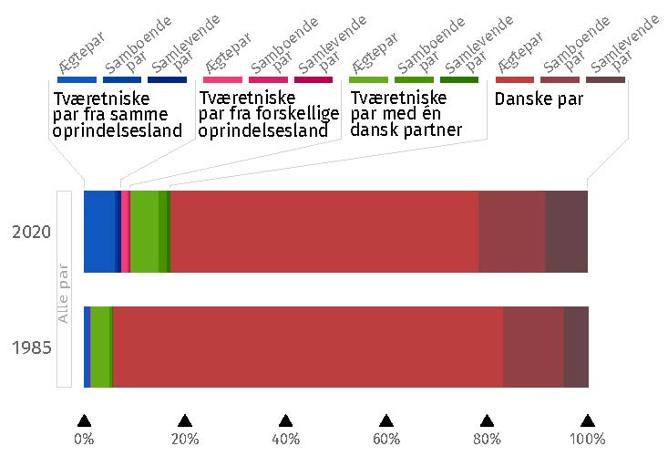
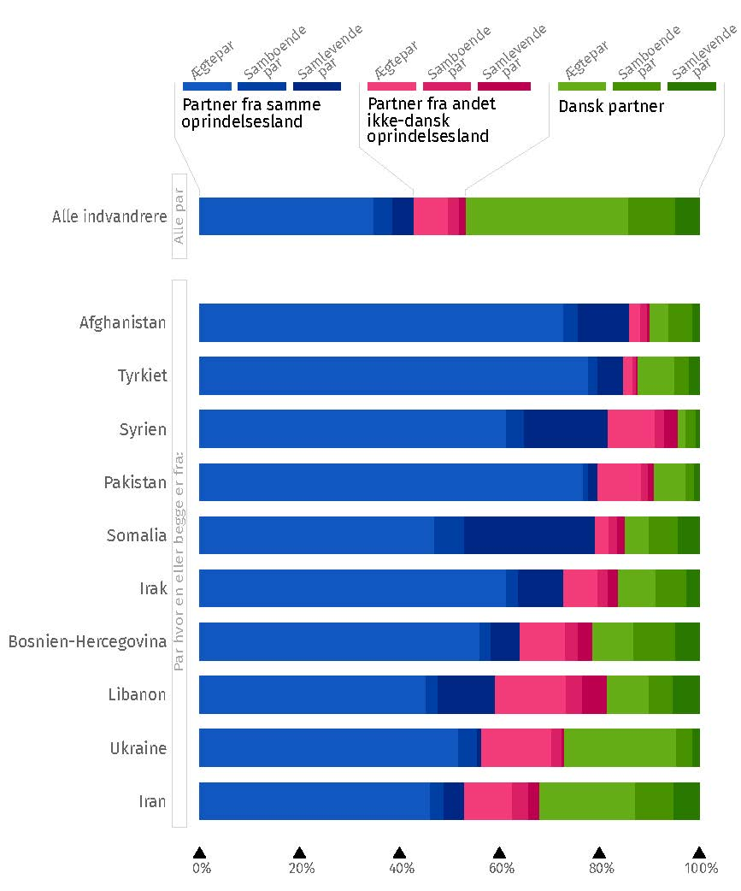

# Tværetniske partnerskaber {#kap2}

\thispagestyle{empty}

*[Hans-Peter Y. Qvist](https://vbn.aau.dk/da/persons/hpq)* og *[Jeevitha Yogachandiran Qvist](https://vbn.aau.dk/da/persons/jy)*

&nbsp;&nbsp;&nbsp;&nbsp;

```{r fig-partner, echo=FALSE, out.width= "100%"}
knitr::include_graphics("images/kap2.jpg")

```

\newpage

Et fast forhold eller ægteskab er den dybeste og mest forpligtende sociale forbindelse, man kan have med et andet menneske. Derfor er det at vælge en fast partner for de fleste en af de vigtigste beslutninger, vi træffer i vores liv. Vælger vi den rette partner, kan det berige vores liv markant. Omvendt kan et forkert valg føre til dybe materielle, følelsesmæssige og sociale tab, især hvis det ender i skilsmisse.  De betydelige konsekvenser af at vælge en partner fører sandsynligvis til, at mange mennesker minimerer risikoen for at vælge forkert og foretrækker en følelse af sikkerhed i deres valg. Modsat den populære forestilling om, at modsætninger tiltrækker hinanden, viser omfattende samfundsvidenskabelig forskning nemlig, at vi mennesker typisk vælger en partner, der ligner os selv på en lang række områder. Det gælder socioøkonomiske faktorer som uddannelse, job og indkomst såvel som kulturelle faktorer som etnicitet, religion og værdier [@kalmijn1998]. 

I lyset af tendensen til at folk typisk vælger partnere, der ligner dem selv, er det ikke overraskende, at indvandrere og deres efterkommere i Danmark og andre lande ofte foretrækker partnere fra deres egne oprindelseslande. Der er imidlertid store forskelle på hvor udbredt denne tendens er imellem forskellige indvandrergrupper. I nogle indvandrergrupper er det mere hyppigt, at man danner par indenfor gruppen end tilfældigheder ville tilsige, men der er omvendt også mange der danner par udenfor gruppen. I andre indvandrergrupper er tendensen til at vælge partnere inden for gruppen meget stærkere, og tværetniske forhold er derfor sjældnere.

I dette kapitel giver vi i det først afsnit en kort introduktion til den sociologiske forskning på området og beskriver herefter udbredelsen af tværetniske ægteskaber i Danmark. I det tredje afsnit refererer vi til hovedkonklusionerne fra studiet af Qvist & Qvist [-@qvistqvist2023], der giver en række forklaringer på mønstrene for tværetniske partnerskaber i Danmark. I det sidste afsnit diskuterer vi det svære spørgsmål om, hvorvidt de danske partnerskabsmønstre viser, at glasset er halvt fyldt eller halvt tomt. 

## Sociologien om de tværetniske partnerskaber 

I sociologien er der en lang tradition for at undersøge årsager og konsekvenser af forskelle i minoritetsgrupper tendens til, at danne par inden- eller udenfor egen gruppe. Det skyldes en forventning om, at udbredelsen af tværetniske ægteskaber, især mellem repræsentanter for indvandrergrupper og majoritetsbefolkningen, kan give en klar indikation på, hvor socialt integrerede indvandrergrupper er i destinationslandet. En af de mest markante repræsentanter for dette perspektiv, den amerikanske sociolog Milton M. Gordon [-@gordon1964], argumenterede således for, at udbredelsen af tværetniske parfold er den ultimative indikation på, at barrierer mellem etniske grupper nedbrydes og at integrationen mellem dem dermed styrkes. 

Ægteskabets rolle i at forene mennesker er et velkendt fænomen gennem historien. Traditionelt har ægteskaber ofte været brugt til at skabe alliancer mellem familier eller endda hele kongeriger. I den tidlige middelalder var det fx almindeligt, at den romerske elite i Vesteuropa indgik ægteskaber med ledere af indvandrende stammer. Dette førte til en kulturel fusion mellem den romerske kultur og stammernes traditioner (Wickham, 2009). Samtidig kunne det være en måde at skabe mere fred og mindre konflikt.  

I vore dage kan tværetniske ægteskaber mellem helt almindelige mennesker stadig have stor betydning. Det er der flere forskellige grunde til. For det første indikerer dannelsen af tværetniske parforhold, at fordomme og sociale grænsedragninger mellem etniske grupper ikke er stærke nok til at forhindre dannelsen af intime og tillidsfulde relationer mellem to personer fra forskellige etniske grupper. Dette kan være afgørende for, at barrierer nedbrydes yderligere mellem grupperne. For det andet forener et blandet par typisk ikke kun to individer, men også deres familie og venner. Personer der indgår i blandede par kan således agere brobyggere mellem sociale netværk eller grupper, som ellers ikke ville have megen kontakt med hinanden. For det tredje har børn fra blandede parforhold en unik position, når det kommer til at udviske kulturelle forskelle, hvilket vil blive udforsket yderligere i [kapitel 3](#kap3).

Det er afgørende at forstå, at den sociologiske forskning, som undersøger konsekvenserne af etnisk blandende parforhold---eller mangel herpå---hovedsageligt betragter effekterne på samfundsplan. Disse teorier fremhæver, at selvom det for den enkelte indvandrer kan virke naturligt og forenkle livet at vælge en partner med samme etniske baggrund, kan denne tendens medføre udfordringer for samfundet og for etniske grupper som helhed. Dette gælder især for indvandrere fra grupper, som systematisk og i vid udstrækning foretrækker partnere fra deres eget oprindelsesland, idet det medvirker til at lukke grupperne om sig selv og kan bidrage til etnisk segregering fremfor integration. 

## Tværetniske partnerskaber i Danmark 

I det følgende skal vi derfor se nærmere på omfanget af tværetniske partnerskaber i Danmark. I Figur \@ref(fig:fig-2-1) vises sammensætningen af samtlige partnerskaber, hvor begge partnere er bosat i Danmark.  I 1985 bestod 94 procent af alle partnerskaber af to personer med dansk oprindelse (den røde farve). Heraf fyldte ægteskaber mellem to personer med dansk oprindelse 77 procent. I 1985 bestod 1,1 procent af alle partnerskaber af to indvandrere eller efterkommere fra samme oprindelsesland (den blå farve), mens 0,2 procent bestod af to indvandrere eller efterkommere fra forskellige oprindelseslande (den pink farve). Endeligt udgjorde partnerskaber mellem én med dansk herkomst og én med anden herkomst 4,3 procent af samtlige partnerskaber. Det svarede til lidt over 54.000 partnerskaber mellem majoriteten og minoriteter i 1985.  

```{r fig-2-1, echo=FALSE, out.width= "75%", fig.align = 'center', fig.cap=" Partnerskaber med samme og forskelligt oprindelsesland. Opgjort i 1985 og 2020.", fig.topcaption=TRUE}


```

```{r, results="asis", echo=FALSE}

if (knitr::is_html_output()) {
  cat('<p style="text-align:left; font-style:italic; color:gray; font-size: 0.85em;">\n')
  cat('Note: DST betegner samlevende som to personer der ikke er i et ægteskab eller i registreret partnerskab med hinanden, men som har mindst ét fælles barn, mens samboende er betegnet som to personer af hvert sit køn med under 15 års aldersforskel, der ikke har børn eller er nært beslægtede.\n')
  cat('</p>\n')
} else if (knitr::is_latex_output()) {
  cat('\\begin{footnotesize}\\textit{\\textcolor{gray}{\n')
  cat('Note: DST betegner samlevende som to personer der ikke er i et ægteskab eller i registreret partnerskab med hinanden, men som har mindst ét fælles barn, mens samboende er betegnet som to personer af hvert sit køn med under 15 års aldersforskel, der ikke har børn eller er nært beslægtede.\n')
  cat('}}\n\\end{footnotesize}\n')
}

```

\newpage 

I 2020 ser fordelingen anderledes ud, se figur \@ref(fig:fig-2-1). I 2020 bestod 83 procent af alle partnerskaber af to personer med dansk oprindelse---heraf udgjorde samlevende og samboende en betydelig større andel end det var tilfældet i 1985, hvor ægteskaber udgjorde en større andel. Samtidig var par blandt indvandrere eller efterkommere kommet til at udgøre en betydelig større andel af alle par end tidligere. I 2020 bestod 7,3 procent af alle partnerskaber af to indvandrere eller efterkommere fra samme oprindelsesland. Derudover udgjorde par med to indvandrere eller efterkommere fra forskellige oprindelseslande 1,8 procent af samtlige partnerskaber. Endeligt er der den, for bogen, mest interessante gruppe af partnerskaber mellem majoritet og minoriteter. Den gruppe udgør i 2020 nu otte procent af samtlige partnerskaber i Danmark. Det svarer til lidt over 110.000 tværetniske partnerskaber. De tværetniske partnerskaber vokser både i absolut antal og som en andel af alle partnerskaber; til trods for velkendte sociologiske mekanismer, der understøtter partnerskabsdannelse blandt samme etniske gruppe.  

Figur \@ref(fig:fig-2-2) viser sammensætningen af partnerskaber i 2020 udelukkende blandt indvandrere og efterkommere. Først opgjort for hele gruppen, og herefter opgjort for de ti største grupper (med partnere bosat i Danmark). For hele gruppen er mønstret, at tværetniske partnerskaber er ganske udbredte. 47 procent har en partner med dansk oprindelse, mens 43 procent har en partner fra samme oprindelsesland som sig selv. Når vi ser på udbredelsen af tværetniske parforhold i indvandrerpopulationen som helhed, er det dog væsentligt at notere, at dette også inkluder par som dannes ved, at personer med dansk oprindelse finder partnere i udlandet. Disse parforhold har typisk væsentlig andre forklaringer end dem som opstår i Danmark blandt indvandrere eller efterkommer og personer med dansk oprindelse. 

\newpage 

```{r fig-2-2, echo=FALSE, out.width= "100%", fig.cap="Tværetniske partnerskab i 2020.", fig.topcaption=TRUE}

```

```{r, results="asis", echo=FALSE}

if (knitr::is_html_output()) {
  cat('<p style="text-align:left; font-style:italic; color:gray; font-size: 0.85em;">\n')
  cat('Note: DST betegner samlevende som to personer der ikke er i et ægteskab eller i registreret partnerskab med hinanden, men som har mindst ét fælles barn, mens samboende er betegnet som to personer af hvert sit køn med under 15 års aldersforskel, der ikke har børn eller er nært beslægtede.\n')
  cat('</p>\n')
} else if (knitr::is_latex_output()) {
  cat('\\begin{footnotesize}\\textit{\\textcolor{gray}{\n')
  cat('Note: DST betegner samlevende som to personer der ikke er i et ægteskab eller i registreret partnerskab med hinanden, men som har mindst ét fælles barn, mens samboende er betegnet som to personer af hvert sit køn med under 15 års aldersforskel, der ikke har børn eller er nært beslægtede.\n')
  cat('}}\n\\end{footnotesize}\n')
}

```

Undersøger vi pardannelsesmønstre blandt de ti største indvandrergrupper i Danmark ser vi et andet billede. I alle større grupper er det typiske mønster, at der etableres partnerskaber med én fra samme oprindelsesland. I alle ti grupper udgør disse interne etniske partnerskaber over 50 procent. Når vi ser på udbredelsen af tværetniske parforhold eller mangel på samme indenfor disse grupper, er det dog væsentligt at notere sig, at mange enten er migreret sammen til Danmark eller efterfølgende er familiesammenført. Dog viser figur \@ref(fig:fig-2-2) en betydelig variation på tværs af de etniske grupper. Interne partnerskaber er mest udbredt blandt indvandrere og efterkommere fra Afghanistan og mindst udbredt blandt indvandrere og efterkommer fra Iran. Spejlbilledet er, at partnerskaberne med majoritetsbefolkningen også varierer på tværs af grupperne, jf. de grønne bjælker i figur \@ref(fig:fig-2-2). Sådanne tværetniske partnerskaber fylder mindste blandt indvandrere og efterkommere fra Syrien og mest blandt indvandrere og efterkommere fra Iran.  

## Forklaringer på mønstre i tværetniske partnerskaber 

Det ovenstående giver et overblik over udbredelsen af tværetniske partnerskaber blandt forskellige indvandrergrupper i Danmark. Disse beskrivende analyser er imidlertid ikke egnet til at sige noget om årsager til, hvorfor tværetniske parforhold er mere udbredte blandt nogle indvandrergrupper end andre. Det skyldes, at den samlede population af par både består af par som var dannet før indvandrerne kom til Danmark og par som er dannet i Danmark – og disse pardannelser må forventes at have vidt forskellige årsager.

For at opnå en større forståelse for de faktorer som forklarer indvandreres og deres efterkommeres pardannelsesmønstre i Danmark er det mere hensigtsmæssigt, at følge personer som endnu ikke har en partner frem til det tidspunkt, hvor de evt. danner et fast parforhold eller bliver gift. 

 Vi har derfor har gennemført et omfattende studie, hvor vi har fulgt over 70.000 personer med indvandrerbaggrund fra de fyldte 18 år og frem til de evt. flyttede sammen med en partner eller blev gift Qvist og Qvist [-@qvistqvist2023]. De personer som vi fulgte, var enten kommet til Danmark før de fyldte 15 år eller var født i Danmark. Derudover havde de rødder i 120 forskellige lande, hvilket gav en unik mulighed for at kaste lys over betydningen af forskellige faktorers betydning blandt de mange forskellige indvandrergrupper i Danmark.
 
I forskningen om indvandres pardannelsesmønstre i vestlige modtagerlande peger man typisk på tre overordnede faktorer som påvirker indvandreres pardannelsesmønstre: personlige præferencer, strukturelle vilkår, og påvirkning fra eksterne parter [@kalmijn1998]. Personlige præferencer dækker over de normer og værdier, der er fremherskende i forskellige grupper, og som kan skabe forhindringer for etableringen af parforhold på tværs af etniske eller kulturelle skel. Strukturelle vilkår handler om de praktiske muligheder for at møde og danne par med nogen fra samme gruppe, hvilket blandt andet kan være betinget af størrelsen på en indvandrergruppe i Danmark og lokalområdet. Endelig omfatter påvirkning fra eksterne parter fx religiøse ledere eller institutioner, der råder imod eller direkte forbyder relationer udenfor egen tro.

Vores studie peger generelt på, at kulturelle forhold spiller en væsentlig rolle i forhold til at forme indvandreres partnerpræferencer. Generelt er det sådan, at jo større kulturelle forskelle der er mellem indvandrergruppen og majoritetsbefolkningen i Danmark, desto mindre er sandsynligheden for, at medlemmer af indvandrergruppen danner par med en person med dansk oprindelse. Den mest betydningsfulde kulturelle faktor er religion. Studiet viser, at personer med indvandrerbaggrund fra ikke-kristne lande har mindre sandsynlighed for at danne par med personer med dansk oprindelse og større sandsynlighed for at danne par med baggrund i eget oprindelsesland end personer med baggrund i andre lande. Samtidig viser studiet, at der er betydelige kønsforskelle. 

Når der statistisk justeres for en lang række socioøkonomiske og demografiske faktorer, viser studiet at oddset for at mænd med indvandrerbaggrund i overvejende muslimske lande danner par med kvinder med dansk oprindelse er ca. halvt så stort som for mænd med baggrund i protestantiske lande. Det samme gælder for mænd med baggrund i hinduistiske og buddhistiske lande.  For kvinder med baggrund i muslimske lande er oddset for at danne par med en mand med dansk oprindelse ca. en tredjedel så stort som for kvinder med baggrund i protestantiske lande. For kvinder med baggrund i hinduistiske og buddhistiske lande er der imidlertid ikke signifikant forskel på deres odds for at danne par med en mand med dansk oprindelse. 

Udover betydningen af religion kaster studiet også lys over den rolle strukturelle betingelser spiller. Her viser studiet, at oddset for at personer med indvandrerbaggrund som tilhører store indvandrergrupper i Danmark, danner par med en person med baggrund i eget oprindelsesland, alt andet lige, er større. Til gengæld er sandsynligheden mindre for personer, der tilhører små grupper, hvor det kan være vanskeligt at finde en partner med samme oprindelse.  

Endeligt viser studiet at personer med indvandrerbaggrund som er født i Danmark, er mere tilbøjelig til at danne blandede par end indvandrere som kom hertil som børn. Dette indikerer, at der sker en udvikling over tid og generationer, hvor personer med indvandrerbaggrund bliver mere tilbøjelige til at danne par med personer med dansk oprindelse, hvilket gælder alle grupper inklusive kvinder med baggrund i overvejende muslimske lande. 

## Er glasset halvt fuldt eller halvt tomt? 

I den danske offentlige debat fremhæves der ofte forskellige aspekter af virkeligheden alt efter hvilket politisk udgangspunkt man har. Politikere og debattører på højrefløjen fremhæver ofte, at der blandt nogle indvandrergrupper er en ganske stor andel som danner par med personer fra deres egne hjemlande. Omvendt fremhæver politikere og debattører fra venstrefløjen typisk, at der sker en udvikling på området, som går i retning af flere tværetniske ægteskaber ikke mindst blandt efterkommere af indvandrere. 

Lidt populært kan man sige, at der er tale om en diskussion af, hvorvidt glasset er halvt tomt eller halvt fuldt. På den ene side er det rigtigt, at der blandt nogle indvandrergrupper er en stærk tendens til at danne par indenfor egen gruppe både i første og anden generation. På den anden side er det også rigtigt, at der indenfor grupperne sker en udvikling over tid og generationer, hvor tværetniske pardannelse bliver hyppigere. Optimisten vil glæde sig over denne udvikling, mens pessimisten vil sige, at den går for langsomt. Under alle omstændigheder betyder det stigende antal tværetniske partnerskaber, at flere og flere børn har en ”blandet” etnisk baggrund, hvilket vi skal se nærmere på i det næste [kapitel](#kap3). 


