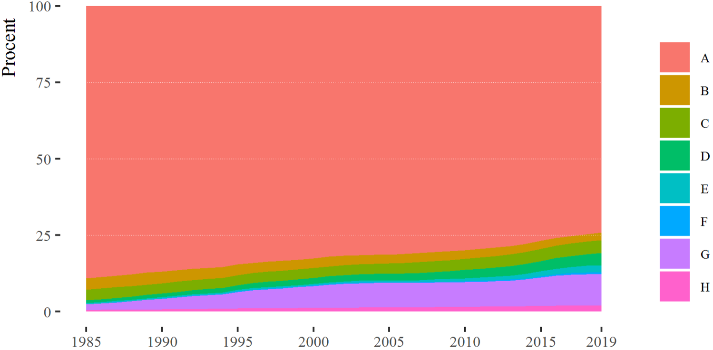

# De blandede børn {#kap3}

\thispagestyle{empty}

*[Jeppe Fjeldgaard Qvist](https://vbn.aau.dk/da/persons/jeppefl)* og *[Christian Albrekt Larsen](https://vbn.aau.dk/en/persons/albrekt)*

&nbsp;&nbsp;&nbsp;&nbsp;

```{r fig-partner222, echo=FALSE, out.width= "100%"}
knitr::include_graphics("images/kap3.jpg")
```

\newpage

I dette kapitel beskriver vi fremkomsten og omfanget af en ny kategori af børn med blandet etisk baggrund. Disse børn medvirker naturligt til at udviske etniske grænsedragninger, da de ikke kan placeres i gamle ”os” og ”dem” kategorier.[^31] Opgaven besværliggøres af, at kategorien ikke findes hos Danmark Statistik (DST). Kapitlet starter med en introduktion til de eksisterende kategorier, som Danmark Statistik bruger til at dele befolkningen op i danskere, indvandrere og efterkommere. En opdeling som vi lidt lemfældigt har brugt i de forudgående kapitler. Dernæst udvikler vi en ny kategorisering, der kan indfange fremkomsten af børn med blandet etnisk herkomst. Disse kategorier bruges i det tredje afsnit til at beskrive udviklingen i antallet af disse børn. Vi beskriver de 0--16-årige i perioden fra 1985 til 2019.  I det tredje afsnit beskriver vi, hvordan partnerskabsmønstrene ser ud hos disse ”blandede” børn. I det afsluttende afsnit diskuterer vi kort resultater i relation til konklusionerne fra [kapital 2](#kap2). 

[^31]: Dele af teksten er direkte baseret på Larsen, J. F., & Larsen, C. A. (2022). Herkomst blandt 0--16-årige bosat i Danmark: Stigende etnisk diversitet og koncentration fra 1985 til 2019. *Metode & Forskningsdesign*, (4), 47--68. Vi takker tidsskriftet for lov til at genoptrykke dele af teksten.

## Hidtidige statistiske begreber 

Det danske CPR-register og de eksisterende klassifikationer foretaget af DST giver et godt udgangspunkt for at give en beskrivelse af integrationsprocesser. Andre lande, for eksempel USA og Storbritannien, har haft en spørgeskematradition [@mendez2013]. I forhold til etnicitet har spørgeskematraditionen den fordel, at der kan laves kategorier, hvor befolkningen selv kan angive deres tilhørsforhold, herunder tilhørsforhold på tværs af etniske grupper. Den registerbaseret tradition er mindre sensitiv over for egne klassifikationer. Derfor kan det være vanskeligt at ”opdage” de blandede børn og deres udviskning af etniske distinktioner. 

DST udnytter som udgangspunkt både forældrenes fødested og statsborgerskab samt individets eget fødested til at afgrænse ”dansk herkomst”, ”indvandrere” og ”efterkommer”. En person med ”dansk herkomst” er en person---uanset fødested---der har mindst én forælder, der både er dansk statsborger og født i Danmark. Kombination af forældres statsborgerskab og fødested i Danmark bidrager til at afgrænse en relativt etnisk homogen gruppe af ”danskere”. Den manglende betydning af eget fødested bidrager til at inkludere dem, der er født af danske forældre under, ofte midlertidige, ophold i udlandet. Disse børn født i udlandet ligner på sprog, kultur og hudfarve ofte børn af ”danskere” født i Danmark. Ligeledes har de typisk dansk statsborgerskab. 

En ”indvandrer” er født i udlandet. Ingen af forældrene må være både danske statsborgere og født i Danmark.[^32] En efterkommer er født i Danmark. Ingen af forældrene må være både danske statsborgere og født i Danmark.[^33] For ”indvandrere” og ”efterkommere” opgør DST også oprindelseslandet. Når begge forældre kendes, defineres oprindelsesland ud fra moderens fødeland eller statsborgerskabsland. Når kun én forælder kendes, defineres oprindelseslandet ud fra dennes fødeland.[^34] 

[^32]: Hvis der ikke findes oplysninger om nogen af forældrene, og personen er født i udlandet, opfattes personen også som indvandrer.

[^33]: Hvis der ikke findes oplysninger om nogen af forældrene, og personen er udenlandsk statsborger, opfattes personen også som efterkommer. Når én eller begge forældre, der er født i Danmark, opnår dansk statsborgerskab, vil deres børn ikke længere blive klassificeret som efterkommere. Fastholder danskfødte forældre imidlertid begge et udenlandsk statsborgerskab, vil deres børn forblive klassificeret som efterkommere.

[^34]: Hvis dette er Danmark, bruges statsborgerskabslandet. Når ingen af forældrene kendes, er oprindelseslandet defineret ud fra personens egne oplysninger. Er personen indvandrer, antages det, at oprindelseslandet er lig med fødelandet. Er personen efterkommer, antages det, at oprindelseslandet er lig med statsborgerskabslandet.

Skelnen mellem vestlige og ikke-vestlige indvandrere og efterkommere har været mere kontroversiel. De vestlige lande defineres som alle fra de 27 EU-lande (og det tidligere medlem Storbritannien), Andorra, Island, Liechtenstein, Monaco, Norge, San Marino, Schweiz, Vatikanstaten, Canada, USA, Australien og New Zealand. Alle øvrige lande opgøres som ”ikke-vestlige”. Kategorien ”vestlig” afgrænser en gruppe, hvor befolkninger målt på velstandsniveau (relativt velstående), religion (relativt kristne) og hudfarve (relativt hvide) nogenlunde ligner hinanden. Det, der karakteriserer   de ”ikke-vestlige”, er derfor, at de ikke har denne kombination. Den sociologiske mening bag ”ikke-vestlige” er således, at gruppen på forskellige parametre er mere afvigende fra den etnisk danske majoritetsbefolkning end ”vestlige” indvandrere. De ”ikke-vestlige” vil typisk også være en synlig minoritet på grund af ikke-hvid hudfarve og store dele har muslimsk baggrund.[^35] 

[^35]: En arbejdsgruppe hos DST har set på denne vestlige og ikke-vestlige opdeling og anbefaler at opretholde distinktionen på grund af tydelig sammenhæng mellem denne klassificering og mål for (manglende) integration (Danmarks Statistik, 2019). Argumentet er således, at det er en distinktion, der bidrager med mening.

Når de to kategorier kombineres, anvender DST opgørelsen ”dansk herkomst”, ”vestlig indvandrer”, ”ikke-vestlige indvandrer”, ”vestlig efterkommer” og ”ikke-vestlig efterkommer”, der formentlig er velkendt for en god del af læserne. I nedenstående accepterer vi den opdeling og søger således primært at bygge videre på det eksisterende begrebsapparat.

## En udvidet kategorisering baseret på forældre 

Vores udbyggede klassificering af de 0--16-årige tager udgangspunkt i forældrene. Hvis de to forældre klassificeres med de hidtidige klassifikationer, fremkommer udfaldsrummet i tabel \@ref(tab:tab-3-1).

\newpage

```{r tab-3-1, echo=FALSE, message=FALSE, out.width= "120%"}

typology <- data.frame(
  col_keys = c(
    "Gruppe", "f1", "f2", "Betegnelse"
  ),
  what = c("Gruppe", "Personens forældre", "Personens forældre", "Betegnelse"),
  measure = c("Gruppe", "Forældre 1", "Forældre 2", "Betegnelse"),
  stringsAsFactors = FALSE
)

read_csv2("data/tabel_2_1.csv") %>% 
  flextable() %>% 
  set_header_df(mapping = typology, key = "col_keys") %>% 
  merge_h(part = "header") %>% 
  merge_v(j = c("Gruppe", "Betegnelse"), part = "header") %>% 
  theme_booktabs() %>% 
  bold(j = c(1, 4), bold = TRUE, part = "body") %>% 
  width(j = c(2:4), width = 1) %>% 
  width(j = c(1), width = 1) %>% 
  fontsize(size = 10, part = "header") %>% 
  fontsize(size = 9, j = c(1:4)) %>% 
  font(fontname = "Fira Sans", part = "all") %>% 
  set_caption("Udfaldsrum for oprindelse baseret på eksisterende klassifikationer fra Danmarks Statistik.\n")

  
```

Udfaldsrummet har otte muligheder, hvis man ligesom Danmarks Statistik undlader af skelne mellem mors eller fars herkomst. I første omgang er vi interesseret i fremkomsten af børn med én forældre med dansk herkomst og én med anden herkomst. Dvs. vi skelner ikke mellem indvandrer- og efterkommerstatus. For at forsimple beskrivelsen har vi foretaget en opdeling i dansk/vestlig (**C**), hvor én af forældrene har dansk herkomst, mens den anden er vestlig indvandrer eller efterkommer. Den gruppe har erfaring med etnisk diversitet i familien, men vil typisk ikke være en synlig minoritet på grund af hudfarve. En opdeling på dansk/ikke-vestlig (**D**), hvor gruppen også har erfaring med etnisk diversitet i familien, men vil i modsætning typisk være en synlig minoritet via hudfarve. 

I 1985 var der 37.504 i alderen 0--16 år i C-gruppen, svarende til 3,48 procent af gruppen, se tabel \@ref(tab:tab-3-2). I 2019 var antallet vokset til 45.911, svarende til 4,22 procent af de 0--16-årige. Men det er imidlertid i D-gruppen, hvor store dele af den relative stigning har fundet sted; kun overgået af stigningen i G-gruppen. I 1985 var der 9.912 i D-gruppen, svarende til 0,9 procent af de 0--16-årige, hvilket i 2019 er vokset til 42.933, svarende til 3,9 procent af de 0--16-årige. Samlet set udgør de cirka 89.000 ”blandede” børn således 8,2 procent af alle 0--16-årige i 2019, se tabel \@ref(tab:tab-3-2). 

\newpage


```{r tab-3-2, echo=FALSE, message=FALSE, warning=FALSE}

typology <- data.frame(
  col_keys = c(
    "Gruppe", "n_1", "pct_1", "n_2", "pct_2"
  ),
  what = c("Gruppe", "1985", "1985", "2019", "2019"),
  measure = c("Gruppe", "n", "%", "n", "%"),
  stringsAsFactors = FALSE
)


read_csv2("data/tabel_2_2.csv") %>% 
  flextable() %>% 
  colformat_double(big.mark = ".", digits = 0) %>%
  set_header_df(mapping = typology, key = "col_keys") %>% 
  merge_h(part = "header") %>% 
  merge_v(j = c("Gruppe"), part = "header") %>% 
  theme_booktabs() %>% 
  bold(j = c(1), bold = TRUE, part = "body") %>% 
  width(j = c(2:4), width = .5) %>% 
  width(j = c(1), width = .5) %>% 
  fontsize(size = 10, part = "header") %>% 
  fontsize(size = 9, j = c(1:5)) %>% 
  font(fontname = "Fira Sans", part = "all") %>% 
  set_caption("Gruppestørrelser. 0-16-årige opgjort i 1995 og 2019.\n") %>% 
  align(align = "center", part = "header")

```

Samtidigt er andelen, hvor begge forældre har dansk herkomst faldet. I bogen arbejder vi primært videre med kategorien dansk/dansk (**A**), hvor begge forældre har dansk herkomst. Det er den kategori, der blev anvendt til at lave figur \@ref(fig:fig-1-2) i [kapitel 1](#kap1). Det er ensbetydende med, at mindst to af bedsteforældrene både har dansk statsborgerskab og er født i Danmark. Den gruppe har ingen eller ringe erfaring med etnisk diversitet i familien. Det samme gør sig formentlig gældende for kategorien ”dansk/ukendt” (**B**), hvor én af forældrene har dansk herkomst, mens den anden forælder er ukendt. Der er typisk tale om en mor, der får et barn med en ukendt far, herunder en donorfar. Vi bruger klassifikationerne **A** og **B** samlet som et konservativt mål til at beskrive børn og unge fra majoritetsbefolkningen. Denne kategorisering af majoritetsbefolkningen omtales herefter ”dansk-dansk herkomst” for at udtrykke *begge* forældres herkomst. 

”Dansk-dansk herkomst” gruppen karakteriseres ved kombinationen af dansk sprog, dansk statsborgerskab, kristen/ateist og hvid hudfarve. Hermed har vi lavet en strammere definition på ”dansk herkomst” end den eksisterende klassifikation, hvor blot én af forældrene skal være dansk. I 1985 udgjorde gruppen med dansk-dansk-herkomst 92,82 procent af de 0--16-årige. I 2019 udgør gruppen med dansk-dansker-herkomst kun 76,59 procent af 0--16-årige. 

De andre gruppeklassificeringer baseret på begge forældres herkomst betegnes som: vestlig/vestlig (**E**), vestlig/ikke-vestlig (**F**), ikke-vestlig/ikke-vestlig (**G**) og øvrige (**H**). Her vil (**E**) typisk ikke være en synlig minoritet på hudfarve, mens det vil være tilfældet for **F** og **G**. På grund af det danske CPR-register kan man med rimelighed antage, at gruppe (**H**) udelukkende består af 0-16-årige, hvor forældrene ikke er født og opvokset i Danmark. Figur \@ref(fig:fig-3-01) viser denne langsomme transformation af børn og unge befolkningen i Danmark over tid.

Det er særligt G-gruppen (ikke-vestlig/ikke-vestlig), der er vokset i perioden. Børn og unge, hvor begge forældre er ikke-vestlige er steget fra 1,8 procent i 1985 til 10,4 procent i 2019. E-gruppen (vestlig-vestlig) er steget fra 0,4 til 2,3 procent. 


```{r fig-3-01, echo=FALSE, out.width= "100%", fig.cap=" Procentandel 0-16-årige inddelt efter ny inddeling.", fig.topcaption=TRUE}

```

## Herkomst og fremtidige partnerskaber 

Hvordan de ”blandede børn” klarer sig i skolen og videre på arbejdsmarkedet findes der nærmest ingen analyser af eftersom de har været usynlige i Danmark Statistisks kategorier. Men vi vil kort illustrere, hvordan en udvidet klassifikation kan give nye indsigter i integrationsprocesserne mellem indvandrere, efterkommere og danskere. Det gøres ved at se på partnerskaber i 2019 blandt den årgang, der var 16 år i 2009 (n=70482), dvs. dem der var 26 år i 2019. Af de 70.482 16-årige i 2009, var 32.081 samboende med en partner i 2019. I Tabel \@ref(tab:tab-3-3) vises den andel blandt denne gruppe af unge, der har en partner med ”dansk herkomst“. Resultaterne for standardklassifikation vises i den øverste del af tabellen. Blandt gruppen med dansk-herkomst, der i 2019 levede i parforhold, havde 95 procent en partner, der også havde dansk herkomst. Den tilsvarende andel var 43 procent og 31 procent blandt indvandrere og efterkommere. Baseret på de resultater kunne man slutte, at danskerne næsten udelukkende danner par med andre danskere. Indvandrerne og efterkommerne danner hyppigst par med andre indvandrere og efterkommere, men blander sig dog mere op end det er tilfældet for danskerne.

```{r tab-3-3, echo=FALSE, message=FALSE}

std_border <- officer::fp_border(color = "black")

read_csv2("data/tabel_2_3.csv") %>% 
  rename(Klassifikation = Klassfikation,
         `%` = pct) %>% 
  flextable() %>% 
  merge_v(j = "Klassifikation") %>% 
  valign(j = "Klassifikation", valign = "top", part = "all") %>% 
  bold(j = c(1), bold = TRUE, part = "body") %>% 
  width(j = c(3:4), width = .3) %>% 
  width(j = c(1:2), width = 2) %>% 
  fontsize(size = 10, part = "header") %>% 
  fontsize(size = 9, j = c(1:4)) %>% 
  theme_booktabs() %>% 
  font(fontname = "Fira Sans", part = "all") %>% 
  hline(i = 3, j = NULL, border = std_border, part = "body") %>% 
  set_caption("Andel med partner med dansk herkomst. Opgjort i 2019 for årgangen, der var 16 år i 2009 og levede i parforhold i 2019.")

```

Resultaterne for den udvidede klassifikation, vist i bunden af tabel \@ref(tab:tab-3-3) giver dog et mere nuanceret billede. Blandt dem med dansk-dansk-herkomst (A-gruppen) er det rigtigt, at majoritetsbefolkningen nærmest udelukkende danner par med majoritetsbefolkningen. Med vores udvidede klassifikation viser der sig også grupper af indvandrere/efterkommere, hvor partneren typisk er dansk. Det gælder for gruppen med vestlig/vestlig-herkomst (E), hvor andelen der har partnere med dansk-herkomst er oppe på 86 procent. Blandt gruppen med vestlig/ikke-vestlig baggrund er andelen på 60 procent. Igen er der tale om begrænsede, men voksende grupper. Det er således kun blandt gruppen med ikke-vestlig/ikke-vestlig herkomst, hvor det hyppigste er, at partneren ikke har dansk herkomst (se Qvist & Qvist, -@qvistqvist2023, for nærmere analyse).

Mest interessant er det imidlertid, hvordan de blandede børn danner partnerskaber. Blandt gruppen med én dansk forældre og én vestlige forældre---der levede i parforhold---havde 92 procent en partner med dansk-herkomst. Blandt gruppen med én dansk forældre og én ikke-vestlig forældre var andel med partner med dansk herkomst på 85 procent. Det typiske er således, at de blandede børn finder partnere med dansk herkomst. Det er en indikation på, at de ”blandede børn” ikke kun udfordrer ”os” og ”dem” klassifikationer, men også udviser en integrerende adfærd på ”partnerskabsmarkedet”. 

## De blandede børn og integrationen 

Partnerskabet er et tveægget sværd for integrationsprocesser. På den ene side er partnerskabet uden tvivl med til at dele et samfund op på tværs af skel; herunder etniske skel. Jo større de kulturelle forskelle er, jo mindre er sandsynligheden for at indgå i partnerskaber og giftmål, se det [forrige kapitel](#kap1). Denne drift mod kulturelt ensartede partnere var ét af vores argumenter for, at partnerskabet ikke var det mest centrale mødested for majoritet og minoritet. Jævnfør [kapitel 1](#kap1) er ”problemet” den høje grad af frivillighed i relationen. På den anden side etableres der en gang imellem tværetniske partnerskaber, der afstedkommer ”blandede” børn, som har et stort potentiale til at nedbryde eksisterende ”os” og ”dem” kategoriseringer. I dette kapitel viste vi, hvordan gruppen af blandede børn har været støt voksende i Danmark siden 1985. I 2019 udgjorde de lidt over otte procent af alle 0--16-årige Danmark. Disse børn passer simpelthen ikke ind i vores eksisterende kategorier. Det er med til at gøre eksisterende etniske distinktioner uklare og formentlig udvide forståelse af hvad det vil sige at være dansk. 


