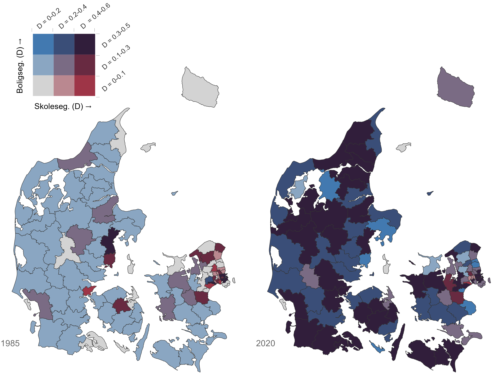

# Grundskoler som mødested (**WIP DO NOT CITE!**) {#kap3}

```{r fig-schoolseg, echo=FALSE, out.width= "100%", fig.cap="Skolesegregering som det tolkes af en AI model"}
knitr::include_graphics("images/dalle-schoolseg.png")
```

<!---
Vi kan kryd-ref til figurer \@ref(fig:fig-schoolseg)
--->

## Introduktion 

Den danske grundskole er et centralt mødested mellem danskfødte, der er kendetegnet ved hvid hudfarve og kulturkristendom, og etniske minoriteter, hvoraf mange ikke deler disse kendetegn. Med andre ord, grundskolen er et rum hvor børn kan interagere med hinanden, uanset deres ligheder med andre børn og deres forældre.  

Grundskolen i Danmark omfatter børn i alderen 6-16 år. Et særligt kendetegn ved den danske grundskole, sammenlignet med andre internationale skolesystemer, er fraværet af "tracking"—elevdifferentiering--baseret på faglige evner. Det betyder, at børn ikke bliver placeret på bestemte skoler eller spor afhængigt af deres præstationer i de tidlige skoleår, som det er tilfældet i andre europæiske lande som Tyskland, Holland og England. I stedet fastlægger folkeskoleloven, at undervisningen i det danske skolesystem skal tilpasses til det pågældende klasserum gennem undervisningsdifferentiering.  

I den internationale kontakt- og integrationslitteratur fremhæves skoler ofte som steder med potentiale til at nedbryde fordomme og stereotyper. Det vil sige, ________. Dette potentiale for at nedbryde fordomme og stereotyper skyldes flere faktorer: 1) Børnene befinder sig i en kontekst, hvor der er en autoritet (læreren), der strukturerer interaktioner og opgaver. 2) Børnene forventes at have et fælles mål (læring/eksamener). 3) De arbejder sammen om dette mål i overensstemmelse med skolens didaktiske principper. 4) Børnene har samme status[^1] i klassen (alle er elever underlagt læreren) [@allport1979; @pettigrew2006; @tropp2005]. Optimal social kontakt i denne kontekst, som påpeget af @pettigrew1998, er også betinget af, 5) at interaktionerne har venskabspotentiale. Da børn i en klasse har samme alder, og der som regel er en nogenlunde lige kønsfordeling i de fleste skoler, er der et principielt højt venskabspotentiale i de danske grundskoler [@mcpherson2001]. 

[^1]: Det skal selvfølgelig ikke underkendes at der er både forskning og personlige historier, der beskriver tilfælde af diskrimination og fordomme mellem lærer og minoritetselever og elever imellem [@andersen2019].  

International forskning har vist, at børn i såkaldte "blandede skoler" har flere venskaber eller sociale relationer på tværs af etniske gruppeskel [@kruse2019; @leszczensky2015]. En anden forventet effekt er de såkaldte klassekammerateffekter (peer effect), som antager, at ressourcestærke elever kan være med til at hæve det faglige niveau for deres mindre ressourcestærke klassekammerater. Der pågår dog samtidigt diskussioner om, at både kontakt- og klassekammerateffekter i en metodologisk forstand er svære at isolere kausalt, da der forventeligt er grundlæggende problemer med selvselektion. For eksempel vil familier med de allerede laveste fordomme være mere tilbøjelige til at vælge den etnisk diverse distriktsskole (se f.eks. @hassan2022 eller @hermansen2015 for en oversigt og diskussion).  

Med det danske princip om undervisningsdifferentiering i stedet for elevdifferentiering er den danske grundskole forventeligt et eksempel på optimal realisering af positive kontakt-effekter gennem sociale relationer på tværs af grænser i et barns formative år [@larsen2024a; @larsen2016], især i betragtning af, at børnene tilbringer 10 år sammen i alle fag. Den aktuelle udfordring er imidlertid, at Danmark har en meget liberal og generøs skolevalgspolitik, hvor omkring 75% af omkostningerne for hvert enkelt barn er statsfinansierede, mens den resterende fjerdedel er brugerbetaling, hvilket gør privatskoler tilgængelige for en stor del af befolkningen - men samtidig utilgængelige for de laveste indkomstgrupper. Dette har skabt bekymringer for, at det socialdemokratiske princip om, at børn fra forskellige baggrunde går på samme skole, ikke længere bliver realiseret, fordi forældre frit kan vælge skoler til og fra.  

Historisk set går retten til at bestemme over sit barns skolegang i Danmark, under myndighedernes tilsyn, tilbage til Friskoleloven fra 1855. I dag tillader reglerne, at selvom hver adresse er tilknyttet et skoledistrikt, hvor barnet har garanteret ret til indskrivning, er familier frie til at søge en anden folke-, privat- eller friskole, enten inden for kommunen eller i en anden kommune. Det eneste lovlige grundlag, en folkeskole kan afvise et barns optagelse på, er, hvis skolen ikke har plads, hvilket defineres som 28 børn i hver klasse i den pågældende årgang[^2]. Til forskel kan fri- og privatskoler permanent bortvise børn eller afvise optagelse baseret på en individuel vurdering, hvilket folkeskoler også kunne før 2005. Disse strukturelle forhold har affødt en grundlæggende bekymring for, at frit skolevalg og det private skolemarked vil føre til stigende ulighed og segregation mellem skoler på grund af socioøkonomiske forskelle i, hvem der i størst omfang vælger – eller er i stand til – at benytte sig af muligheden for frit skolevalg.  

[^2]: Kommuner kan dog sænke dette maksimum, for at begrænse mulighederne for anvendelsen af skolevalg. Grundet den decentrale finansiering af folkeskolen har de enkelte folkeskoler også store individuelle omkostninger ved at flytte et barn til et specialtilbud og kan i praksis ikke udelukke børn fra skolen. I modsætning har privatskolerne mindre udgifter i forbindelse med henvisninger til specialtilbud idet de søger disse midler hos staten, hvor folkeskolerne skal finde midlerne i deres kommunalt allokerede budget.  

I dette kapitel vil jeg beskrive og illustrere omfanget af segregering i det danske grundskolesystem fra 1985 til 2020. Selvom skolesegregering på mange måder er et velbeskrevet fænomen i den internationale litteratur (se @larsen2024a for et overblik), er disse beskrivelser fortsat ofte grovkornede, da de er baseret på aggregerede tabeldata, såsom survey-baserede census data. Med de danske registerdata er det muligt at lave en detaljeret og mere finkornet beskrivelse af fordelingen af børn mellem skoler, da disse data indeholder detaljeret information om hvert enkelt barn i alle skoler, inklusive privat- og friskoler, hvilket sjældent er tilgængeligt i den internationale segregeringslitteratur.   

Det resterende af kapitlet er opdelt i fire sektioner. Første sektion præsenterer det danske skolelandskabs geografi og demografi. Anden sektion måler graden af segregering på både nationalt og kommunalt niveau. Dette efterfølges af en præsentation og diskussion af, hvordan skolesegregering skal ses som et produkt af boligsegregering. Fjerde sektion konkluderer og diskuterer implikationer.  

## Betingelser for møder i grundskolen

Den primære hindring for realiseringen af kontakt- eller klassekammerateffekter i barndommen er først og fremmest omfanget af skolesegregering, da det konkret forhindrer kontakt mellem grupper af børn, hvis de ikke møder hinanden i deres daglige liv [@kruse2017].

Segregering er et udtryk for en fysisk adskillelse af personer fra forskellige klassificerede grupper[^3]. Typisk er segregering blevet drøftet i forhold til (etnisk) boligsegregering, som angiver i hvilket omfang personer med indvandrerbaggrund bor i de samme boligområder som danskfødte personer – og omvendt. På samme måde udtrykker etnisk skolesegregering i hvilket omfang danskfødte børn kun går på skoler med andre danskfødte børn, og vice versa. En vigtig pointe her er, at segregering refererer til fordelingen eller spredningen af de to grupper, der sammenlignes. Det vil sige, at minoritetsgruppen ikke kan være segregeret uden at majoritetsgruppen også er det.  
	
[^3]: Disse grupper kan være defineret som majoritet/minoritet status, social status, køn, og alle andre former for identitets-, økonomiske, eller sociale faktorer.  

### Det danske skolelandskab

Når vi ser på det fysiske skolelandskab, det vil sige alle skoler og deres adresser, var det danske skolelandskab i 1985—det tidligste år, vi har data—bestående af 1327 skoler, hvoraf 246 var privat- eller friskoler[^4]. I 2020—det seneste år, vi har data for—var der samlet 1848 individuelle skoler[^5], hvoraf 545 var privat- eller friskoler[^6]. I 2020 havde 12% af alle børn i niende klasse, enten første eller anden generation indvandrerbaggrund. Til sammenligning det kun under 2% i 1985.  

[^4]: For skoler, der lukkede før institutionsregistreret blev centraliseret, er disse skoler manuelt kodet som hhv. folkeskole eller privat-/friskole.  

[^5]: En teknisk bemærkning er, at nogle skoler er blevet lagt sammen som afdelinger under den samme hovedskole. Selvom de er fysisk adskilte skoler, er de afdelinger af den samme institution og har fælles ledelse. I en teknisk forstand er de den samme institution. I forhold til skolevalg betyder det, at forældre kun kan vælge eller være indskrevet på hovedskolen, men principielt ikke frit kan vælge mellem afdelingerne, selv hvis de ligger nær hinanden.  

[^6]: Denne optælling ser bort fra alle specialtilbud, efterskoler og lignende og inkluderer kun institutioner, der i institutionsregistret er klassificeret som folkeskole eller privat- og friskole. Med denne begrænsning af data var der omkring 2,8 millioner børn, der på mindst ét tidspunkt har været registreret i det danske skolesystem på tværs af alle klassetrin.   

Fra et geografisk perspektiv er der stor variation i, hvor tæt skoler ligger på hinanden. Dette har en indirekte betydning for omfanget af frit skolevalg, da områder med få skoler inden for relativt kort afstand også har færre reelle muligheder for at vælge alternative til distriktskolen, som diskuteret ovenfor. Figur \@ref(fig:fig-3-1) visualiserer antallet af skoler inden for 2 km fra centroiden af bopælssognet[^7]. Kortet fungerer på sin vis som en proxy for befolkningstæthed, da der naturligvis vil være flere skoler i områder med mange familier. Men grundet lave omkostninger ved etablering af private- eller friskoler vil nogle områder stadig have et relativt stort skolemarked, på trods af relativ lav befolkningstæthed[^8]. Derfor er det sådan, at familier i urbane områder generelt har flere skoler, de potentielt kan vælge mellem. De fleste husstande i Danmark har to skoler inden for 2 km, men som strålende outliers er der i København og Frederiksberg henholdsvis 20 og 24 skoler inden for 2 km[^9].  

[^7]: Centroiden, eller det geografiske midtpunkt, er punktet, der repræsenterer den gennemsnitlige position for et område, såsom et bopælssogn.  

[^8]: For at åbne en fri- eller privatskole er den eneste ikke-refunderbare direkte omkostning et gebyr på 20.000 kr. til ministeriet i forbindelse med anmeldelse om oprettelse af ny skole.  

[^9]: Det skal bemærkes, at et skæringspunkt på 2 km for, hvornår skoler er tæt på bopælen, selvfølgelig delvist er et arbitrært skæringspunkt, da familier har forskellige behov, præferencer og muligheder for transport. Kortet ser dog grundlæggende ens ud, hvis vi hæver skæringsgrænserne, og der er blot et tilsvarende antal flere skoler i hver kategori.   


```{r fig-3-1, echo=FALSE, out.width= "100%", fig.cap="Gennemsnitligt antal skoler indenfor 2 km. af bopæls-adressen (A) og koncentration af børn med ikke-vestlig indvandrerbaggrund i skolealderen i 2020 (B). <br> <br> Note: *Afstandene til skolen er baseret på den euclidiske afstand fra bopælssognets centroid til de geografiske koordinater for skolens adresse. Ikke-vestlig indvandrerbaggrund inkluderer børn, hvor begge eller én af forældrene er første generations immigrant fra et ikke-vestligt land.*"}
knitr::include_graphics("images/figur_3_1c_distance_antal.png")
```


Det centrale her er, at fordi børnefamilier med indvandrerbaggrund er koncentreret i urbane områder (se [kapitel 1](#kap1)), er konsekvensen en stærk korrelation mellem store skolemarkeder (områder med mange skoler at vælge mellem) og områder med høj etnisk diversitet. Det betyder, at der i urbane områder på den ene side er et strukturelt potentiale for "blandede" skoler med høj gensidig eksponering. Samtidig er der dog også, på den anden side, et stort strukturelt potentiale for etnisk skolesegregering, der overstiger det niveau, der er betinget af etnisk boligsegregering, fordi der er nok skoler til, at familier realistisk kan undgå de mindre attraktive skoler ved at indskrive deres børn på andre skoler [@larsen2024b]. Disse mindre attraktive skoler er — rimeligt eller ej — ofte associeret med en høj andel elever fra ikke-vestlige immigrantbaggrunde[^10].   

[^10]: De fleste familier angiver, når de bliver spurgt, at det vigtigste kriterium i skolevalget er barnets trivsel og skolens "faglige kvalitet" [@epinion2017]. Denne kvalitet kan dog ofte være svær at vurdere i praksis, så det udefra observerbare elevgrundlag bliver ofte en proxy for vurderet kvalitet og skolens omdømme [@rambøll2011]. Empiriske studier viser, at familier med de højeste uddannelser også er mest sensitive over for antallet af "ikke-indfødte" elever på en skole [@bjerrenielsen2020; @nielsen2019; @karsten2003]. Efter trivsel og "faglig kvalitet" er "afstand til skolen" fra bopælen også et kriterium for flere forældre [@epinion2017].   

## Segregering i det danske skolelandskab

Når vi måler graden af segregering er det mest anvendte anvendte mål for (skole)segregering Dissimilarity ($D$) indekset, men også Separation ($S$) indekeset har en vis udbredelse[^11]. Den grundlæggende forskel mellem de to mål er at $D$ måler graden af ulige fordeling og $S$ måler graden af polarisering. Lidt simplifiseret vil det sige at $D$ måler hvor mange fra én af grupperne i sammenligningen, der hypotetisk skal flyttes til en ny skole for at fordelingen er “lige”. “Lige fordeling” er i denne kontekst et udtryk for en situation hvor samtlige skoler i en kommune har samme andel minoriteter som der er på kommunalt niveau. Igen en smule simplifiseret skal $S$, på den anden side, tolkes som omfanget af skoler der udelukkende har elever fra minoritets eller majoritetsbaggrund og kan dermed tolkes som et spektrum af polarisering. Begge mål kan have værdierne 0-1 og i empiriske cases vil de to mål essentielt altid være korrelerrede. $S$ er typisk noget lavere end $D$, da $S$ korregerer for størrelsen af skoler og grupper, mens $D$ ikke gør (se [bilag A](#bilag1) for yderlig information).  

[^11]: S er også kendt under andre navne, såsom eta2, variansratioen eller korrelationsratioen. Se @fossett2017 for en detaljeret diskussion af forskellen mellem S og andre mål for segregering.

### National skala 

På landsplan måles segregeringen til $D = 0,44$ og $S = 0,16$ i 2020, se Figur \@ref(fig:fig-3-2). Præcis hvornår segregering er "for højt" er delvist et politisk og normativt spørgsmål. Ifølge den klassiske (amerikanske) segregeringslitteratur anses $D < 0,3$ som lavt, mens $D > 0,6$ betragtes som højt [@massey1994]. I en segregeringskontekst vil $S=0,6$ betragtes som meget højt, da der vil være en betydelig mængde skoler, der (næsten) udelukkende består af enten majoritets- eller minoritetsbaggrund.

```{r fig-3-2, echo=FALSE, out.width= "100%", fig.cap="Etnisk skolesegregering i Danmark"}
knitr::include_graphics("images/figur_3_2.png")
```

Graden af segregering i Danmark vil derfor være at betragte som moderat i dag, hvilket kan være overraskende for nogle, givet den aktuelle offentlige debat. På nationalt plan har segregeringen faktisk været faldende. Selvom fordelingen har været skæv, især frem til årtusindskiftet, har der ikke været egentlig polarisering, hvor minoritetsgrupper har gået på skoler med meget begrænset kontakt til majoritetsgrupper. Graden af segregering har grundlæggende været strukturelt betinget idet der ikke har været tilstrækkeligt mange minoritetsbørn, og de har været koncentreret i for få kommuner til, at de praktisk kunne fordeles blandt alle skoler i Danmark. Fordelingen af denne gruppe børn ville altså være skæv, selv ved en tilfældig fordeling af børn mellem skolerne. Samtidig har vi dog set en stigning i S-indekset frem til omkring 2007. Denne stigning skal ses i lyset af bosættelsesmønstrene blandt immigranter. Når visse kommuner oplever en relativ koncentration af immigranter, vil der i numerisk forstand være "nok" børn med indvandrerbaggrund til at udgøre en større andel af elevgrundlaget på en skole. Især fremkomsten af muslimske friskoler bidrager til polarisering i en segregeringskontekst, især når der samtidig også er skoler, hvor alle børn er danskfødte.

### Lokal skala 

Når segregering måles på en stor skala, som f.eks. på landsplan, skjules betydelige lokale variationer i gennemsnittet. Ved at måle skolesegregering i de enkelte kommuner over tid, med fokus på år 1985 og 2020 (se Figur \@ref(fig:fig-3-3)), ser vi i 1985, at i nogle kommuner lå segregeringsniveauet på $0,2-0,4$, mens det i andre kommuner var over $0,4$. Det er dog væsentligt at bemærke, at ingen af disse kommuner havde høj segregering, hvis det måles som polarisering ($S$. Alle kommuner havde et segregeringsniveau under $0,1$ målt som $S$ i 1985. Tolkningen af disse to dimensioner af segregering i sammenhæng er derfor, at selvom der isoleret set var relativt høje grader af segregering i flere kommuner i 1985, skyldtes dette i høj grad strukturelle forhold, som diskuteret ovenfor.


I 2020 ændrer dette billede sig markant. Vi ser, at mange kommuner har både en høj grad af ulige fordeling af minoritetsbørn mellem skoler ($D$), og at børn med indvandrerbaggrund udgør en betydelig del af elevgrundlaget på visse skoler ($S$), og vice versa for danskfødte børn. Med andre ord begynder segregering, målt som både $D$ og $S$, at korrelere stærkere over tid, hvilket betyder, at skolesegregeringen i mange kommuner i dag er præget af ikke bare en ulige fordeling mellem skoler som en strukturel betingelse, men også polarisering mellem skoler, hvor der er stadig flere skoler, hvor børn med indvandrerbaggrund udgør store dele af elevgrundlaget, samtidig med at andre skoler stort set ingen elever med indvandrerbaggrund har. Denne udvikling skyldes delvist det private skolemarked, hvor for eksempel de Muslimske friskoler i høj grad bidrager til kommunal skolesegregering, da disse skoler både har en ren minoritetskoncentration og dermed er polariserede i forhold til de andre lokale skoler med få eller ingen minoritetsbørn. Derudover bidrager sådanne skoler til, at minoritetsbørn "trækkes ud" af omkringliggende lokale skoler og øger dermed koncentrationen af danskfødte børn på disse skoler, hvilket igen øger polariseringen yderligere mellem lokale skoler. Den samme proces gør sig selvfølgelig gældende for alle private og friskoler, der henvender sig til bestemte grupper, såsom kristne eller jødiske skoler.    

```{r fig-3-3, echo=FALSE, out.width= "100%", fig.cap="Etnisk skolesegregering i Danmark på kommunalt niveau, 1985 og 2020"}
knitr::include_graphics("images/Figur4.png")
```


Det er blevet beskrevet mange steder i dansk såvel som i international forskning, at segregeringsniveauet er betydeligt højere blandt privat- og friskoler end det er blandt folkeskoler isoleret set (se @larsen2024a for overblik). I Danmark var skolesegregeringen blandt privat- og friskoler $D=0,81$ og $S=0,07$ i 1985 og $D=0,44$ og $S=0,27$ i 2020. Dette står i kontrast til segregeringen mellem folkeskolerne isoleret set, hvor skolesegregeringen var $D=60$ og $S=0,16$ i 1985 og $D=0,58$ og $S=0,44$ i 2020.

## Skolesegregering som produkt af boligsegregering 

Som det blev diskuteret i [afsnit 1.1][Det danske skolelandskab], er der stor variation i koncentrationen af familier med indvandrerbaggrund og afstanden mellem skoler. Som andre har vist, er koncentrationen af familier med indvandrerbaggrund ikke kun mellem kommuner, men også inden for kommuner, hvor nogle nabolag er kendetegnet ved høje koncentrationer af minoriteter—i særlig høj grad gældende for den almene boligsektor [@andersen2019a: @landsbyggefonden2020]. Bemærkelsesværdigt er også, at kommuner med få familier med indvandrerbaggrund angiver, at de ikke ser, at frit skolevalg fører til øget etnisk segregering, mens kommuner med mange familier med indvandrerbaggrund siger det modsatte [@rambøll2011].

Som jeg [@larsen2024c] og andre [@bunar2010; @butler2007; @boterman2019] også har diskuteret, giver det altså en forventning om, at skolesegregering skal forstås i direkte relation til boligsegregering. Fordi de skoler, en familie enten automatisk indskrives i—distriktsskolen—eller har mulighed for at vælge som alternativ, helt grundlæggende er betinget af de skoler, der er i nærheden af boligen.

Kigger vi på sammenhængen i segregering (målt som $D$) på henholdsvis bolig- og skolemarkedet, ser vi i Figur \@ref(fig:fig-3-4), at der er en klar sammenhæng mellem graden af bolig- og skolesegregering i de fleste kommuner og at denne sammenhæng er stigende (Pearson's $r=0,50$ i 2020 og $r=0,29$ i 1985). Med andre ord har de kommuner med høj boligsegregering typisk også høj skolesegregering[^12]. Selvom skolevalget principielt er ubegrænset, er der nogle skoler, der logisk set er for langt væk fra hjemmet til, at hverdagen ville kunne hænge sammen. Når familier, der ligner hinanden, bor tættere på andre familier, der ligner dem selv, end de gør med familier, der er forskellige fra dem, vil der være en observerbar tendens til, at børn, som ligner hinanden, også kommer til at gå i skole sammen.

[^12]: Skolesegregering kan også eksistere med lav boligsegregering—som @rangvid2007 også diskuterer og var aktuelt frem til tidlige 2000, som Figur \@ref(fig:fig-3-4) også illustrerer for 1985—ser vi en stærk sammenhæng mellem de to typer segregering i de fleste kommuner i 2020. Jeg understøtter dette med en dekomponeringsanalyse i @larsen2024b.

```{r fig-3-4, echo=FALSE, out.width= "100%", fig.cap="Etnisk skole- og boligsegregering i Danmark (D indeks) <br> <br> Note: *Boligsegregering er målt som de personer der går i den danske grundskole og ikke den fulde population. Boligsegregering er målt på sogne inddelinger og ikke skoledistrikter, da disse kun er tilgængelig for 19 kommuner og årene 2007-2017 i Danmarks Statistiks registre. Måles segregering med afsæt i skoledistrikter er sammenhængen markant udpreget (se Larsen, 2023b).*"}

```

## Konklusion

Denne bog har beskæftiget sig med mødet mellem den danskfødte befolkning og befolkningen med indvandrerbaggrund set i et historisk perspektiv i lyset af stigende immigration til Danmark. Dette kapitel har bidraget til denne problemstilling med en beskrivelse af, i hvilket omfang den danske grundskole danner et mødested for børn (og deres familier), som ikke ligner hinanden.	

Som jeg har beskrevet i dette kapitel, er segregering i det danske grundskolesystem "kun" moderat—og segregering har på nogle parametre været faldende over tid på grund af ændrede strukturelle forhold, såsom en større minoritetsbefolkning i de fleste kommuner. Det vil sige, at de danske skoler er mødesteder på tværs af etniske gruppeskel—men omfanget af møder i denne arena er langt fra “optimalt udnyttet”, og den positive udvikling har været langsom. Samtidigt er der tendenser der tegner et ikke-optimistisk billede af udviklingen. Den langsomme udvikling af mere blandende skoler skal tilskrives den disproportionalt geografiske koncentration af familier med indvandrerbaggrund i bestemte kommuner og nabolag. Mit centrale budskab er, at problemets omfang ikke har rod i eksistensen af frit skolevalg, som andre også argumenterer for (f.eks. @rambøll2011 eller Gandil i @zetland2018). Ikke at skolevalget ingen betydning har, men skolevalg øger kun segregering i bestemte områder [@rangvid2010]; skolevalget er ikke den mekanisme, der skaber segregering. I stedet skal skolesegregering forstås først og fremmest som et produkt af bosætningsmønstre, da det har en fundamental betydning for, hvilke skoler der er tilgængelige for den enkelte familie, uafhængigt af familiens muligheder for at vælge alternativer til distriktskolen. Hvad der yderligere bidrager til skolesegregering er, at disse muligheder samtidigt er betinget af, at de alternative skoler rent faktisk har plads til flere elever—hvilket de mest populære skoler sjældent har [@rambøll2011].  
	
	
