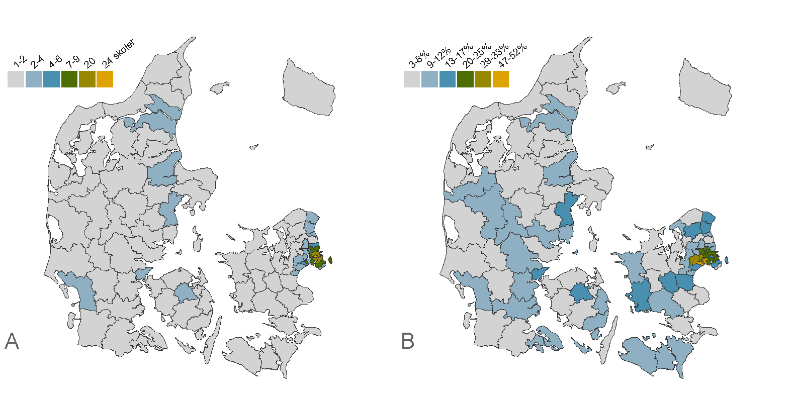
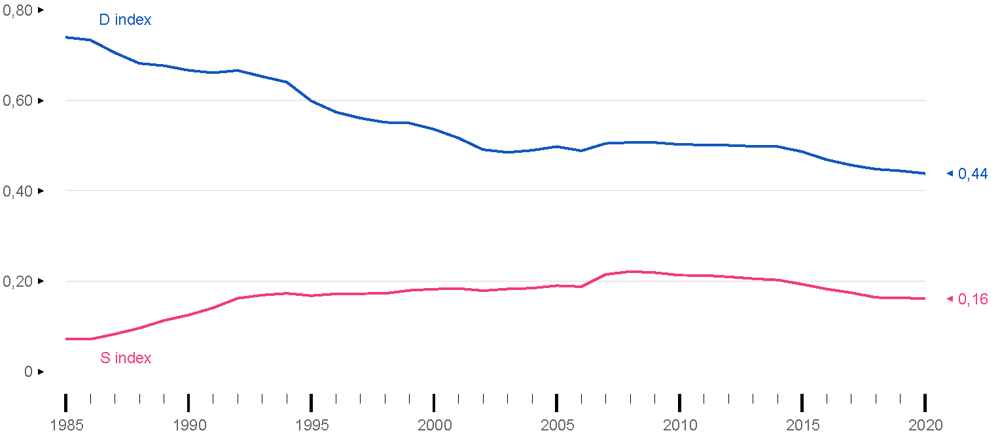
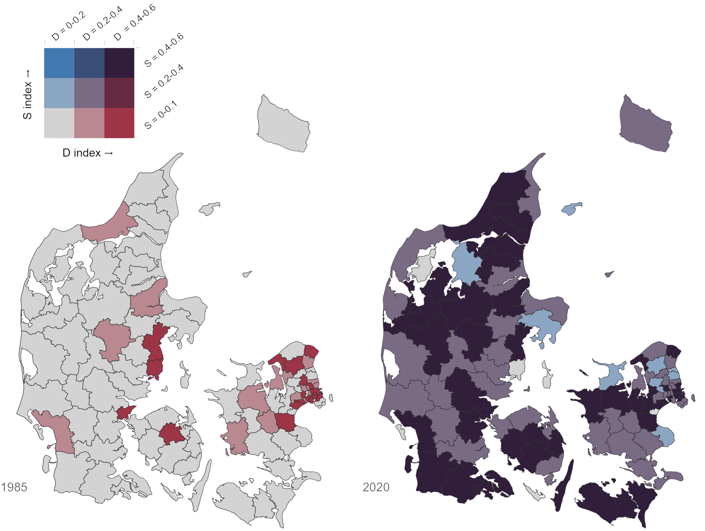
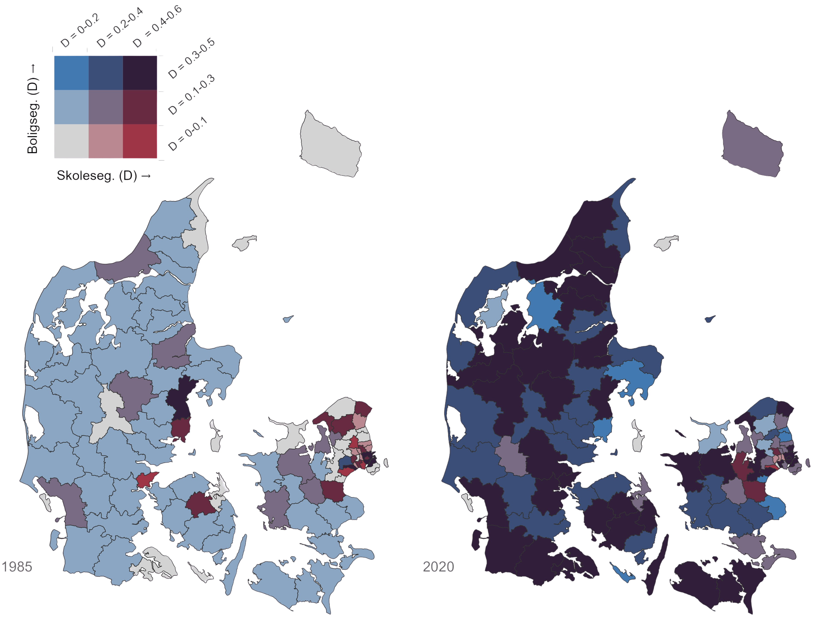

# Grundskoler som mødested {#kap4}

\thispagestyle{empty}

*[Jeppe Fjeldgaard Qvist](https://vbn.aau.dk/da/persons/jeppefl)*

&nbsp;&nbsp;&nbsp;&nbsp;

```{r fig-schoolseg, echo=FALSE, out.width= "100%"}

```

\newpage

Denne bog er interesseret i mødesteder, hvor man ikke selv vælger, hvem man mødes med, og hvor interaktionen mellem personerne er intensiv, se [kapitel 1](#kap1). Det er sådanne mødesteder, der har det største potentiale til at nedbryde etniske skillelinjer i befolkningen. Grundskolen er således både interessant fordi man ikke frit kan vælge sine klassekammerater og samtidigt kommer til at have intens kontakt med disse klassekammerater. Endvidere er grundskolen et mødested, hvor befolkningen mødes i en alder, hvor grundlæggende verdensopfattelser og normer formes. Det gør grundskolen endnu mere interessant for nedbrydningen af etniske skillelinjer. 

Historisk har den integrerende funktion af grundskoler haft stor politisk opmærksomhed. Det gælder både med hensyn til at skabe tillid og forståelse på tværs af sociale og etniske skillelinjer. Et nyere eksempel findes i Jens Joels (MF, Socialdemokratiet) bog Fællesskaberen, der handler om, at "tilliden, forståelsen og samhørigheden" i Danmark er truet. En trussel mod den danske sammenhængskraft, der bl.a. skyldes at vi ikke længere "mødes [...] i det, der før var 'folkets skole'. I hvert fald ikke i tilstrækkelig grad" [@joel2022, s. 11]. Joel formår fortrinligt at udtrykke forestillingen om grundskolen, som et sted, hvor befolkningen (bør) mødes på tværs af sociale og etniske skel for at skabe det langsigtede fundament for et samfund præget af tillid, forståelse og samhørighed. Man kan være mere eller mindre enig eller uenig i den diagnose, men der har hersket politiske enighed om, at det er problematisk, hvis indvandrere og efterkommere bliver koncentreret på nogle få enkelte skoler. Det man i forskningslitteraturen benævner skolesegregering. 

I dette kapitel vil jeg beskrive grundtrækkene i omfanget af skolesegregering i den danske grundskole fra 1985 til 2020. Med disse beskrivelser er det hensigten at nuancere og kvalificere de pågående debatter vedrørende den danske grundskole og dens rolle i de danske målsætninger for integration, se [kapitel 7](#kap7). Jeg vil ikke tage stilling til, hvornår segregeringen er for høj. Jeg vil heller ikke diskutere, hvorvidt mindre skolesegregering altid er godt [men se eventuelt @larsen2024phd]. Jeg koncentrerer mig om at beskrive, hvordan skolesegreringen ser ud, hvilket kræver en del analysearbejde. Min konklusion er, at den etniske skolesegregering på landsplan er moderat og har været svagt faldende. Men samtidigt er der stor variation på tværs af i kommuner. I de største byer findes en skolesegregering, der er drevet af mange skoletilbud indenfor en snæver geografisk radius samt dynamikker på boligmarkedet. 

Kapitlet er inddelt i syv afsnit. I første afsnit gives en kort introduktion til kontaktteorien, der blev nævnt og kommenteret i [kapitel 1](#kap1), med fokus på teoriens relevans i en (grund)skolekontekst. Dernæst præsenteres det danske skolelandskab, med et fokus på grundskolens demografi og geografi. I tredje afsnit bliver de anvendte metoder til at måle segregering præsenteret. En detaljeret introduktion til disse metoder er tilgængelig i [bilag A](#bilag1). Fjerde og femte afsnit beskriver omfanget af segregering i Danmark på hhv. national og kommunal skala. Sjette afsnit diskuterer hvordan graden af skolesegregering kan tolkes som et biprodukt af boligsegregering. Sidste afsnit opsummerer og gør status på omfanget af skolesegregering i Danmark.

## Betydningen af at mødes i grundskolen 

I den internationale kontakt- og integrationslitteratur fremhæves skoler ofte som steder med potentiale til at nedbryde fordomme og stereotyper. Kontakt mellem grupper i en skolekontekst på daglig basis kan være med til at skabe gensidig forståelse og konfrontere uberettigede fordomme og stereotyper fordi børn får mulighed for at møde og se hinanden som individer og ligeværdige elever fremfor som medlemmer af deres respektive grupper.  På en række områder lever grundskoler også op til Allports fire kriterier, jævnfør [kapitel 1](#kap1): (1) Børnene befinder sig i en kontekst, hvor der er en autoritet, der strukturerer interaktioner og opgaver (læreren), (2) børnene forventes at have et fælles mål (leg/læring/eksamener), (3) de arbejder sammen om dette mål i overensstemmelse med skolens didaktiske principper, og (4) børnene har samme status i klassen (alle er elever underlagt læreren) [@allport1954; @pettigrew2006; @tropp2005].

International forskning har da også vist, at børn i "blandede” skoler har flere venskaber på tværs af etniske gruppeskel [@kruse2019; @leszczensky2015]. En anden forventet effekt er de såkaldte klassekammerateffekter (peer effects), hvor ressourcestærke elever kan være med til at hæve det faglige niveau for deres mindre ressourcestærke klassekammerater.[^400] Modsat er der dog også forskning, der dokumenterer og beskriver tilfælde af diskrimination og fordomme mellem lærer og minoritetselever og elever imellem [fx @andersen2019]. Lige status er derfor ikke nødvendigvis givet i en skolekontekst. Men ansigt-til-ansigt relationer i skoler anses her grundlæggende som et positivt potentiale for at skabe tværetniske sociale relationer og nedbryde fordomme.

[^400]: Der pågår dog samtidigt diskussioner om, at både kontakt- og klassekammerateffekter i en metodologisk forstand er svære at isolere kausalt, da der forventeligt er grundlæggende problemer med selvselektion. For eksempel vil familier med de allerede laveste fordomme være mere tilbøjelige til at vælge den etnisk diverse distriktsskole (se fx @hassan2022 eller @hermansen2015 for en oversigt og diskussion, se også [kapitel 7](#kap7))

## Den danske grundskole 

Grundskolen i Danmark omfatter børn i alderen 6--16 år. I 1985---det tidligste år, vi har data---var der 1327 skoler, hvoraf 246 var privat- eller friskoler. I 2020---det seneste år, vi har data---var der samlet 1848 skoler, hvoraf 545 var privat- eller friskoler.[^42] I 2020 havde 12 procent af alle børn i niende klasse enten første eller anden generations indvandrerbaggrund. Til sammenligning gjaldt det under to procent i 1985.

[^42]: Alle optællinger er baseret på [institutionsregistret]( https://data.stil.dk/InstregV2/Default.aspx?ReturnUrl=%2finstregv2%2f&AspxAutoDetectCookieSupport=1). Optælling af skoler ser bort fra alle specialtilbud og efterskoler og inkluderer kun institutioner, der i institutionsregistret er klassificeret som folkeskole eller privat- og friskole. I de mellemliggende år mellem 1985 og 2020, og særligt siden 2007, er der et stort antal skoler som er blevet lukket eller sammenlagt trods den absolutte stigning siden 1985. 

Et særligt kendetegn ved den danske grundskole er fraværet af såkaldt *tracking*. Det betyder, at børn ikke bliver placeret på bestemte skoler eller spor afhængigt af deres præstationer i de tidlige skoleår, som det er tilfældet i lande som Tyskland, Holland og England. I stedet fastlægger [folkeskoleloven](https://arkiv.emu.dk/sites/default/files/2019-01/Vidensnotat%20-%20Undervisningsdifferentiering.pdf), at undervisningen i det danske skolesystem skal tilpasses det pågældende klasserum. Det er ikke klasserummet, der skal tilpasses undervisningen.  Hensyntagen til forskelle i elevernes faglige niveau skal i stedet ske gennem  undervisningsdifferentiering internt i den givne klasse (fra børnehaveklassen frem til afgangseksamen i alle fag). Den fælles skolegang på tværs af niveauer vidner om, at der er udbredt konsensus om, at ”folket” skal mødes på tværs af skel i den danske grundskole. Det kommer også til udtryk i [folkeskoleloven](https://arkiv.emu.dk/sites/default/files/2019-01/Vidensnotat%20-%20Undervisningsdifferentiering.pdf).

Samtidigt har Danmark dog en meget liberal og generøs skolevalgspolitik, der muliggør, at forældre kan vælge mellem forskellige offentlige og private skoler. Derfor gælder det, at selvom hver adresse er tilknyttet et skoledistrikt, hvor barnet har garanteret ret til indskrivning, så kan forældre frit søge om indskrivning på en anden folke-, privat- eller friskole, enten inden for kommunen eller endda i en anden kommune. Det eneste lovlige grundlag, den enkelte folkeskole kan afvise et barns optagelse på, er, hvis skolen ikke har plads, hvilket i folkeskoleloven defineres, med få muligheder for afvigelse, som *maksimum* 28 børn i hver klasse i den pågældende årgang. Fri- og privatskoler kan afvise elever og kan permanent bortvise børn, baseret på en individuel vurdering. En mulighed folkeskolerne mistede med den nye [folkeskolelov i 2005](# https://www.retsinformation.dk/eli/lta/2005/393). Vigtigere er det dog, at omkring 75% af omkostningerne for hvert enkelt barn på en privatskole er statsfinansieret. Denne skattefinansiering gør privatskoler tilgængelige for en stor del af befolkningen, hvilket gør dem mere ”folkelige”. Men samtidigt er en egenfinansiering omkring 25 procent formentligt med til at gøre privatskolerne utilgængelig for de laveste indkomstgrupper.[^43]

[^43]: For at åbne en fri- eller privatskole er den eneste ikke-refunderbare direkte omkostning et gebyr på 20.000 kr. til ministeriet i forbindelse med anmeldelse om oprettelse af ny skole.

Der er opstået en bekymring for, at kombinationen af fravær af tracking, forældres stigende fokus på, hvem deres børn går i skole med [se @andersen2019], samt omfangsrige muligheder for frit skolevalg kan udfordre målsætningen om, at grundskolen skal være et sted, hvor børn mødes på tværs af sociale og etniske skel, jævnfør indledningen. Bekymringen er, at stigende ulighed og indvandring fører til øget segregation på grund af forskelle i, hvem der i størst omfang vælger---eller er i stand til---at benytte sig af muligheden for frit skolevalg ved skolestart eller i løbet af barnets skolegang.[^11133]. De fleste forældre angiver i spørgeskemaundersøgelser, at det vigtigste kriterie i skolevalget er barnets trivsel og skolens faglige kvalitet [@epinion2017; @andersen2019]. Denne kvalitet kan dog ofte være svær at vurdere i praksis, så det observerbare elevgrundlag bliver ofte en målestok for vurderet kvalitet og skolens omdømme [@rambøll2011]. Det viser sig også, at familier med de højeste uddannelser er mest sensitive over for antallet af "ikke-indfødte" elever på en skole [@bjerre-nielsen2020; @karsten2003].

[^11133]: En anden direkte relateret bekymring er omfanget af ”lære-segregering”. Forskning har vist at de mest ressourcestærke lærer også underviser de mest ressourcestærke børn [@gensowski2020], hvilket kan give disse børn en *dobbelt-fordel*. 

Afstanden til skolen fra bopælen er dog også et vigtigt kriterium for mange forældre [@epinion2017; @andersen2019]. Derfor kan sammenhængen mellem antallet af skoler og koncentrationen af børn med indvandrerbaggrund være med til at forstå de udfordringer og muligheder, der eksisterer for integration og skolevalg i forskellige geografiske områder. Det er derfor vigtigt, at der er stor variation i, hvor tæt skoler ligger på hinanden. Denne geografi har en indirekte betydning for omfanget af frit skolevalg. I områder med få skoler er der reelt ikke et frit skolevalg. Figur \@ref(fig:fig-4-1) illustrerer antallet af skoler inden for to km fra det geografiske midtpunkt af bopælssognet. Kortet fungerer delvist som en indikator for befolkningstæthed, da der naturligvis vil være flere skoler i områder med mange familier. Derfor gælder det, at familier i byområder generelt har flere skoler, de potentielt kan vælge mellem. I figur \@ref(fig:fig-4-1).A vises det, at de fleste husstande i Danmark har to skoler inden for en pendleafstand på to km. Men der er dog  bemærkelsesværdige afvigelser fra gennemsnittet. I København og Frederiksberg er der henholdsvis 20 og 24 skoler inden for to km. Der gør sig således nogle vilkår gældende for skolesegregering i hovedstadsområdet, der er helt anderledes end i resten af landet landet.

```{r fig-4-1, echo=FALSE, out.width= "100%", fig.cap="Gennemsnitligt antal skoler inden for 2 km af bopælsadressen (A) og koncentration af børn med ikke-vestlig indvandrerbaggrund i skolealderen i 2020 (B).", fig.topcaption=TRUE}

```

```{r, results="asis", echo=FALSE}

if (knitr::is_html_output()) {
  cat('<p style="text-align:left; font-style:italic; color:gray; font-size: 0.85em;">\n')
  cat('Note: Afstandene til skolen er baseret på den euclidiske afstand fra bopælssognets centroide (midtpunkt) til de geografiske koordinater for skolens adresse og er aggregerede som et kommunalt gennemsnit. Ikke-vestlig indvandrerbaggrund inkluderer børn, hvor enten begge eller én af forældrene er første generations indvandrer fra et ikke-vestligt land.\n')
  cat('</p>\n')
} else if (knitr::is_latex_output()) {
  cat('\\begin{footnotesize}\\textit{\\textcolor{gray}{\n')
  cat('Note: Afstandene til skolen er baseret på den euclidiske afstand fra bopælssognets centroide (midtpunkt) til de geografiske koordinater for skolens adresse og er aggregerede som et kommunalt gennemsnit. Ikke-vestlig indvandrerbaggrund inkluderer børn, hvor enten begge eller én af forældrene er første generations indvandrer fra et ikke-vestligt land.\n')
  cat('}}\n\\end{footnotesize}\n')
}

```

Det er velkendt, at familier med indvandrerbaggrund er koncentreret i byområder, særligt familier med ikke-vestlig oprindelse, se figur \@ref(fig:fig-4-1) og [kapitel 1](#kap1). Konsekvensen er et sammenfald mellem store skolemarkeder (\@ref(fig:fig-4-1).A; områder med mange skoler at vælge mellem) og områder med høj etnisk diversitet (\@ref(fig:fig-4-1).B). I byområder er der derfor, på den ene side, et potentiale for "blandede" skoler med høj eksponering mellem majoritets- og minoritetsgrupper. På den anden side er der dog også et stort potentiale for etnisk skolesegregering, da der er nok skoler til, at forældre realistisk kan undgå de mindre attraktive skoler ved at indskrive deres børn på andre skoler [@larsen2024b]. Byområder med mange skoler og høj etnisk diversitet står således over for udfordringen med at sikre, at skoler forbliver “blandet” i lyset af forældrenes frie muligheder for at anvende skolevalget (eller omvendt kan man sige, at landdistrikter kan være udfordret af *begrænsede* skolevalgsmuligheder). Af denne grund skelner jeg i nedenstående mellem udviklingen af skolesegregeringen på lands- og kommuneniveau. 

## Hvordan måler vi segregering? 

Når man måler graden af (skole)segregering, er det mest anvendte mål  *Dissimilarity* ($D$) indekset, men også *Separation* ($S$) indekset har en vis udbredelse[^40]. Begge mål kan tage værdierne 0-1. Den grundlæggende forskel mellem de to mål er, at $D$ måler graden af ulige fordeling af to gruppe (“hvor mange fra gruppe A skulle flyttes fra én skole til en anden for at opnå lige fordeling”), mens $S$ måler graden af polarisering mellem to grupper (“hvor sandsynligt er det at møde én fra gruppe A, hvis man selv tilhører gruppe B, og omvendt”). 

For $D$-indekset gælder det, at 0 betyder, at fordelingen af to grupper på de enkelte skoler perfekt svarer til fordelingen i befolkningen. Omvendt betyder 1, at ingen fra den etniske minoritets og den etniske majorits gruppe går i skole sammen. Virkelighedens fordelinger ligger oftest et sted imellem disse ekstremer. Hvis man for eksempel finder en værdi af $D$ = 0.1, betyder det, at ti procent af enten børn med indvandrerbaggrund eller ti procent af danskfødte børn skulle skifte skole for få en elevsammensætning på skolerne, der afspejler den generelle befolkningssammensætning af de to grupper.

For separationsindekset gælder det, at hvis $S$ = 0, vil et barn på en given skole have samme sandsynlighed for at møde børn fra den anden  gruppe, som hvis eleverne var fordelt tilfældigt---uafhængigt af skoler eller nabolag. Det betyder, at hvis 10 procent af børnene i en kommune har indvandrerbaggrund, så vil ethvert barn på enhver skole have 10 procents sandsynlighed for at møde et barn med indvandrerbaggrund. I den anden ende af skalaen, hvis $S$ = 1, vil børn på samtlige skoler udelukkende møde børn fra deres egen gruppe. Jo højere $S$-indekset er, desto flere skoler vil have en elevsammensætning, hvor børn med indvandrerbaggrund enten udgør en meget stor eller en meget lille andel af eleverne.

De to indeks måler altså to forskellige dimensioner af segregering[^0055] (se [Bilag A](# bilag1) for tekniske detaljer og @massey1988 eller @damm2022 for uddybende diskussioner af disse dimensioner). De to mål følger ofte hinanden, men det er ikke altid tilfældet.[^040] 

[^40]: $S$ er også kendt under andre navne, såsom $\eta^2$, variansratioen eller korrelationsratioen. Se @fossett2017 for en detaljeret diskussion af forskellen mellem $S$ og andre mål for segregering.

[^040]: $S$ er typisk noget lavere end $D$, da $S$ korrigerer for størrelsen af skoler og grupper, mens $D$ ikke gør (se [bilag A](#bilag1) for tekniske detaljer).

[^0055]: Lidt simplificeret kan man sige, at $D$ måler, hvor mange fra én af grupperne i sammenligning med én anden gruppe, der skulle flyttes til en ny skole for, at fordelingen er “lige”. “Lige fordeling” er i denne kontekst et udtryk for en situation, hvor samtlige skoler i fx en kommune eller nation har samme andel minoriteter som på kommunalt/nationalt niveau. Det vil sige, at indekset måler i hvilket omfang andelene på de enkelte skoler ligner den overordnede befolkningssammensætning i kommunen/nationen. Et lavt $D$-indeks udtrykker altså, at de fleste skoler har en andel af hver gruppe, der afspejler størrelserne af grupperne i populationen. Begrænsningerne i anvendelsen af $D$ er, at det ikke er påvirket af den absolutte størrelser af de grupper, der sammenlignes, da det kun er den relative fordeling, der indgår i målet. Det betyder at $D$ ikke fortæller noget om potentiel kontakt mellem minoritets og majoritets gruppen. Derudover er målet meget sensitivt overfor antallet og størrelsen af skoler, hvilket er en begrænsning når der sammenlignes mellem områder og over tid (se også [næste kapitel](#kap5)). 

$S$ indekset udtrykker i hvilket omfang børn fra forskellige grupper er isoleret fra hinanden. $S$ = 0 udtrykker en fordeling mellem skoler, hvor børn på alle skoler har den samme grad af intergruppe eksponering. Fx, hvis der er 10% børn med indvandererbaggrund i en kommune, har det gennemsnitlige barn en eksponering til børn med indvandererbaggrund på 10%. $S$ = 1 er i kontrast en situation, hvor børn *udelukkende* er eksponerede til andre børn fra deres egen gruppe. 

Præcis hvornår segregering er "for høj" er et politisk og normativt spørgsmål. Dog peger den klassiske (amerikanske) segregeringslitteratur på, at $D$ < 0,3 anses som lavt, mens $D$ > 0,6 betragtes som højt, mens værdierne imellem indikerer moderat segregering [@massey1994]. For $S$ vil 0,5 betragtes som højt, da det typisk vil betyder at der vil være skoler, der (næsten) udelukkende består af elever med enten majoritets- eller minoritetsbaggrund, hvilket ikke nødvendigvis er tilfældet ved et højt $D$ indeks.  

Diskussionen og bekymringerne samler sig normalt om fordeling af børn med ikke-vestlig oprindelse baggrund. De følgende analyser viser derfor segregering mellem børn af ikke-vestlig oprindelse og danskfødte børn. Bemærk også, at for perioden 1985-2007 har vi kun data for børn i 8. og 9. klasse. Så i den periode referer vores analyser til de disse to klassetrin. Fra 2008 og frem er data tilgængelig for hele grundskolen, hvorfor andele referer til andelen på tværs af hele elevgrundlaget fra 0. til 9. klasse. 

## Segregering på national skala 

På tværs af hele landet kan segregeringen af danskfødte børn og børn med ikke-vestlig oprindelse opgøres til $D$ = 0,44 og $S$ = 0,16 i 2020. I figur \@ref(fig:fig-4-2) ses udviklingen af begge mål for segregering over tid. I 1985 var segregering målt som $D$ = 0.74 og $S$ = 0.07. Det meste anvendte mål for segregering, D-indekset, er således faldet, mens $S$-indekset er steget. Vi ser dog $S$ er kontinuerligt, men forholdsvis svagt, stigende til 0.21 frem mod 2010, mens $D$ parallelt er faldende til 0.50 i samme periode. Herfra har segregering på national skala været næsten konstant frem til 2014, hvorefter begge måler falder en smule til 2020 niveauet. Denne nationale segregering afspejler sig også i eksponeringen. Det har vi målt som den andel af børn med hhv. dansk og ikke-vestlig baggrund på skolen, som det ”gennemsnitlige” barn fra hver gruppe møder. Man kan også kalde det sandsynligheden for, at den næste man møder på ens skole er fra den ”anden” gruppe. I 1985 gik et barn med ikke-vestlig baggrund på en skole, hvor ni procent af eleverne havde ikke-vestlig indvandrerbaggrund, i gennemsnit. I 2020 var den andel steget til 23 procent. Til sammenligning gik det gennemsnitlige barn med dansk oprindelse i 1985 på en skole, hvor under én procent (0,7%) af eleverne havde ikke-vestlig indvandrerbaggrund; i 2020 var den andel steget til 7 procent.

Ser vi fortsat mere teknisk på tallene bag de beregnede segregeringsmål på nationalt niveau, viser tallene, at der i 1985 var 1327 skoler i alt, hvoraf 971 skoler ikke havde nogle børn med ikke-vestlig indvandrerbaggrund. Dette forklarer det høje $D$-indeks. Samtidig var der kun otte skoler, hvor andelen af børn med indvandrerbaggrund oversteg 20 procent (hvoraf to skoler havde over 50 procent i 1985), hvilket bidrager til det lave $S$-indeks.

I 1990, 2010 og 2020 var antallet af skoler uden børn med ikke-vestlig indvandrerbaggrund henholdsvis 787, 440 og 168. Samtidig steg antallet af skoler med en højere andel børn med ikke-vestlig indvandrerbaggrund i disse år. Der var henholdsvis 38, 177 og 152 skoler, hvor mere end 20 procent af eleverne havde indvandrerbaggrund, hvilket forklarer det parallel fald i $D$-indekset og stigning i $S$-indekset frem til 2014 og det det svagt faldende niveau derefter. Perioder med stigning i $S$-indekset afspejler altså ikke nødvendigvis kun en intensiveret segregering i traditionel forstand, men kan forklares af den stigende andel af børn med ikke-vestlig indvandrerbaggrund i befolkningen. Når denne gruppe vokser, vil børn med ikke-vestlig baggrund i højere grad møde hinanden på skolerne---også selvom den geografiske fordeling af grupperne er blevet mere jævn, hvilket netop ses i faldet i $D$-indekset. 

I praksis betyder det, at skolerne på landsplan fortsat er relativt blandede, når man ser på gennemsnittet. Dog er der over tid opstået flere skoler med en relativt stor andel af elever med ikke-vestlige indvandrerbaggrunde, samtidig med, at nogle skoler stadig ikke har nogen elever med denne baggrund. Som en overordnet betragtning er det mest centrale derfor, at figuren viser, at de to mål for segregering tilsyneladende konvergerer frem mod 00’erne. Dette skyldes ændrede strukturelle forhold: I 1985 var der for få børn med indvandrerbaggrund og for mange skoler til, at disse børn kunne have været “ligeligt” fordelt, selv hvis de var fordelt ved ren tilfældighed. En vis grad af skolesegregering har derfor været en strukturel betingelse. Til gengæld viser $S$-indekset, at denne gruppe af børn med indvandrerbaggrund i meget stort omfang har gået på skoler, hvor de har udgjort en numerisk minoritet. Det ses ved, at $S$ har været lavt. Minoritetsbørnenes eksponering til majoritetsbørn har således generelt været høj. Dette er også en basal strukturel betingelse, når minoritetsgruppen numerisk udgør en lille gruppe. Indvandrergruppen har simpelthen ikke været stor nok til, at den i praksis kunne have nærmet sig en numerisk majoritet på enkelte skoler. 

I takt med, at gruppen af børn med indvandrerbaggrund bliver større er der kommet de nødvendige strukturelle betingelser for, at flere skoler kan optage børn med indvandrerbaggrund. Der er simpelthen kommet ”nok” børn med indvandrerbaggrund på landsplan til, at de ville kunne være repræsenteret på de fleste skoler. Dette bliver til en vis grad realiseret, illustreret i figur \@ref(fig:fig-4-2) ved et faldende $D$ indeks. Men, som vi ser med et parallelt stigende $S$-indeks, kommer der fortsat flere skoler, hvor børn med indvandrerbaggrund udgør en relativt stor andel på skolen. Men denne isolation er begrænset målt på nationalt niveau. Denne stigende koncentration på bestemte skoler har en klar strukturel tolkning. Indvandrerfamilier bosætter sig disproportionalt i hovedstadsområdet og de største kommuner, hvilket muliggør eksistensen af skoler, hvor relativt store andele udgøres af børn med indvandrerbaggrund. Situationen, hvor det ene mål falder, og det andet stiger, tolker jeg derfor først og fremmest som et tegn på ændrede strukturelle betingelser for segregering; herunder historiske bosætningsmønstre blandt familier med indvandrerbaggrund.

```{r fig-4-2, echo=FALSE, out.width="100%", fig.cap="Etnisk skolesegregering i Danmark.", fig.topcaption=TRUE}

```

Overordnet er graden af segregering i Danmark at betragte som moderat på landsplan i dag, hvilket kan være overraskende for nogle, givet den aktuelle offentlige debat, hvor man kunne tro, at den har været voldsomt stigende. Selvom fordelingen har været skæv, især frem til årtusindskiftet, har der ikke været egentlig udbredt polarisering, hvor minoritetsgrupper har gået på skoler med meget begrænset kontakt til majoritetsgrupper.

Resultaterne viser, at selvom børn ikke er perfekt fordelt mellem skoler på landsplan (moderat $D$), er danskfødte og indvandrerbørn med ikke-vestlig oprindelse som grupper ikke skarpt adskilt mellem skoler (lavt $S$). Der er derfor---forventeligt---en betydelig hverdags-interaktion mellem de to grupper i grundskolen. 

De to forskellige "historier", som hvert mål for skolesegregering fortæller, understreger vigtigheden af at måle segregering på flere dimensioner frem for blot én. Dette er nødvendigt for at indfange virkelighedens multifacetterede kompleksitet [@massey1988; @damm2022].

De omkring 30 procent af børnefamilier som i dag vælger et alternativ til distriktskolen ved skolestart, hvoraf ca. 15 procent vælger en privatskole [@larsen2024b; @privatskoleforening2021], bidrager også til skolesegregering, der går udover basale strukturelle betingelser. Det er dog ikke disse “skolevælgere”, der er den primære forklaring på det observerede omfang af segregering. Det er i særlig grad koncentration af immigrantfamilier i kommuner og nabolag indenfor kommunerne, der betinger de observerede grader af skolesegregering over tid, som vil blive beskrevet nedenfor.

## Segregering på kommunal skala 

Når den etniske segregering måles på landsplan skjules betydelige lokale variationer. I figur \@ref(fig:fig-4-3) er begge mål for segregering og deres korrelation illustreret på det kommunale niveau. Figuren skal læses således, at segregering kan være lav eller høj målt som $D$ (rødlige farver: horizontale kvadranter) og lav eller høj målt som $S$ (blålige farver: vertikale kvadranter). Idet de to mål ofte korrelerer i praksis, ser vi, at de to mål for segregering ofte er “*lav $D$ og lav $S$*” eller “*høj $D$ og høj $S$*” (lilla farver: diagonale kvadranter fra nedre-venstre til øvre-højre). Disse lokale variationer viser, at selvom analyser på landsplan indikere en moderat segregering, er der betydelige lokale forskelle mellem kommuner. Nogle kommuner har høj polarisering mellem skoler, mens andre har en ulige fordeling uden egentlig polarisering. Dette illustrerer også vigtigheden af at analysere segregering på forskellige dimensioner [@damm2022: 80--85] og på forskellige geografiske skalaer for at få et mere nuanceret billede af fænomenet. 

Ved at måle skolesegregering i de enkelte kommuner over tid, med fokus på år 1985 og 2020, ses, at segregeringsniveauet i 1985 lå mellem $D$ = 0,2-0,4 i nogle kommuner, mens det i andre kommuner var $D$ > 0,4. Det er dog væsentligt at bemærke, at ingen af disse kommuner havde høj segregering, hvis det måles som polarisering ($S$). Alle kommuner havde et segregeringsniveau under 0,1 målt som $S$ i 1985. Ser vi bag disse tal for de mest segregerede kommuner i 1985, København og Frederiksberg, viser tallene et skolelandskab, hvor henholdsvis 68 ud af 96, og 10 ud af 15 skoler, havde færre end fem procent børn med ikke-vestlig indvandrerbaggrund. Samtidigt havde syv københavnske skoler flere end 20 procent børn med indvandrebaggrund (ingen i Frederiksberg kommune). 

På tværs af alle kommuner, er tolkningen af disse to dimensioner af segregering, at selvom der isoleret set var relativt høje grader af segregering i flere kommuner i 1985, skyldtes dette i høj grad strukturelle forhold (dvs. mange skoler og en relativ lille minoritetsgruppe, således, at der ikke var “nok” minoritets børn til at være repræsenteret på alle skoler i de fleste kommuner). Med andre ord, selvom $D$-indekset viste en ulige fordeling af elever med ikke-vestlig indvandrerbaggrund, viste $S$-indekset, at der ikke var en høj grad af polarisering, da minoritetsgruppen har været et numerisk mindretal på alle de skoler, hvor de har været repræsenteret.

```{r fig-4-3, echo=FALSE, out.width= "100%", fig.cap="Etnisk skolesegregering i Danmark på kommunalt niveau, 1985 og 2020.", fig.topcaption=TRUE}

```

\newpage

Mønstret ændrer sig dog frem mod 2020, hvor vi ser, at flere kommuner har både en høj grad af ulige fordeling mellem skoler (høj $D$) og at børn med ikke-vestlig indvandrerbaggrund udgør en relativ stor del af elevgrundlaget på bestemte skoler (høj $S$) og vice versa for børn med dansk oprindelse. Med andre ord, segregering målt som henholdsvis $D$ og $S$ begynder at korrelere stærkere over tid indenfor bestemte kommuner. Det betyder, at skolesegregeringen i flere kommuner i dag er præget af ikke bare ulige fordeling mellem skoler som en strukturel betingelse, men også polarisering mellem skoler. Dette indebærer, at der er stadig flere skoler, hvor børn med indvandrerbaggrund udgør en større del af elevgrundlaget, samtidigt med at andre skoler stort set ingen elever med indvandrerbaggrund har.[^47] 

Dette bliver tydeligt, hvis man ser nærmere på to af de mest segregerede kommuner i 2020, Aabenraa og Aalborg. Her havde henholdsvis 18 ud af 25 og 40 ud af 58 skoler færre end fem procent børn med ikke-vestlig indvandrerbaggrund. Samtidig var der henholdsvis én og fem skoler, hvor mere end 20 procent af eleverne havde indvandrerbaggrund.

Min tolkning er, at selvom den overordnede segregering er moderat og faldende på nationalt plan, så er der stadig lokalt betingede udfordringer med polarisering, især i områder med høj koncentration af indvandrere på nabolagsniveau. Dermed sagt, at de nationale tendenser ikke nødvendigvis afspejler sig lokalt.	

[^47]: Det er blevet beskrevet mange steder i dansk såvel som i international forskning, at segregeringsniveauet er betydeligt højere blandt privat- og friskoler end det er blandt folkeskoler (se @larsen2024a for overblik). I Danmark var skolesegregeringen blandt privat- og friskoler $D$ = 0,81 og $S$ = 0,07 i 1985 og $D$ = 0,44 og $S$ = 0,27 i 2020. Dette står i kontrast til segregeringen mellem folkeskolerne alene, hvor skolesegregeringen var $D$ = 0,60 og $S$ = 0,16 i 1985 og $D$ = 0,58 og $S$ = 0,44 i 2020.

## Skolesegregering som produkt af boligsegregering

Der er stor variation i koncentrationen af familier med ikke-vestlig indvandrerbaggrund og afstand mellem skoler. Det er illustreret i figur \@ref(fig:fig-4-1). Som andre har vist, varierer koncentrationen af familier med indvandrerbaggrund ikke kun mellem kommuner, men også inden for kommuner. Nogle nabolag er kendetegnet ved høje koncentrationer af minoriteter---særligt i den almene boligsektor [@andersen2019a; @landsbyggefonden2020]. Som jeg [@larsen2024phd] og andre [e.g., @bunar2010; @butler2007; @boterman2019] tidligere har beskrevet, giver det en forventning om, at skolesegregering først skal forstås i direkte relation til boligsegregering.[^0099]

[^0099]: Betydning af boligmæssig segregering studeres nærmere i Larsen [-@larsen2024b; -@larsen2024c], hvor jeg argumenter for, at det særligt er mekanismer på boligmarkedet, der driver skolesegregering, og ikke kun aktivt til- og fravalg af bestemte skoler, som ellers er den meget omtalte diagnose i den offentlige debat.  

Betragter vi sammenhængen i mellem hhv. bolig- og skolemarkedet, målt som $D$, ser vi i figur \@ref(fig:fig-4-4), at der er en klar sammenhæng mellem graden af bolig- og skolesegregering i de fleste kommuner. De kommuner med høj boligsegregering har også typisk høj skolesegregering. I de seneste år ser vi en stærk sammenhæng mellem de to typer segregering i de fleste kommuner.[^48] Og når familier, der ligner hinanden, bor nærmere hinanden, end de gør med familier, der er forskellige fra dem, vil der være en tendens til, at børn, som ligner hinanden, også kommer til at gå i skole sammen. 

[^48]: Denne korrelation er ydermere stigende over tid (Pearson's $r$ = 0,50 i 2020 mod $r$ = 0,29 i 1985). Jeg understøtter dette yderligere med en dekomponeringsanalyse i Larsen [@larsen2024b].

```{r fig-4-4, echo=FALSE, out.width= "100%", fig.cap="Etnisk skole- og boligsegregering i Danmark (D indeks).", fig.topcaption=TRUE}

```

```{r, results="asis", echo=FALSE}

if (knitr::is_html_output()) {
  cat('<p style="text-align:left; font-style:italic; color:gray; font-size: 0.85em;">\n')
  cat('Note: Boligsegregering er målt blandt personer, der går i den danske grundskole og ikke den fulde population. Boligsegregering er målt på sogneinddelinger og ikke skoledistrikter, da disse kun er tilgængelige for 19 kommuner og årene 2007-2017 i Danmarks Statistiks registre. Måles segregering med afsæt i skoledistrikter er sammenhængen markant mere udpræget [se @larsen2024b].\n')
  cat('</p>\n')
} else if (knitr::is_latex_output()) {
  cat('\\begin{footnotesize}\\textit{\\textcolor{gray}{\n')
  cat('Note: Boligsegregering er målt blandt personer, der går i den danske grundskole og ikke den fulde population. Boligsegregering er målt på sogneinddelinger og ikke skoledistrikter, da disse kun er tilgængelige for 19 kommuner og årene 2007-2017 i Danmarks Statistiks registre. Måles segregering med afsæt i skoledistrikter er sammenhængen markant mere udpræget (se J. F. Larsen, 2024b).\n')
  cat('}}\n\\end{footnotesize}\n')
}

```

## Skolesegregering i Danmark 

Dette kapitel har bidraget med en beskrivelse af, i hvilket omfang den danske grundskole danner et mødested for børn (og deres familier) på tværs af etniske skel. Jeg har vist, at segregeringen i det danske grundskolesystem er moderat---og segregering har på nogle parametre været faldende over tid på grund af ændrede strukturelle forhold, såsom en større minoritetsbefolkning. Det vil sige, at de danske grundskoler (fortsat) er et sted, hvor befolkningen mødes på tværs af etniske skel. Børn med dansk oprindelse er blevet mere eksponeret til børn med indvandererbaggrund i en skolekontekst. Fra under 1 procent i 1985 til 7 procent i 2020. På den anden side er eksponeringen mellem børn med indvandererbaggrund steget fra 9 procent til 23 procent. Det vil sige, at i takt med stigende indvandring og ændrede demografiske forhold i populationen bliver dele af minoritetsgruppe forholdsvis mere ”isoleret” i skolelandskabet. Det vidner om, at potentialet for at mødes på tværs af etniske skel i grundskolen langt fra er fuldt udnyttet. Endvidere kan man på lokalt niveau se eksempler på stigende isolation af indvandrere og efterkommere. 

Med hensyn til forklaring på skolesegregering er mit centrale budskab, at problemets omfang *ikke* har rod i eksistensen af frit skolevalg alene, som andre også argumenterer for (fx @rambøll2011 eller Gandil i @zetland2018). Det frie skolevalg leder til etnisk opdeling, men effekten er begrænset. I stedet skal skolesegregering først og fremmest ses som et produkt af bosætningsmønstre. Vil man tackle skolesegregering effektivt, skal må man derfor adressere de underliggende bosætningsmønstre.

\newpage
\thispagestyle{empty}
