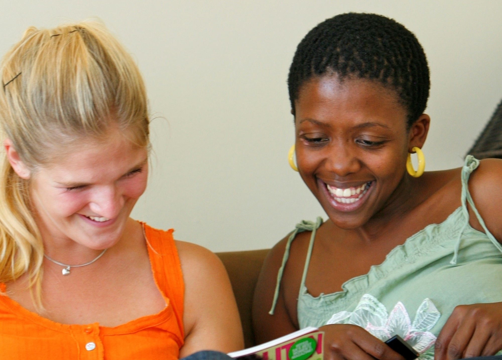

# Tværetniske venskaber --- det første skridt {#kap6}

*[Christian Albrekt Larsen](https://vbn.aau.dk/en/persons/albrekt)* og *[Jeppe Fjeldgaard Qvist](https://vbn.aau.dk/da/persons/jeppefl)*

&nbsp;&nbsp;&nbsp;&nbsp;

```{r fig-friendships, echo=FALSE, out.width= "100%"}

```

\newpage 

Bogen har indtil videre vist, at der i familier, skoler og på arbejdspladser er et stigende potentiale for, at majoriteten og minoriteter kan mødes ansigt-til-ansigt. I det kapitel beskriver, hvorvidt det også afspejler sig i venskaber mellem majoritet og minoriteter. Jævnfør [kapitel 1](#kap1) er vores antagelse, at der er relativt mange tværetniske venskaber. 

Kapitlet er opdelt i fire afsnit.  Det første afsnit definerer venskaber og diskuterer nogle af problemerne ved at måle venskaber. Det næste afsnit beskriver tværetniske venskaber målt fra majoritetsbefolkningens perspektiv. Specielt afrapporterer vi et studie, der undersøger sammenhængen mellem majoritetsbefolkningens alder og geografiske placering og det at have mindst én ven med indvandrerbaggrund [@larsen2023]. Det tredje afsnit beskriver tværetniske venskaber målt fra indvandreres/efterkommeres perspektiv [@calarsen2024]. Kapitlet afsluttes med en kort opsummering og diskussionen, herunder kausalitetsproblemer.

## Hvad er venskaber og hvordan måles det 

Venskab er et almindeligt træk ved menneskelivet og udtrykket ven findes på tværs af kulturer. Venskab defineres typisk som en social relation, der ligger imellem de stærke familiebånd og de svage bånd person, som man bare kender [@rybak2006]. Vores arbejdsdefinition er, at venskab er et frivilligt forhold mellem to personer uden for den nære familie med en vis grad af intimitet. Dermed også sagt, at nogle venskaber kan være ganske intime, mens andre kan være flygtige. 

Denne noget brede definition af venskab giver nogle problemer med at måle omfanget af venskaber. I de to studier, vi afrapporterer, beder man spørgeskemarespondenter om at angive, hvor stor en andel af deres venner, der henholdsvis har dansk eller udenlandsk baggrund. Man overlader det således til svarpersonerne selv at definere, hvad en ven er. Andre undersøgelser har brugt formuleringen ”gode venner” eller ”personer udenfor familien, som man kan have fortrolige samtaler med”. Ved de sidste to formuleringer forsøger man at afgrænse sig til mere intime venskaber, hvilket, på grund af et mindre antal, gør det muligt at spørge ind til de intime venners karakteristika, som køn, alder og etnicitet. 

## Majoritetens venskaber med indvandrere og efterkommere 

Omfanget af majoritetsbefolkningen, der har venner med indvandrerbaggrund, er lidt afhængigt af, hvordan man måler. De danske ministerielle medborgerskabsundersøgelser fra 2012 til 2016 viser, at 55 procent af den voksne befolkning med dansk-dansk herkomst, se [kapitel 3](#kap3), angiver, at de har mindst én ven med indvandrerbaggrund (Larsen & Larsen, 2023). Denne ven med indvandrerbaggrund behøver ikke at være en ”nær ven” eller en ven, man kan tale fortroligt med, hvilket alt andet lige øger sandsynligheden for tværetniske venskaber. Målt på den måde vidner studiet om, at lidt over halvdelen af befolkningen med dansk-dansk herkomst har en venskabelig relation til en indvandrere/efterkommer, trods et grundlæggende ønske om at danne venskaber med ligesindede, se [kapitel 1](#kap1). Det er således kun 45 procent af majoritetsbefolkningen, der udelukkende har venner blandt majoritetsbefolkningen [@larsen2023]. 

I en undersøgelse fra 2022 blev gruppen af voksne (+18 år) med dansk-dansk herkomst spurgt, hvor mange af deres ”nære” venner, der kom fra forskellige baggrunde. Resultat ses i Tabel \@ref(tab:tab-6-01). Adspurgt om ”nære” venner angiver 59 procent, at ingen af deres nære venner har indvandrerbaggrund. 25 procent og 12 procent angiver henholdsvis ”1--2” og ”3 eller flere”. Tre procent angiver, at de ikke ved, hvorvidt nogle af deres nære venner har indvandrerbaggrund. Spørger man mere specifikt om nære venner med muslimsk baggrund viser undersøgelsen, at 66 procent af majoriteten ikke har et sådan nært venskab. 20 og 10 procent har henholdsvis ”1-2” og ”3 eller flere” nære venner med muslimsk baggrund. Spørger man til nære venner med østeuropæisk baggrund ses nogenlunde samme fordeling. Hvis man spørger til venner med afrikansk baggrund, stiger andelen uden nogen nære venner til 77 procent, se Tabel \@ref(tab:tab-6-01). 

\newpage

```{r tab-6-01, echo=FALSE, message=FALSE, warning=FALSE}

typology <- data.frame(
  col_keys = c(
    "...1", "Ingen", "1-2 personer", "3 eller flere", "Ved ikke", "%", "N"
  ),
  what = c("Oprindelse", "Antal nære venskaber med personer fra:", "Antal nære venskaber med personer fra:", "Antal nære venskaber med personer fra:", "Antal nære venskaber med personer fra:", "I alt", "I alt"),
  measure = c("Oprindelse", "Ingen", "1-2 personer", "3 eller flere", "Ved ikke", "%", "N"),
  stringsAsFactors = FALSE
)

read_csv2("data/tabel_6_1.csv") %>%
  flextable() %>% 
  set_header_df(mapping = typology, key = "col_keys") %>% 
  merge_h(part = "header") %>% 
  merge_v(j = c("Oprindelse", "Antal nære venskaber med personer fra:", "I alt"), part = "header") %>% 
  set_header_labels(...1 = " ") %>% 
  theme_booktabs() %>% 
  bold(j = c(1), bold = TRUE, part = "body") %>% 
  width(j = c(2:7), width = .5) %>% 
  width(j = c(1), width = 1) %>% 
  fontsize(size = 9, part = "header") %>% 
  fontsize(size = 9, part = "body") %>% 
  font(fontname = "Fira Sans", part = "all") %>% 
  set_caption("Majoritetsbefolkningens nære venskaber.\n") %>% 
  align(align = "left", part = "header") %>% 
  align(align = "left", part = "body")

```

```{r, results="asis", echo=FALSE}

if (knitr::is_html_output()) {
  cat('<p style="text-align:left; font-style:italic; color:gray; font-size: 0.85em;">\n')
  cat('*Spørgsmål*: Når du nu tænker på dine **nære venner**, hvor mange kommer så fra følgende baggrunde?\n')
  cat('*Note*: Blandt respondenter med begge forældre født i Danmark. Vægtet data.\n')
  cat('*Kilde*: Egne beregner på Allison Harell, Keith Banting, Will Kymlicka, Christian Albrekt Larsen, Robert Ford, Gina Gustavsson, Pierangelo Isernia and Stuart Soroka. 2022. Intergroup Relations and the Foundations of Solidarity (IRFS) Survey. Data Set, Montreal (Canada).\n')
  cat('</p>\n')
} else if (knitr::is_latex_output()) {
  cat('\\begin{footnotesize}\\textit{\\textcolor{gray}{\n')
  cat('\\textit{Spørgsmål}: Når du nu tænker på dine \textbf{nære venner}, hvor mange kommer så fra følgende baggrunde?\n')
  cat('\\textit{Note}: Blandt respondenter med begge forældre født i Danmark. Vægtet data.\n')
  cat('\\textit{Kilde}: Egne beregner på Allison Harell, Keith Banting, Will Kymlicka, Christian Albrekt Larsen, Robert Ford, Gina Gustavsson, Pierangelo Isernia and Stuart Soroka. 2022. Intergroup Relations and the Foundations of Solidarity (IRFS) Survey. Data Set, Montreal (Canada).\n')
  cat('}}\n\\end{footnotesize}\n')
}

```

\newpage

Både medborgerskabsundersøgelserne og undersøgelsen fra 2022 viser et klart mønster mellem majoritetsbefolkningens alder og omfanget af venskaber med indvandrere og efterkommere. Det illustreres i Figur \@ref(fig:fig-6-1). I 2022-undersøgelsen svarer cirka 70 procent af de 50-årige og derover, at de ikke har en nær ven med indvandrerbaggrund. Blandt de 40-49-årige og 30 – 39-årige er andelen uden en nær ven med indvandrerbaggrund henholdsvis 59 og 51 procent. Endeligt er det kun cirka hver tredje af de 18 – 29-årige, der ikke har en nær ven med indvandrerbaggrund, se Figur \@ref(fig:fig-6-1).


```{r fig-6-1, echo=FALSE, fig.cap="Sammenhængen mellem alder på majoritetsbefolkning og nære venskaber med personer med indvandrerbaggrund. 2022.", fig.topcaption=TRUE, message=FALSE, warning=FALSE, out.width="100%"}

read_csv2("/Users/jeppefl/Documents/GitHub/enbefolkningblandersig/data/figur_6_1.csv") %>% 
  pivot_longer(!gruppe, names_to = "kategori", values_to = "pct") %>% 
  ggplot(aes(x = gruppe, y = pct, fill = fct_rev(factor(kategori, levels = c("Ingen", "1-2 personer", "3 eller flere", "Ved ikke"))))) +
  geom_bar(stat = "identity", position = "fill") +
  scale_y_continuous(labels = scales::percent_format()) +
  scale_fill_manual(values = c("#434e87", "#ad5b9c", "#52b6b6", "#d3d3d3")) +
  labs(y = " ", x = " ", fill = " ") +
  theme_classic()


```

```{r, results="asis", echo=FALSE}

if (knitr::is_html_output()) {
  cat('<p style="text-align:left; font-style:italic; color:gray; font-size: 0.85em;">\n')
  cat('Note: se note til Tabel 6.1 for datagrundlag.\n')
  cat('</p>\n')
} else if (knitr::is_latex_output()) {
  cat('\\begin{footnotesize}\\textit{\\textcolor{gray}{\n')
  cat('Note: se note til Tabel 6.1 for datagrundlag.\n')
  cat('}}\n\\end{footnotesize}\n')
}

```

En oplagt forklaring på mønsteret i Figur \@ref(fig:fig-6-1) er, at den yngre del af majoritetsbefolkningen har bedre mulighedsbetingelser for at danne nære venskaber med indvandrere og efterkommere. I en dansk kontekst har @larsen2023 beregnet andelen af indvandrere og efterkommere i den mulige venskabspulje. Studiet beregner hver enkelt svarpersons mulige venskabspulje som antallet er personer af samme køn, der er fem år yngre/ældre end svarpersonen, og som er bosat i samme boligkvarter, sogn eller kommune som svarpersonen. Logikken er, at der skal være nogle af samme aldersgruppe og af samme køn i et geografisk område før tværetniske venskaber kan opstå.[^62] I Figur \@ref(fig:fig-6-2) vises andele af ikke-danske i venskabspuljen på tværs af kommunerne og aldersgrupper. De 18-39-årige svarpersoner, der bor i hovedstadskommunerne, har gode muligheder for at etablere tværetniske venskaber. Andelen af ikke-danske  i deres beregnede venskabspulje er i gennemsnit 31 procent, se venstre side i Figur \@ref(fig:fig-6-2). Blandt disse unge har alle en ikke-dansk i deres mulighedspulje, dvs. er ingen med nul procent i, se Figur \@ref(fig:fig-6-2). Omvendt er der heller ikke nogle, hvor med samme alder og køn i deres kommune er ikke-danske, dvs. ingen har 100 procent. 

[^62]: Blau har udtrykt det på følgende måde: *”We cannot have Buddhist friends if there are no Buddhist around”* [@blau1997].

\newpage

```{r fig-6-2, echo=FALSE, fig.cap="Andelen af indvandrere og efterkommere i majoritetsbefolkningen mulige venskabspulje.", fig.topcaption=TRUE, message=FALSE, warning=FALSE, out.width="100%"}
knitr::include_graphics("images/Figur_6_2.jpg")
```

```{r, results="asis", echo=FALSE}

if (knitr::is_html_output()) {
  cat('<p style="text-align:left; font-style:italic; color:gray; font-size: 0.85em;">\n')
  cat('Note: Opgjort på kommunalt niveau på tværs af aldersgrupper (A: XX, B: XX) og kommunetype (A: XX, B: XX).\n')
  cat('</p>\n')
} else if (knitr::is_latex_output()) {
  cat('\\begin{footnotesize}\\textit{\\textcolor{gray}{\n')
  cat('Note: Opgjort på kommunalt niveau på tværs af aldersgrupper (A: XX, B: XX) og kommunetype (A: XX, B: XX).\n')
  cat('}}\n\\end{footnotesize}\n')
}

```

Omvendt ser det ud for de ældre svarpersoner (60 år eller derover), der bor i en landkommune, se højre side af Figur \@ref(fig:fig-6-2) . Andelen af ikke-danske i deres venskabspulje er i gennemsnit kun fire procent. Endvidere er fordelingen venstreskæv, hvilket medfører, at flertallet har under de fire procent---og mange essentielt ingen. Ældre i landkommuner har således begrænsede muligheder for at finde en ven, der ikke har dansk-dansk herkomst. Konklusionen i studiet er således, at den voksne befolkning med dansk-dansk-herkomst har meget forskellige mulighedsstrukturer for at danne venskaber med personer, der ikke har dansk-dansk herkomst. Det skyldes både geografi og det faktum, at indvandrere og efterkommere i gennemsnit er yngre end gruppen med dansk-dansk-herkomst. 

@larsen2023 viser også, at der er en sammenhæng mellem størrelsen af disse venskabspuljer og omfanget af majoritetsbefolkningens venskaber med indvandrere og efterkommere. Dette indikerer, at mulighedsstruktur har betydning for den voksne majoritetsbefolkning. Udtrykt anderledes, fraværet af tværetniske venskaber i nogle kontekster og demografiske segmenter af samfundet er en strukturel betingelse og ikke nødvendigvis et udtryk for bevidst ”venskabsisolation”.   

## Indvandrere og efterkommeres venskaber med majoriteten 

Mulighedsstrukturerne for at danne venskaber ser anderledes ud for indvandrere og efterkommere. For minoriteterne er det typiske, at der er rigeligt af mulige majoritetsmedlemmer at danne venskaber med. Det gør sig gældende på skoler, se [kapitel 4](#kap4), og arbejdspladser, se [kapitel 5](#kap5). ”Problemet” for indvandrere og efterkommere er snarere, at der kan være for få fra deres egen etniske gruppe til at danne sociale relationer med. Det kan gøre det svært at få opfyldt det naturlige ønsket om at finde venner, der ligner sig selv [@mcpherson2001].[^63] Ligesom for majoritetsbefolkningen er indvandreres/efterkommeres venskaber vanskelige at beskrive og studere. @calarsen2024 har dog brugt ministerielle medborgerskabsundersøgelser til at beskrive ikke-vestlige indvandreres og efterkommers venskaber (blandt voksne, der minimum har levet tre år i Danmark). 

Studiet viser, at langt hovedparten af ikke-vestlige indvandrere angiver, at de har en dansk ven. Det er således kun fem procent, der angiver, at de udelukkende har venner med indvandrerbaggrund. Risikoen for en sådan ”venskabsisolation” er større blandt kvinder, ældre og gruppen med lavere uddannelse og indkomst. Det typiske mønster er, at cirka halvdelen af de ikke-vestlige indvandreres venner har indvandrerbaggrund.[^64] For voksne ikke-vestlige efterkommere angiver kun tre procent, at de udelukkende har venner med indvandrerbaggrund. For disse relativt unge voksne kunne studiet ikke finde sammenhænge mellem baggrundsvariable som køn, alder, uddannelse, indkomst og ”venskabsisolation”. Blandt ikke-vestlige efterkommere er det typiske mønster også, at omkring halvdelen af deres venner har indvandrerbaggrund.[^65] 

[^63]: Selvom det er et veletableret menneskeligt forhold, at mennesker har en præference for relationer med andre, der ligner en selv på et eller flere parametre, ved vi ikke hvorvidt indvandrere og efterkommere har større ønske om at etablere venskaber med majoriteten end omvendt. I udgangspunktet kunne man forvente et større ønske om tværetnisk venskab, da indvandrere og efterkommere har stærkere incitamenter til at danne sådanne venskaber, se [kapitel 1](#kap1).

[^64]: Målt på andel med indvandrerbaggrund er mønstret igen, at andelen med indvandrerbaggrund er større blandt kvinder, ældre og lavt uddannede, mens der ikke er en selvstændig effekt fra lav indkomst (i modsætning til mønstret for ”venskabsisolation”).

[^65]: Måler man på den samlede indvandrerandel blandt vennerne er det eneste klare mønster for efterkommerne, at de højtuddannede har færre venner med indvandrerbaggrund. Der er ikke tydelige sammenhænge med køn, alder og indkomst.

Et centralt spørgsmål i studiet er, hvorvidt størrelsen af egen gruppe påvirker venskabsrelationerne. Størrelsen på egen gruppe er i målt som antallet af indvandrere og efterkommere fra samme oprindelsesland. Indvandrerne kommer fra 122 forskellige lande, mens efterkommerne kommer fra 61 forskellige. Nogle af indvandrerne og efterkommerne har næsten ingen mulighed for at finde venner fra eget oprindelsesland, da de nærmest er de eneste fra et givent land bosat i Danmark. Andre har langt bedre muligheder. Sidstnævnte gælder for eksempel for indvandrere og efterkommere med tyrkisk og syrisk oprindelse, da der er cirka 60.000 personer med tyrkisk og 40.000 med syrisk oprindelse. Studiet viser, at jo større ens egen gruppe er, jo større er andelen af venner med indvandrerbaggrund, og jo mindre er gruppen af venner med dansk baggrund. Størrelsen på egen gruppen forøger også ”risikoen” for udelukkende at have venner med indvandrerbaggrund. Mønstret ser lidt anderledes ud blandt de ikke-vestlige efterkommere. Det gælder stadig, at jo større antal indvandrere og efterkommere fra deres eget oprindelsesland, jo mindre andel danske venner. Til gengæld er det ikke statistisk sikkert, at et større antal fra samme oprindelsesland påvirker efterkommernes ”risiko” for udelukkende at have venner med indvandrerbaggrund. 

Interessen samler sig ofte om venskabsrelationerne for ikke-vestlige indvandrere og efterkommere. I Udlændinge- og Integrationsministeriets undersøgelser er det kun ikke-vestlige indvandrere/efterkommere, der bliver spurgt. Det efterlader et spørgsmål om, hvorvidt vestlige indvandrere bosat i Danmark egentlig har flere venskabsrelationer med majoritetsbefolkningen end det er tilfældet for ikke-vestlige indvandrere. En ældre undersøgelse fra 2015 kan give en vis indikation. Undersøgelsen blev gennemført blandt voksne (+18) indvandrere fra ti forskellige lande, der havde boet minimum et år i Danmark. Herunder vestlige grupper fra Polen, Rumænien og Spanien, hvor mange var kommet som vandrerne EU-arbejdstagere i perioden fra 2005 og frem, og fra USA og Storbritannien, hvor mange havde levet længere i Danmark. I Figur \@ref(fig:fig-6-3) er grupperne arrangeret efter andelen fra de ti grupper, der angiver, at de ingen danske venner har. For alle grupper er der tale om en lille andel, der slet ingen danske venner har. Lægger man andelen, der har ”ingen” eller kun ”nogle få” danske venner sammen, så er det indvandrere med kinesisk oprindelse, der har færrest danske venner, se Figur \@ref(fig:fig-6-3). Derefter kommer indvandrerne med rumænsk og filippinsk herkomst. Indvandrerne med britisk og amerikansk oprindelse har flest danske venner. Grupper er vidt forskellige på for eksempel opholdstid, hvilket gør, at man skal være varsom med at sammenligne omfanget af venskaber med majoritetsbefolkningen. Men 2015-undersøgelsen giver en indikation på, at forskelle mellem vestlige og ikke-vestlige indvandrere er begrænset; i det mindste vurderet på andelen uden én eneste ven med dansk baggrund.

```{r fig-6-3, echo=FALSE, fig.cap="Andel af venner med dansk oprindelse blandt 10 forskellige indvandrergrupper. 2015.", fig.topcaption=TRUE, message=FALSE, warning=FALSE, out.width="100%"}

read_csv2("/Users/jeppefl/Documents/GitHub/enbefolkningblandersig/data/figur_6_4.csv") %>% 
  pivot_longer(!Country, names_to = "kategori", values_to = "pct") %>% 
  ggplot(aes(x = factor(Country, levels = c("Tyrkiet", "Rumænien", "Spanien", "Rusland", "Filippinerne", "Kina", "Japan", "Polen", "USA", "Storbritannien")), 
             y = pct, 
             fill = fct_rev(factor(kategori, 
                                   levels = c("Ingen", "Nogle få", "Mange", "De fleste", "Alle"))))) +
  geom_bar(stat = "identity", position = "fill") +
  scale_y_continuous(labels = scales::percent_format()) +
  scale_fill_manual(values = c("#434e87", "#ad5b9c", "#52b6b6", "#ad3b6b", "wheat")) +
  labs(y = " ", x = " ", fill = " ") +
  theme_classic() +
  theme(axis.text.x = element_text(angle = 50, hjust = 1, vjust = 1))

```

## Tværetniske venskaber og deres effekter 

Bogens position er, at venskaber nok er svære at studere, men ikke desto mindre er de værd at beskæftige sig med. Etablering af venskaber mellem majoriteten og indvandrere/efterkommere er den oplagte første tværetniske social relation og der er mange indikationer på, at sådanne venskabsrelationer kan have effekter. Figur \@ref(fig:fig-6-4) og Figur \@ref(fig:fig-6-5) illustrerer sammenhængen mellem venskabsrelationer og fordomme på danske data. 

```{r fig-6-4, echo=FALSE, message=FALSE, warning=FALSE, fig.cap="Majoritetens vurdering af hvorvidt muslimer i Danmark identificerer sig mindre med landet end andre danskere. Opdelt på antal muslimske venner.", fig.topcaption=TRUE, out.width="100%"}

read_csv2("/Users/jeppefl/Documents/GitHub/enbefolkningblandersig/data/figur_6_5.csv") %>% 
  pivot_longer(!Gruppe, names_to = "kategori", values_to = "pct") %>% 
  filter(Gruppe != "Don't know" & kategori %in% c("Meget mindre end andre danskere", "Noget mindre end andre danskere")) %>% 
  ggplot(aes(x = Gruppe, y = pct/100, fill = factor(kategori, levels = c("Meget mindre end andre danskere", "Noget mindre end andre danskere")))) +
  coord_cartesian(ylim = c(0, 1)) +
  geom_bar(position="stack", stat="identity") +
  scale_y_continuous(labels = scales::percent_format()) +
  scale_fill_manual(values = c("#434e87", "#ad5b9c")) +
  labs(y = " ", x = " ", fill = " ") +
  theme_classic()  +
  theme(axis.text.x = element_text(angle = 30, hjust = 1, vjust = 1),
        legend.position = c(.8, .98))
  
```

Figur \@ref(fig:fig-6-4) viser, at majoritetsbefolkningen uden én eneste muslimsk ven er langt mere tilbøjelig til at svarere, at muslimer i Danmark identificerer sig mindre med Danmark. 40 procent siger ”meget mindre” og 41 procent siger ”noget mindre”. Blandt majoritetsbefolkningen, der har tre eller flere venner med muslimsk baggrund, er de tilsvarende andele 15 og 28 procent. Figur \@ref(fig:fig-6-5) viser en lignende sammenhæng mellem det at have muslimske venner og opfattelsen af, at muslimer i Danmark bekymrer sig mindre om andre danskere. 

```{r fig-6-5, echo=FALSE, message=FALSE, warning=FALSE, fig.cap="Majoritetens vurdering af hvorvidt muslimer i Danmark bekymrer sig mindre om andre danskernes anliggender og behov. Opdelt på antal muslimske venner.", fig.topcaption=TRUE, out.width="100%"}

read_csv2("/Users/jeppefl/Documents/GitHub/enbefolkningblandersig/data/figur_6_6.csv") %>% 
  pivot_longer(!Gruppe, names_to = "kategori", values_to = "pct") %>% 
  filter(Gruppe != "Don't know" & kategori %in% c("Meget mindre end andre danskere", "Noget mindre end andre danskere")) %>% 
  ggplot(aes(x = Gruppe, y = pct/100, fill = factor(kategori, levels = c("Meget mindre end andre danskere", "Noget mindre end andre danskere")))) +
  coord_cartesian(ylim = c(0, 1)) +
  geom_bar(position="stack", stat="identity") +
  scale_y_continuous(labels = scales::percent_format()) +
  scale_fill_manual(values = c("#434e87", "#ad5b9c")) +
  labs(y = " ", x = " ", fill = " ") +
  theme_classic() +
  theme(axis.text.x = element_text(angle = 30, hjust = 1, vjust = 1),
        legend.position = c(.8, .98))
  
```

Man skal dog tage sammenhænge mellem venskabsrelationer og fordomme med en række forbehold. Det vigtigste er, at kausaliteten kan gå begge veje. Venskaber kan lede til færre fordomme, for eksempel om muslimer i Danmark, men færre fordomme kan også lede til flere venskaber med den muslimske minoritet. Problemer med at isolere den kausale effekt fra venskabsrelationer diskuteres i næste [kapitel](#kap7). 

Vi opfatter de præsenterede studier som et første skridt i et spirende forskningsfelt. Deres ydmyge bidrag er at påpege, at størrelsesforhold har effekt på tværetniske venskabsrelationer. På grund af alder og geografi har dele af majoritetsbefolkningen begrænsede muligheder for at etablere venskaber med indvandrere/efterkommere. Andre har bedre mulighedsstrukturer. Det gælder de unge og dem i byerne. Det gør (tilsyneladende) en forskel for sandsynligheden for at have en ven med indvandrerbaggrund. Selv blandt dem, der mener, at indvandring er et problem for Danmark [@larsen2023]. Indvandrere og efterkommere er ikke på samme måde begrænset af, at der ikke er danskere nok. Men antallet fra eget hjemland kan virke som en begrænsning på deres venskabsmuligheder, hvilket for indvandrere tilsyneladende øger sandsynligheden for at etablere venskaber med majoritetsbefolkningen. Effekten er dog svag og kunne ikke findes for efterkommerne. Mens tværetniske partnerskaber er undtagelsen, se [kapitel 2](#kap2), så vidner ovenstående om, at tværetniske venskaber er typiske. Venskab er det naturlige første skridt. 


