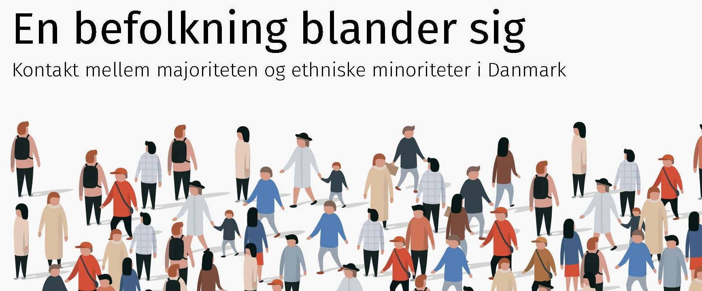
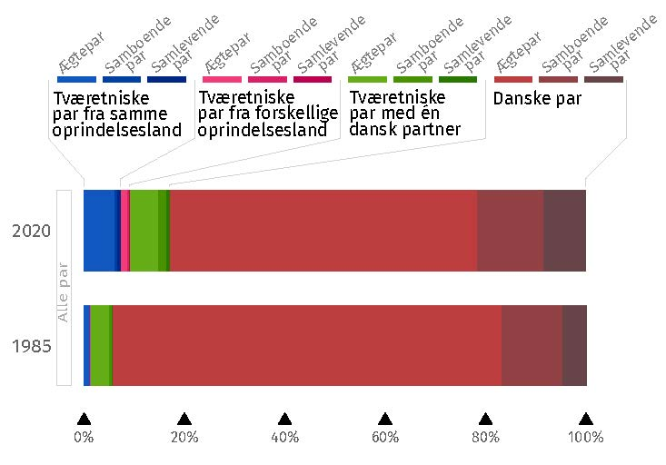
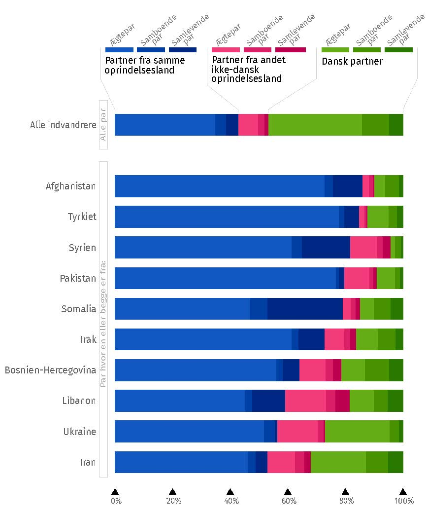

```{r include=FALSE}

options(tinytex.engine_args="-shell-escape")
gdtools::register_gfont(family = "Fira Sans")

library(tidyverse)
library(ggimage)
library(cowplot)
library(sf)
library(leaflet)
library(leaflet.extras)
library(flextable)
library(gt)

```

\pagestyle{empty}

ISBN: 978-87-89383-85-9   
       
Published by:  
Institut for Politik og Samfund
Aalborg Universitet 

© Copyright by author(s)
   
\newpage
\newpage
\thispagestyle{empty}

\pagenumbering{roman}

<div style="color: white; opacity: 0.0;">
# Forord {-}
</div>

```{r fig-forside00, echo=FALSE, out.width= "100%"}

if (knitr::is_html_output()) {

  
  
}


```

Bogen er baseret på forskningsprojektet *”Measuring intense migrant-native contact and its concequences”* (MNcontact), der var finansieret af Den Fri Forskningsfond i perioden fra 2019 til 2025. Bogen er en formidlingsbog, der er baseret på projektets datamateriale og forskningsresultater. 

Projektgruppen har bestået af undertegnet, [Jeppe Fjeldgaard Qvist](https://vbn.aau.dk/da/persons/jeppefl)[^00001], [Lanciné Eric Diop-Christensen](https://vbn.aau.dk/en/persons/led), [Hans-Peter Y. Qvist](https://vbn.aau.dk/da/persons/hpq), [Jeevitha Y. Qvist](https://vbn.aau.dk/en/persons/jy), [Troels Fage Hedegaard](https://vbn.aau.dk/en/persons/troelsfh) og [Anna Diop-Christensen](https://dk.linkedin.com/in/anna-diop-christensen-58b5ba282) (i tilfældig rækkefølje). Gruppen har i forskellige konstellationer publiceret en række videnskabelige publikationer og flere er på vej. De er samlet på [projektets hjemmeside](https://vbn.aau.dk/en/projects/measuring-intense-migrant-native-contact-and-its-consequences/publications/). 

[^00001]: Jeppe Fjeldgaard Larsen i publikationer før 2025.

Undervejs har vi arbejdet tæt sammen [Anders Bastrup Jørgensen]( https://vbn.aau.dk/en/persons/anbajo), der skrev Ph.D-afhandling om indvandrere og efterkommeres deltagelse i frivillige foreninger. Vi har også arbejdet sammen med [Rolf Lyneborg Lund]( https://vbn.aau.dk/en/persons/rolfll) og [Anja Jørgensen]( https://vbn.aau.dk/en/persons/anjaj), der i samme periode analyserede spørgsmålet om indvandrere- og efterkommeres boligmæssige placering. 

Vi ønsker alle en god læselyst 

Aalborg 2025


[Christian Albrekt Larsen](https://vbn.aau.dk/en/persons/albrekt)


Forskningsleder på MNcontact. \
Professor, Institut for Politik og Samfund\
Aalborg Universitet\


\newpage

```{=latex}
\tableofcontents
```

<!--chapter:end:index.Rmd-->


\clearpage
\pagestyle{fancy}

# En befolkning blander sig {#kap1}

\pagenumbering{arabic}

\thispagestyle{empty}

*[Christian Albrekt Larsen](https://vbn.aau.dk/en/persons/albrekt)* og *[Hans-Peter Yogachandiran Qvist](https://vbn.aau.dk/en/persons/hpq)*  

&nbsp;&nbsp;&nbsp;&nbsp;

```{r fig-smelte, echo=FALSE, out.width= "100%"}
knitr::include_graphics("images/kap0.jpg")
```

\newpage 

Integration diskuteres typisk som noget, nogle burde gøre noget ved. Det kan være indvandrere og efterkommere, der burde gøre noget mere eller noget andet. Eller danskerne og deres politikere, der burde gøre noget mere eller noget andet. Dermed også sagt, at integrationen ofte fremstilles som et uløst problem. Politiske partier på både højre- og venstrefløjen er enige om, at integrationen er gået og går skævt. Danskerne selv vurderer også ofte, at integrationen står værre til, end den faktisk gør, særligt når det gælder beskæftigelse, kriminalitet og demokratiske holdninger blandt ikke-vestlige indvandrere [@nielsen2024]. Samtidigt viser meget af den hidtidige danske forskning, at integrationen udvikler sig positivt på mange områder. Trods de dystre skildringer i politiske debatter og medier viser statistikker over beskæftigelse, uddannelse og demokratiske værdier tydelige fremskridt [@skaksen2024; @borberg2019; @ministeriet2011]. Det har fået nogle forskere til at pointere, at den største udfordring ikke nødvendigvis er integrationen, men snarere de negative opfattelser, der dominerer offentligheden [@simonsen2022]. 
En hovedpointe i denne bog er, at majoriteten og etniske minoriteter i stigende grad mødes på kryds og tværs i forskellige sociale arenaer. Det betyder, at integrationen foregår løbende og uden direkte styring. Derfor har bogen fået titlen ”En befolkning blander sig”. Det er et ordspil med en tidligere bog fra Rockwool Fondens Forskningsenhed, der bar titlen ”En befolkning deler sig op” [@damm2006]. Analysen fra Rockwool Fondens Forskningsenhed viste, hvordan indvandrere og efterkommere bosætter sig blandt andre indvandrere og efterkommere, og hvordan gruppen med dansk herkomst, bosætter blandt andre med dansk herkomst. Efterfølgende analyser af bosætningsmønstre har dog vist, at den etniske opdeling steg frem til slutningen af 1990’erne, hvorefter den har været faldende på landsplan [@damm2022]. Der er altså indikationer på, at selvom politikere og meningsdannere ofte slår en kritisk tone an, når de diskuterer integrationsområdet – så bevæger befolkningen sig i retning af stigende integration i landets boligområder. I denne bog bidrager vi til dette felt ved at vise, at der er mange andre steder end boligkvarteret, hvor majoritets- og minoritetsbefolkning mødes i hverdagslivet. 
De fleste er enige om, at det er et positivt tegn, at en befolkning blander sig. Møderne mellem mennesker er et udgangspunkt for etablering af sociale relationer, der igen kan blive et udgangspunkt for etablering af tillid [@singh2016; @putnam2000; @putnam1994]. Få ønsker sig et samfund, hvor etniske grupper lever adskilt og nærer mistillid til hinanden. 

Ikke desto mindre kan man godt argumentere for, at øget blanding ikke altid er en fordel for den enkelte. Trivselsmålinger i de danske skoler har også vist, at børn med minoritetsbaggrund trives bedre i skolen, hvis de går i klasse med mange andre med minoritetsbaggrund. Danske børn trives også bedre, hvis de går i klasse med mange med majoritetsbaggrund (Kruse, Guul & Jensen, 2025). Det kan give tryghed og selvtillid, at man ikke er anderledes end de andre. Vi er også fuldt bevidste om, at politiske initiativer, der aktivt blander befolkningen kan være kontroversielle og måske modvirke integrationen. Et godt eksempel er såkaldt ”bussing”, hvor der skabes etnisk blanding ved at køre børn rundt i skolebusser. Pointen i nærværende bog er dog ikke at argumentere for mere eller mindre opblanding af befolkningen. Pointen er først og fremmest at vise, at befolkningen faktisk blander sig. 

I resten af dette kapitel uddyber vi bogens perspektiv. I det første afsnit redegøres for vores forståelse af integration som en dynamisk tovejsproces, der gradvist mindsker betydningen af etniske skel i befolkningen. Derefter forklarer vi, hvorfor bogen fokuserer på det vi kalder uundgåelige mødepladser – arenaer, hvor der er begrænset mulighed for at fravælge mødet med ”de andre”. I vores optik er disse mødepladser centrale for at bryde en almenmenneskelig tendens til at danne sociale relationer med mennesker, der ligner os selv. I tredje afsnit introducerer vi den socialpsykologiske litteratur, der har beskæftiget sig med, hvornår og hvordan ansigt-til-ansigt møder kan reducere betydningen af etniske skillelinjer. Efter dette fokus på mikro-mekanismer, vender vi blikket mod de makro-mekanismer, der knytter sig til størrelsesforholdene mellem majoriteten og etniske minoriteter. Pointen er, at gruppestørrelser i sig selv har betydning for omfanget af ansigt-til-ansigt møder og dannelsen af sociale relationer. Kapitlet afsluttes med en sammenligning mellem Danmark, som har en relativt kort integrationshistorie, og lande som har længere erfaring, især USA, hvor de fleste teorier om integration og assimilering er blevet udviklet. Endeligt giver vi en kort introduktion til bogens øvrige kapitler. 

## Integration og assimilering---en tovejsproces

Både personer med dansk oprindelse og indvandrerne kan påvirkes af at mødes og danne relationer. Specielt nytilkomne indvandrere har ofte meget at vinde ved at mødes med majoritetsbefolkningen og danne relationer. Disse relationer kan blandt andet give nytilkomne information om, hvordan man klarer sig i det nye land. Et klassisk eksempel på såkaldte netværkseffekter stammer fra arbejdsmarkedet, hvor majoritetsbefolkningen ofte har privilegeret information om mulige jobåbninger. Men relationer med individer fra majoritetsbefolkningen kan give meget andet end relevant information på arbejdsmarkedet. Det kan være alt fra, hvordan adgang til biblioteket og NemID fungerer, til, hvad der er acceptabelt og ikke-acceptabelt at gøre ved en børnefødselsdag. Alle, der har prøvet at bosætte sig i et andet land, ved, at antallet af praktiske spørgsmål nærmest er uendeligt.

Møder med majoritetsbefolkningen er også en mulighed for at få sprogkundskaber. Sproget er som en dåseåbner til et samfund. Det letter adgangen fra den mest specifikke information, fx om det med adgang til biblioteket, og til den mest abstrakte information, fx om, hvad danskerne mener en nation er. Sprogkundskaber er også vigtige for at kunne tale sin sag, fx i sundhedsvæsenet, for at kunne blive accepteret af de andre forældre i ens børns klasse og for at klare sig i uddannelsessystemet og på arbejdsmarkedet.

Møder med majoritetsbefolkningen kan også være en lejlighed til at få justeret eventuelle negative forestillinger om, hvordan danskerne er. Indvandrere ankommer normalt med optimisme [@Hedegaard2019] og et positivt syn på danske institutioner og danskere [@breidahl2021]. Men indvandrere og deres efterkommere kan blive skuffet. Samtidigt har alle mennesker en  tendens til at skabe positive historier om sig selv og negative historier om de andre. Hvis alle ”danskere” ses gennem stereotype forestillinger, kan ansigt-til-ansigt møder potentielt skabe nuancering af disse forestillinger. 

Majoritetsbefolkningen sidder ikke med samme spørgsmål om, hvordan man klarer og gebærder sig i Danmark.  Derfor har de typisk mindre at vinde ved at mødes ansigt-til-ansigt med indvandrere end omvendt. Men for majoritetsbefolkningen kan ansigt-til-ansigt møder også være afgørende lejligheder til at få justeret eventuelle negative stereotype forestillinger om, hvordan indvandrere og efterkommere er. Hvis indvandrere og efterkommere opfattes som mærkværdige, dovne eller ligefrem farlige, så kan ansigt-til-ansigt møder potentielt også skabe nuancering hos majoritetsbefolkningen. Derfor er vi optaget af, hvad vi i nedenstående vil kalde uundgåelige mødesteder. 

Møder mellem mennesker kan give grobund for mere eller mindre intime sociale relationer. I den ene ende af skalaen findes overfladiske sociale relationer, fx ved køb og salg af varer, hvor vi interagerer, men uden at investere nævneværdigt i hinanden. I den anden ende af skalaen findes dybe sociale relationer, hvor vi lægger vores liv i hinandens hænder. Det typiske eksempel er indgåelse af ægteskab. Imellem disse yderpunkter ligger venskaber. Venskaber er interessante, fordi de kan være stærke nok til at ændre på vores forståelser af andre grupper, men samtidig svage nok til, at mange tør danne dem med nogle, der ikke ligner én selv. De er også interessante, fordi én person kan have mange venskaber, hvilket giver mulighed for et højt antal sociale relationer mellem majoriteten og etniske minoriteter. Dette står i modsætning til ægteskabs- og samlivsrelationer, hvor der normalvis kun etableres én relation per person ad gangen. 

Bogen er inspireret af amerikansk forskning i forholdet mellem indvandrere og majoritetsbefolkning. Det moderne USA er grundlagt af indvandrere og landet har fortsat det største antal udenlandskfødte indbyggere i verden. Siden samfundsvidenskabernes etablering har amerikanske forskere været optaget af at beskrive og forklare, hvordan disse nytilkomne indbyggere og majoritetsbefolkningen i en gensidig to-vejs-proces  gradvist blev integreret. 

Et klassisk eksempel er fattige katolske italienske indvandrere. De blev i begyndelsen af det 20. århundrede opfattet som en uønsket kulturelt distinkt underklasse af den amerikanske majoritetsbefolkning – en opfattelse, der kan minde om den danske majoritetsbefolknings syn på muslimske indvandrere fra såkaldt MENAPT-lande[^001]. I dag, ca. 100 år senere, opfattes disse katolske italienske indvandreres efterkommere imidlertid som en del af den nuværende amerikanske hvide kristne majoritet. Dette rejser selvsagt spørgsmålet om det samme vil gøre sig gældende for efterkommerne af de muslimske indvandrere fra MENAPT-landene, hvis vi kigger 100 år frem i Danmark.  

[^001]: En gruppering, der omfatter Syrien, Kuwait, Libyen, Saudi-Arabien, Libanon, Somalia, Irak, Qatar, Sudan, Bahrain, Djibouti, Jordan, Algeriet, Forenede Arabiske Emirater, Tunesien, Egypten, Marokko, Iran, Yemen, Mauretanien, Oman, Afghanistan, Palæstina, Gaza, Vestbredden, Østjerusalem, Pakistan og Tyrkiet.

Den amerikanske forskning bruger primært termen *assimilering* til at beskrive disse processer, mens europæiske forskere ofte foretrækker termen *integration*. I det danske hverdagssprog betegner assimilering ofte et ønske om, at indvandrere bør komme til at ligne danskerne, mens integration betegner et ønske om en gensidig tilpasning. I forskningsmæssig sammenhæng bruges begge begreber dog til at betegne processen, der både forandrer indvandrere og majoritetsbefolkningen. Vi vælger dog at bruge den europæiske sprogbrug og kalde det integration[^002].

[^002]: En klassisk kritik af den amerikanske assimileringsforskning er, at majoriteten præsenteres som idealet – en standard for, hvordan indvandrere og deres efterkommere skal opføre sig og mene. Den amerikanske assimileringsforskning har dog for længst gjort op med det forældede normative perspektiv [@AlbaNee2003].  I dag bruges assimilering og integration som betegnelser for det samme empiriske fænomen [@AlbaFoner2015; se også @ breidahl2021, kapitel 2].

Bogen følger Alba og Nee, der definerer assimilation/integration: 

> ”som nedgang i betydning af en etnisk distinktion og dens forbundne kulturelle og sociale forskelle. Hvor ’nedgang’ fortolkes således, at den etniske distinktion fremtræder mindre og aftager i relevans for færre og færre domæner af det sociale liv” [-@alba1997: 863, egen oversættelse].

Betydningen af en etnisk distinktion reduceres i et gensidigt spil mellem indvandrere og majoritetsbefolkningen. En etnisk skillelinje kan udviskes, når nogle indvandrere definerer sig selv som majoritetsbefolkning. Dette kan ske ved, at de frasiger sig sin oprindelige kultur og indoptager den nye. Sådan beskriver hverdagssproget ofte assimilering på individniveau. Mere hyppigt vil betydningen af en etnisk skillelinje imidlertid reduceres ved, at grænsen mellem etniske grupper bliver mindre tydelig. Et eksempel er, at danskerne tillægger kristendom mindre og mindre betydning for at være dansk; specielt de yngre generationer [@larsen2016]. Det er med til at udviske skillelinjen mellem den kristne majoritet og de ofte ikke-kristne indvandrere. På samme måde som betydningen af forskellen mellem katolsk og protestantisk blev reduceret i USA. Tilbage står en bredere forståelse af, hvad det vil sige at være dansk eller amerikansk. 

Vores perspektiv er, at integration som hovedregel *ikke* er noget majoritetsbefolkninger og indvandrere vælger eller fravælger. Integration/assimilation er snarere et biprodukt af levede liv, der har handlet om alt muligt andet. En grundlæggende drivkraft er jagten på kærlighed, parforhold og/eller ægteskab. Børnene fra parforhold mellem individer fra majoritetsbefolkningen og indvandrergrupper kan bidrage til at udviske etniske skillelinjer, selvom det ikke har været planlagt. Derfor har den amerikanske forskning ofte brugt antallet af giftemål mellem befolkningsgrupper, som en vigtig indikator på graden af integration.  Derfor starter denne bog også med basale demografiske beskrivelser og etablering af en ny klassifikation, der kan beskrive antallet af børn fra ”blandede” forhold. 

En anden grundlæggende drivkraft er jagten på penge til at klare dagen og vejen eller til at opnå succes og status. I en markedsøkonomi er hovedparten af både majoritetsbefolkningen og indvandrere nødsaget til at sælge deres arbejdskraft for at skaffe penge. Det gælder i særdeleshed for indvandrerne, da de typisk ankommer i den arbejdsdygtige alder og typisk har dårligere adgang til overførselsindkomster end majoritetsbefolkningen. Indvandrere besætter typisk lavere lønnede jobs i mindre regulerede sektorer, men de vil have et betydeligt incitament til at søge jobs i mere velbetalte sektorer, hvor majoritetsbefolkningen dominerer. Indvandrere har også et betydeligt incitament til at investere i uddannelsesbeviser fra destinationslandet, da disse ofte fungerer som adgangsbillet til attraktive stillinger. Både i uddannelsessektoren og på arbejdsmarkedet møder indvandrerne og danskerne hinanden, men det er ikke derfor, at de er der. Integration er således typisk et biprodukt. Kunne man helt selv bestemme, hvem man gerne ville interagere med, så havde vi formentligt et langt mere opdelt samfund.

## Drivkraften mod sine egne og tvungne mødepladser 

En etnisk distinktion skal have betydning før, at den kan miste sin betydning. Med en verden opdelt i nationalstater, der både afspejler etniske grupperinger og aktivt understøtter nationale sprog og kulturer, kan etniske distinktioner nærmest tages for givet. Italienerne ankom til USA med en forståelse af, at de var italienere, og amerikanerne opfattede dem også som italienere. På samme måde ankommer polakker og syrere typisk også til Danmark med en forståelse af, at de er polske eller syriske, og danskerne ser dem som polakker og syrere. 

Samtidig indikerer meget samfundsvidenskabelig forskning, at det ligger dybt i menneskets natur, at vi i udgangspunktet gerne vil være sammen med andre mennesker, der ligner os selv. Det skyldes formentligt en søgen efter anerkendelse og beskyttelse i en gruppe. Det er vist i et utal af sociologiske undersøgelser, at vi primært etablerer venskaber og partnerskaber med nogle, der ligner os selv [@mcpherson2001].

Der er også en række økonomiske og praktiske forhold, der gør, at indvandrere og majoritetsbefolkning ofte deler sig op i starten. Det meste oplagte er, at indvandrere typisk ankommer til større byer, hvor de bosætter sig i de billigste boligkvarterer. Indvandrere er således typisk koncentreret ved ankomsten, da de typisk bosætter sig steder, hvor de kan få job, hvor huslejerne er overkommelige og, hvor de kender nogle, der kan hjælpe dem i gang i det nye land. New York og Chicago er klassiske eksempler fra amerikansk historie, men samme dynamik udspiller sig i mange større Europæiske byer.

Meget af den amerikanske assimileringslitteratur handler således om at beskrive, hvordan indvandrere bosætter sig i forhold til majoritetsbefolkningen. Den europæiske forskning og ikke mindst politiske debat har overtaget den samme optagethed af indvandrernes bosætningsmønstre. Dette med god grund idet vores bosætningsmønstre til stadighed udgør helt centrale rammer for det liv vi lever og de mennesker vi møder.

Ansigt-til-ansigt-møder kan dog ske mange andre steder end i boligkvarteret. I det moderne samfund, hvor mennesker er mere mobile og hvor livet er mindre bundet til ens nabolag, kan sociale møder og relationer opstå i mange forskellige arenaer. Derfor fokuserer vi i denne bog på at afdække en række af disse potentielle mødesteder.

&nbsp;&nbsp;

```{r fig-1-1, echo=FALSE, warning=FALSE, out.width= "100%", fig.cap="Idealtypiske mødepladser.", fig.topcaption=TRUE}

data.frame(x = c(-1,1), 
           y = c(-1,1)) %>% 
  ggplot(aes(x = x, y = y)) +
  coord_cartesian(xlim = c(-1.1, 1.1), ylim = c(-1.1, 1.1)) +
  annotate("segment", y = 1, yend = -1, x = 0, xend = 0, arrow = arrow(ends = "both")) +
  annotate("segment", y = 0, yend = 0, x = -1, xend = 1, arrow = arrow(ends = "both")) +
  annotate("text", y = 0, x = -1.1, label = latex2exp::TeX("\\textit{Overfladisk interaktion}"), 
           size = 4.5, angle = 90) +
  annotate("text", y = 0, x = 1.1, label = latex2exp::TeX("\\textit{Intensiv interaktion}"), 
           size = 4.5, angle = 270) +
  annotate("text", y = 1.1, x = 0, label = latex2exp::TeX("\\textit{Høj frivillighed}"), 
           size = 4.5) +
  annotate("text", y = -1.1, x = 0, label = latex2exp::TeX("\\textit{Lav frivillighed}"), 
           size = 4.5) +
  
  annotate("text", y = .5, x = -.7, label = "Foreninger\nog klubber", 
           size = 3.5) +
  annotate("text", y = .5, x = .7, label = "Ægteskaber og\npartnerskaber", 
           size = 3.5) +
  annotate("text", y = -.5, x = -.7, label = "Boligkvarterer", 
           size = 3.5) +
  annotate("text", y = -.2, x = .55, label = "Arbejdspladser", 
           size = 3.5, hjust = 0) +
  annotate("text", y = -.35, x = .55, label = "Skoler", 
           size = 3.5, hjust = 0) +
  annotate("text", y = -.55, x = .55, label = "Udvidet familie", 
           size = 3.5, hjust = 0) +
  annotate("text", y = -.7, x = .55, label = "Forældre", 
           size = 3.5, hjust = 0) +
  theme_void()

```

&nbsp;&nbsp;

Bogen er specielt optaget af de mødesteder, der idealtypisk befinder sig i det nedre højre hjørne af figur \@ref(fig:fig-1-1). Det er mødesteder med en relativ lav frivillighed, hvilket modvirker menneskers tendens til at opsøge  folk, der ligner dem selv. Det meste ekstreme eksempel på ufrivillighed er, at vi ikke selv vælger vores forældre. Hvis man er barn af et blandet ægteskab kan man dårligt undgå både at møde majoritetsbefolkning og indvandrere. Et mindre ekstremt eksempel er, at man ikke vælger sine bredere familier. Majoritetsbefolkningen kan fx opleve at børn eller søskende vælger indvandrere som partnere – og omvendt kan indvandrere opleve, at børn eller søskende vælger personer fra majoritetsbefolkningen som partnere. Dermed skabes der møder mellem majoritet og indvandrere, der er svære at fravælge. 

Arbejdspladser og skoler er andre mødepladser, hvor graden af frivillighed er relativt lav. Man kan ikke frit vælge sine kolleger. Det er en ret, der tilfalder arbejdsgiverne at ansætte og organisere arbejdet. Ligeledes kan skolebørn ikke selv vælge deres klassekammerater. Det afhænger normalt af administrativt fastsatte skoledistrikter. Samtidig er skoler, arbejdspladser og familier mødesteder, hvor interaktionen mellem mennesker ofte er intensiv. Det ekstreme eksempel er igen børn af blandede partnerskaber. Her hænger man år efter år på sine forældre. Men skoler og arbejdspladser kan også være præget af intense og langvarige interaktioner mellem mennesker. Det er ved sådanne intense interaktioner, at potentialet for at nedbryde betydningen af etniske distinktioner er særligt stort.  Det er disse uundgåelige mødesteder med intensiv interaktion, der har interesseret os mest. 

I det modsatte øverste venstre hjørne af Figur 1.1 finder vi foreninger, klubber og andre mødesteder i civilsamfundet. Disse mødesteder er per definition kendetegnet ved en høj grad af frivillighed. Samtidigt kan interaktionerne være mere overfladiske – i hvert fald i den forstand, at man som regel ikke mødes dagligt. Tidligere har indflydelsesrige samfundsforskere, som @Putnam2007, betragtet denne type mødesteder som helt centrale for at fremme etnisk integration, da de kan samle mennesker med forskellige baggrunde sammen om fælles mål. I praksis står disse mødesteder dog over for en udfordring i et integrationsperspektiv: Folk vælger selv, om de ønsker at deltage i en klub eller forening, og hvilken de eventuelt vil engagere sig i. Dette bliver særligt problematisk, fordi indvandrere, især fra ikke-vestlige lande med en svag foreningskultur, ofte er mindre tilbøjelige til at opsøge sådanne mødesteder end personer med dansk oprindelse – selv efter mange års ophold i Danmark [@JorgensenQvist2024]. Denne udfordring afspejles i markante forskelle i foreningsdeltagelse mellem indvandrere fra ikke-vestlige lande og personer med dansk oprindelse, som ikke har ændret sig væsentligt siden 1990'erne [@JorgensenQvist2023]. Derudover viser forskning, at individer har en stærk tendens til at vælge klubber og foreninger, hvor flertallet deler deres etniske baggrund – og når de deltager, bruger de ofte mest tid sammen med personer fra deres egen etniske gruppe [@DederichsWiertz2025]. 

I det nedre venstre hjørne har vi idealtypisk placeret boligkvarteret. Her er der tale om en arena, hvor man har mindre indflydelse på, hvem man møder. Man kan fravælge fodboldholdet, men man kan ikke så nemt fravælge sine naboer. Den mindre frivillighed skulle alt andet lige føre til flere ansigt-til-ansigt-møder mellem indvandrere og majoritetsbefolkningen. Dog afhænger valget af bopæl i høj grad af økonomiske ressourcer: Dem med større økonomisk råderum har langt flere muligheder for frit at vælge, hvor de vil bo, end dem med færre ressourcer. Ikke desto mindre er der i majoritetsbefolkningen segmenter, der må søge efter billigere boligområder, hvor der typisk er mange indvandrere, og blandt indvandrere er der segmenter, der har råd til at søge mod majoritetsbefolkningens mere attraktive boligkvarterer. Boligkvarteret er således et sted, hvor man potentielt blander sig. Problemet er dog, at møderne i boligkvarterne kan være ganske overfladiske. De fleste hilser pænt på naboen, men herudover kan interaktionen være meget begrænset. I vores perspektiv er boligkvarteret primært interessant fordi det potentielt påvirker sammensætningen af de uundgåelige møder med intensiv kontakt i det nedre højre hjørne. Mest oplagt den etniske sammensætning af skolerne, som bliver beskrevet i [kapitel 3](#kap3).

Endeligt har vi det øvre højre hjørne af figur 1.1, hvor vi idealtypisk har placeret parforhold og ægteskaber. Her er den fysiske mødeplads typisk en fælles bolig, og det repræsenterer den mest intensive form for interaktion, man kan forestille sig. Derfor er potentialet for at nedbryde, hvad der måtte være af fordomme stort. 

I et integrations- og assimileringsperspektiv er det primære ”problem” ved ægte- og partnerskaber, at frivilligheden er så høj og interaktionen så intens, at mange vælger en partner, der ligner dem selv. Derfor kan ægte- og partnerskaber medvirke til at fastholde, og til tider forstærke, betydningen af etniske skillelinjer. Desuden er de personer fra både majoriteten og minoriteten, der vælger at indgå i blandede parforhold, ofte dem, der i forvejen har få fordomme og derfor ikke har meget at få nedbrudt. I vores perspektiv er de ”blandede” partner- og ægteskaber primært interessante, fordi det skaber ”blandede” børn, der effektivt nedbryder et samfunds etniske kategorier, og fordi det har effekter på deres bredere familier. 
## Det menneskelige møde og dets effekt på betydning af etniske distinktioner 

Hvad der sker, når mennesker mødes på tværs af etniske skillelinjer er blevet studeret og teoretiseret af socialpsykologien. Socialpsykologiens udgangspunkt er, at negative opfattelser af såkaldte ud-grupper ikke er nogen mærkværdighed. Ifølge socialpsykologien er det (desværre) alment menneskeligt, at grupper af mennesker, definerer sig selv ved at tage afstand fra andre. Det gælder både for små og store grupper. Skoleklasser etablerer fx ofte negative billeder af deres søsterklasser, og folkeslag skaber ofte negative billeder af andre folkeslag. Der er derfor heller ikke noget mærkværdigt i, at majoritetsbefolkninger ofte opbygger negative mentale billeder af indvandrere (og omvendt). Grænsedragningen mellem ”etniske danskere” og ”indvandrere” knytter sig til selve fundamentet for dannelsen af nationalstater.  Majoritetsbefolkningen skaber internt sammenhold og identitet ved at etablere et negativt billede af ud-grupper. Omvendt kan etniske minoriteter skabe internt sammenhold og identitet ved at etablere et negativt billede af majoritetsbefolkningen. 

Det er velkendt fra socialpsykologien, at gruppetilhørsforhold nærmest per automatik skaber positive billeder af ind-gruppen og negative billeder af ud-gruppen. Socialpsykologiske forsøg har vist, at selv simpel gruppedannelse, hvor de involverede personer ved, at de er inddelt helt tilfældigt, skaber intern solidaritet [@tajfel1981]. Det skaber realistiske forventninger om, at personer i ens ind-gruppe er solidarisk indstillede, mens personer i ens ud-gruppe er fjendtligt indstillede (selv ved helt tilfældig inddeling, fx i blåøjede over for brunøjede). 

Den amerikanske socialpsykologi har specielt været optaget af, hvorvidt møder mellem den hvide majoritet og den sorte minoritet formindsker eller forstærker denne etniske/racemæssige distinktion. I et klassisk værk fra 1954 beskrev Allport, hvordan kontakt har et potentiale til at nedbryde fordomme på tværs af grupper [@allport1954]. Men han understregede, at det ikke er nogen enkel proces. Allport advarede om, at overfladisk kontakt – som et flygtigt møde i bybilledet – ofte kan forstærke snarere end reducere fordomme. En teori han udviklede på baggrund af den empiriske observation, at hvide nordstats-amerikanere, der uddannede sig i sydstaterne ofte fik flere og ikke færre fordomme om afroamerikanere. 

Nyere forskning understøtter teorien. Et amerikansk studie placerede spansktalende personer på togperroner og fandt, at  de hvide majoritetsamerikanere, der havde mange overfladiske møder med dem på togstationerne, blev mere kritiske overfor indvandringen fra Mexico [@enos2014]. Tilsvarende viste et europæisk studie, at beboere på de græske øer, der havde mange overfladiske møder med flygtninge på gennemrejse i 2015 og 2016 blev mere kritiske overfor indvandringen, sammenlignet med grækere bosat på naboøer, der ikke havde denne gennemstrømning [@hangartner2019]. 

Et lignende mønster kan muligvis gælde i Danmark. Personer med dansk oprindelse, der bor i boligkvarterer med mange indvandrere, kan være mere tilbøjelige til at opbygge negative stereotyper om indvandrere, da der kun er overfladisk kontakt mellem grupperne. Det støttes af Dinesen og Sønderskov [-@dinesen2015], der viste, at personer med dansk oprindelse har lavere tillid til andre mennesker, hvis der bor mange indvandrere i deres nærområde (80 meters radius rundt om bopælen). 

Allport argumenterede for, at kontakt mellem grupper kan reducere fordomme, men kun hvis kontakten opfylder visse betingelser. Han opstillede fire kriterier for, hvornår kontakt kan have sådanne gavnlige effekter. Der skulle være 1) statuslighed mellem grupper, 2) fælles målsætninger, 3) samarbejde på tværs af grupper og 4) opbakning fra autoriteter, lov eller vane. 

Baggrunden for disse kriterier var blandt andet studier, der havde vist, at sorte og hvide soldater, der havde kæmpet sammen i Anden Verdenskrig, havde markant færre fordomme om hinanden [@stouffer1949]. Disse soldater havde haft lige status (rang), de havde haft en fælles målsætning (nedkæmpe fjenden), sorte og hvide havde samarbejdet (i krigshandlingen) og samarbejdet var understøttet af en autoritet (befalingsmænd), der overvågede samarbejdet. 

Med dette udgangspunkt har en lang række studier analyseret, hvornår og hvordan kontakt kan nedbryde fordomme [@pettigrew2006]. Et eksempel er et norsk studie, hvor værnepligtige blev inddelt i etnisk diverse og etnisk homogene grupper. Studiet viste, at værnepligtige med majoritetsbaggrund fik et mere positivt syn på indvandreres arbejdsetik, hvis de var i etnisk blandede grupper [@finseraas2017]. Det er med baggrund i denne litteratur, at bogen fokuserer på mødepladser med lav frivillighed og intensiv interaktion, se ovenstående figur \@ref(fig:fig-1-1). 

Vi er fuldt bevidste om, at vores inddeling af mødesteder efter graden af frivillighed og kontaktintensitet er overordnet, og at kontakt i alle typer arenaer kan føre til vidt forskellige udfald. I nogle tilfælde kan kontakt i foreninger eller klubber udvikle sig til dybe relationer, der har afgørende betydning for de involverede parter. I andre tilfælde kan selv den dybeste kontakt, fx i familier, føre til konflikt og øget polarisering. Det er derfor vigtigt at understrege, at denne inddeling skal forstås som et analytisk værktøj – et prisme til at belyse, hvordan forskellige arenaer varierer i deres potentiale for at skabe relationer og påvirke de involverede individer. For at forstå de præcise udfald for den enkelte person kræves dog en mere detaljeret analyse af deres specifikke relationer og de kontekster, de indgår i.

Når kontakt fører til konflikt, skyldes det ofte, at personer fra minoritetsgrupper oplever manglende ligestilling i interaktionen. Hvis minoriteten oplever, at de bliver diskrimineret i skolen eller på arbejdspladsen forøges negative ud-gruppeforestillinger. Efterkommere af indvandrere har typisk højere forventning om ligebehandling end første generation, hvilket afspejler sig i større oplevelse af diskrimination. 

For majoriteten leder interaktion specielt til konflikt i situationer, hvor etniske minoriteter udgør så stor en andel, at det truer de fordele, som majoriteten har ved at være majoritet [@forbes2004]. Majoritetsfordele kan være alt fra det sprog, der skal tales på arbejdspladsen og i skolens frikvarterer, til, hvad der skal være på menuen til firmafesten. En anden klassisk teori er, at medlemmer af majoriteten specielt føler sig truet, hvis de befinder sig i en udsat position. Det kan være en økonomisk udsat situation, hvor det kan være en frygt, at indvandrere overtager ens job eller (yderligere) forringer arbejdsvilkårene. Men det kan også være en kulturel udsat situation, hvor det kan være en frygt for, at man kan miste sin status i sin egen ind-gruppe, hvis grænserne til udgruppen eroderes. Ikke desto mindre er bogens perspektiv, at det er på de uundgåelige mødepladser med intensiv interaktion, at det største *potentiale* for integration ligger. 

## Betydningen af størrelsesforholdene mellem majoritet og minoritet 

Mens socialpsykologien har været optaget af dynamikker i mødet mellem mennesker, så har makrosociologske teoretikere som Peter M. Blau [@blau1994; @blau1997; @blau1984a] været optaget af gruppestørrelsers betydning for muligheden for at mødes. For majoriteten kan kontakten med minoritetsgrupper være begrænset af deres størrelse. I 1980 udgjorde indvandrere og efterkommere tre procent af befolkningen (ifølge Danmark Statistisk definitioner, hvilket vi skal komme tilbage til i kapitel 3). Selv hvis indvandrere havde været helt lige fordelt i boligkvarterer, i foreninger, i skoler og på arbejdspladser, ville personer med dansk oprindelse (som defineret af Danmark Statistik) kun have tre procent chance for, at det næste ansigt-til-ansigt møde var med en indvandrer.

For minoriteter er situationen omvendt. Indvandrere og efterkommere ville have 97 procent chance for, at det næste møde var med en person med dansk oprindelse. Minoriteten eksponeres således markant mere for majoriteten end majoriteten eksponeres for minoriteten---alt andet lige. Hvis man antager, at fysiske møder mellem etniske grupper har konsekvenser, betyder det, at disse konsekvenser i langt højere grad påvirker minoriteten end majoriteten. Det betyder også, alt andet lige, at integrationens tovejsproces foregår i forskellige hastigheder. Minoriteten ændres hurtigt. Majoriteten ændres langsomt. 
De seneste fire årtiers stigende indvandring har ændret disse størrelsesforhold i Danmark. I 2023 udgjorde indvandrere og efterkommere 15 procent af befolkningen ifølge definitionerne fra Danmarks Statistik. Under antagelse om lige fordeling på mødepladser, er majoritetsbefolkningens sandsynlighed for næste gang at møde en indvandrer eller efterkommer således steget fra tre til 15 procent. Omvendt er minoritetens sandsynlighed for næste gang at møde en med dansk herkomst reduceret fra 97 til 85 procent. Følger man ovenstående logik vil det betyde, at majoriteten ændres lidt hurtigere og minoriteten lidt langsommere end det var tilfældet tidligere.   

Effekterne af disse størrelsesforhold på antallet af møder mellem minoritet og majoritet begrænses naturligvis af de strukturelle forhold, der typisk koncentrerer indvandrere i byområder, jf. ovenstående. Figur \@ref(fig:fig-1-22) viser andelen af indbyggere, der ikke har to forældre med dansk herkomst. Med vores strammere kriterier for at være dansk-dansk (to danske forældre, se [kapitel 3](#kap3) for definitioner) illustrerer kortet med al tydelighed, at der også i Danmark er en betydelig koncentration af minoriteter i hovedstadsområdet. I [kapitel 6](#kap6) vil det nærmere blive beskrevet, hvordan gruppen med dansk herkomst i nogle kommuner har ret begrænsede muligheder for at danne sociale relationer med indvandrere; specielt hvis man også medtænker et alderskriterium ift. hvem man forventeligt danner sociale relationer med.


\newpage

```{r include=FALSE}

koms <- read_csv2("data/kommunekoder.txt")

df <- read_csv2("data/FOLK1B2024.csv") %>% 
  left_join(koms, by = "KOM")
  
dk_kom <- st_read("data/dk_kom.shp")%>% 
  rmapshaper::ms_simplify(., keep = 0.005) %>% 
  left_join(df, by = "KOMKODE") %>% 
  mutate(non_native = (Vestlige+Ikke_vestlige) / (Vestlige+Ikke_vestlige+Danmark))

rm(koms, df)
```


```{r fig-1-22, echo=FALSE, warning=FALSE, out.width= "100%", fig.cap="Andelen af indbyggere, hvor begge forældre ikke har dansk herkomst. 2024.", fig.topcaption=TRUE}

pal <- colorNumeric("PiYG", domain = dk_kom$non_native)

if (knitr::is_html_output()) {
leaflet(dk_kom) %>%
  #addTiles() %>%
  addPolygons(data = dk_kom %>% st_transform('+proj=longlat +datum=WGS84'),
              stroke = FALSE,
              smoothFactor = 0.2,
              weight = 1,
              fillOpacity = .7,
              color= ~pal(non_native)) %>% 
  addLegend("bottomright", pal = pal, values = ~dk_kom$non_native, 
            title = "Personer med to</br>ikke-danskfødte</br>forældre",
            labFormat = labelFormat(suffix = '%', between = '% - ',
                                                  transform = function(x) 100 * x)) %>% 
  setMapWidgetStyle(list(background= "white"))

} else if (knitr::is_latex_output()) {

leaflet(dk_kom) %>%
  #addTiles() %>%
  addPolygons(data = dk_kom %>% st_transform('+proj=longlat +datum=WGS84'),
              stroke = FALSE,
              smoothFactor = 0.2,
              weight = 1,
              fillOpacity = .7,
              color= ~pal(non_native)) %>% 
  addLegend("bottomright", pal = pal, values = ~dk_kom$non_native, 
            title = "Personer med to</br>ikke-danskfødte</br>forældre",
            labFormat = labelFormat(suffix = '%', between = '% - ',
                                                  transform = function(x) 100 * x)) %>% 
  setMapWidgetStyle(list(background= "white"))
  
}

```

```{r, results="asis", echo=FALSE}

if (knitr::is_html_output()) {
  cat('<p style="text-align:left; font-style:italic; color:gray; font-size: 0.85em;">\n')
  cat('Note: Baseret på FOLK1B 2024K2.\n')
  cat('</p>\n')
} else if (knitr::is_latex_output()) {
  cat('\\begin{footnotesize}\\textit{\\textcolor{gray}{\n')
  cat('Note: Baseret på FOLK1B 2024K2.\n')
  cat('}}\n\\end{footnotesize}\n')
}

```

Hvorvidt indvandreres større mulighed for at møde andre indvandrere reelt begrænser antallet af møder med majoritetsbefolkningen er omstridt. Den dominerende hypotese i den amerikanske integrationslitteratur er, at en større gruppe fra ens egen nationalitet, fx italienere eller mexicanere, kan virke som en trædesten, der gør det nemmere for en nytilkommen indvandrer at få kontakt med majoriteten, og de heraf følgende ofte forbedrede livsmuligheder. Denne optimistiske udlægning baseret på historiske amerikanske erfaringer er dog problematiseret af nyere teoriretninger. Såkaldt segmenteret assimileringsteori [@portes1993] fremhæver, at denne effekt afhænger af ressourcerne hos indvandrere med ens egen nationalitet, der allerede er i landet. Hvis ens nationalitet klarer sig dårligt i uddannelsessystemet og på arbejdsmarkedet kan det virke hæmmende og ikke befordrende for en nytilkomnes livsmuligheder. Teorien fremhæver også, at post-moderne økonomier skaber en segmentering af arbejdsmarkedet, hvilket gør det vanskeligt at tale om en majoritetsbefolkning med rimeligt ensartede livsvilkår, som indvandrere langsomt integreres i. Den alternative hypotese er, at indvandrere lige så vel kan integreres ind i et underklasse- eller overklassesegment i destinationslandet. 

## Den danske versus den amerikanske kontekst 

Bogen bygger på en antagelse om, at de grundlæggende mekanismer, der former relationerne mellem indvandrere og majoritetsbefolkning, er de samme i Danmark som i USA. Disse mekanismer udspringer grundlæggende egenskaber ved den menneskelige natur, en verden opdelt i nationalstater og markedsøkonomiens rolle. Samtidig er der åbenlyse forskelle mellem den danske og den amerikanske kontekst – både historisk og aktuelt. 

Én første markant forskel er, at Danmark har en større andel humanitære indvandrere end det er tilfældet i USA. Humanitære indvandrere, såsom flygtninge og familiesammenførte, har ofte sværere ved at klare sig på arbejdsmarkedet end indvandrere, hvor arbejdsmotivation ofte er årsagen til migrationen. Til gengæld har humanitære indvandrere typisk ikke noget ønske om at vende tilbage til deres oprindelsesland. Der er således ikke anden udvej end at forsøge at klare sig i destinationslandet. Dermed har de humanitære indvandrere større incitament til at lade sig integrere end arbejdsimmigranter. 

Én anden markant forskel er, at Danmark har et mere reguleret arbejdsmarked end USA. Det skaber bedre løn- og arbejdsvilkår, også for indvandrere, hvilket alt andet lige må antages at lette integrationen. Samtidig kan reguleringerne gøre det vanskeligere for indvandrere at komme ind på arbejdsmarkedet, fx fordi de ikke kan acceptere lavere løn- og arbejdsvilkår end majoritetsbefolkningen. Risikoen ved et reguleret arbejdsmarked er således, at flere indvandrere slet ikke kommer ind på arbejdsmarkedet. 

Én tredje forskel er, at Danmark har en mere udbygget velfærdsstat, der leverer sygesikring, børnepasning og skoleundervisning af relativt høj kvalitet for alle; inklusive indvandrere. Det letter presset for at klare sig på arbejdsmarkedet. Samtidig kan det dog forøge majoritetsbefolkningens bekymring for at indvandrere bliver en økonomisk byrde. Opgørelser fra Finansministeriet har således vist, hvordan ikke-vestlige indvandrere er en netto-udgift, mens det modsatte i øvrigt er gældende for vestlige indvandrere [-@Finansministeriet2019].

Endeligt er der markant mere politisk regulering i Danmark end i USA. I årtier har Danmark således ført en politik, der aktivt har forsøgt at understøtte møder mellem majoriteten og indvandrere/efterkommere, og reducere interne møder mellem sidstnævnte. Mest omdiskuteret er de offentlige politikker om boligplacering af humanitære indvandrere, der siden 1999 er blevet spredt i landets kommuner. I den første treårige periode mister flygtninge retten til kontanthjælp, hvis de fraflytter den tildelte kommune. 

Derudover har skiftende regeringer siden 1994 gennemført en række ”ghetto-planer”, der har til hensigt at forhindre koncentration af indvandrere og efterkommere i specifikke boligkvarterer. I skrivende stund implementeres en bred politisk aftale kaldet [”Blandede boligområder -- næste skridt i kampen mod parallelsamfund”]( https://www.sm.dk/media/24475/Pjece_Blandede%20boligomr%C3%A5der.pdf). Udover disse nationale tiltag har de danske kommuner i årtier aktivt forsøgt at sammensætte grundskoler, så majoritetens og indvandrernes børn møder hinanden. Specielt har man været optaget af at forhindre grundskoler, hvor indvandrere udgør en numerisk majoritet. 

Dertil kommer en myriade af andre integrationspolitikker, der primært drives af landets jobcentre. Her har man i mere end 30 år eksperimenteret med politikker, der i særdeleshed har fokuseret på at forøge beskæftigelsen blandt indvandrere og efterkommere. Man kan sige, at man i Danmark via offentlig politik aktivt har forsøgt at påvirke møderne mellem majoritets- og minoritetsbefolkningen, mens man i USA mere passivt har accepteret, at integration tager tid. Aktiv amerikansk ”blandingspolitik” har primært fokuseret på at afskaffe de diskriminerede politikker over for sorte; suppleret med aktive politiker som ”affirmative action”, der forsøger at skabe social mobilitet for denne specifikke gruppe. 

Når man sammenligner integrationen i Danmark og USA, er det nærliggende at spørge, i hvilket omfang aktiv offentlig integrationspolitik øger antallet af møder mellem majoritetsbefolkningen og indvandrere. Det kan vi desværre ikke give et svar på, men denne bogs resultater viser dog, at møderne mellem personer med dansk oprindelse og indvandrere og deres efterkommere ofte er drevet af mekanismer, der vanskeligt lader sig påvirke af isolerede integrationspolitikker. Det er økonomiske forhold som priser på boligmarkedet og jobmuligheder, demografiske forhold såsom gruppestørrelser og køn- og aldersfordelinger og stærke menneskelige drivkræfter som forelskelse og ønsket om gruppetilhørsforhold, der er de primære drivkræfter i opretholdelse og nedbrydning af etniske distinktioner. 
 
## Bogens plan 

I [kapitel 2](#kap2) beskriver vi, hvordan partnerskaber i Danmark typisk etableres inden for samme etniske gruppe. Samtidig viser vi, at antallet af tværetniske partnerskaber er stigende, hvilket medfører en voksende gruppe af børn med blandet etnisk baggrund. [Kapitel 3](#kap3) beskriver, hvordan de kategorier, der typisk anvendes i Danmark, overser denne gruppe af børn og unge. Derfor etableres en alternativ kategorisering, der også vil blive brugt i bogens efterfølgende kapitler. 

[Kapitel 4](#kap4) beskriver den etniske sammensætning af danske grundskoler. Kapitlet viser, at den etniske opdeling generelt er moderat og faldende over tid i Danmark. Etnisk opdeling er primært et storbyfænomen, der skyldes bosætningsmønstre og muligheden for alternative skoler inden for en kort afstand fra bopæl.  I [Kapitel 5](#kap5) vender vi blikket mod den etniske sammensætning af danske arbejdspladser. Kapitlet viser, at de danske arbejdspladser bliver mere etnisk opdelt. Samtidig viser kapitlet, at trods disse velkendte segmenteringstendenser på arbejdsmarkedet, så arbejder flere og flere med dansk oprindelse sammen med indvandrere og efterkommere, hvilket nuancerer billedet. 

Efter disse kapitler, der primært beskriver forudsætningerne for etableringen af sociale relationer mellem gruppen med dansk herkomst, indvandrere og efterkommere, retter [kapitel 6](#kap6) fokus mod omfanget af venskabsrelationer på tværs af etniske skel. Kapitlet viser, at langt de fleste indvandrere og efterkommere har majoritetsmedlemmer i deres omgangskreds, og langt de fleste fra majoriteten har indvandrere og efterkommere i deres omgangskreds. Undtagelsen er ældre med dansk herkomst bosat i landkommuner, hvor muligheden for at mødes med indvandrere og efterkommere er begrænset. 

Endeligt diskuterer vi i det afsluttende [kapitel](#kap7), hvordan bogens fokus på sociale relationer mellem etniske grupper adskiller sig fra andre tilgange til at analysere integration. Bogen er en formidlingsbog, der sammenfatter resultater fra et større dansk forskningsprojekt, som allerede nævnt i forordet. Ikke desto mindre inkluderer bogen et teknisk appendiks, der omhandler de statistiske metoder og mål, der anvendes til at beskrive skillelinjer på tværs af etniske skel.


\newpage
\thispagestyle{empty}

<!--chapter:end:01-enbefolkningblandersig.Rmd-->


# Tværetniske partnerskaber {#kap2}

\thispagestyle{empty}

*[Hans-Peter Y. Qvist](https://vbn.aau.dk/da/persons/hpq)* og *[Jeevitha Yogachandiran Qvist](https://vbn.aau.dk/da/persons/jy)*

&nbsp;&nbsp;&nbsp;&nbsp;

```{r fig-partner, echo=FALSE, out.width= "100%"}
knitr::include_graphics("images/kap2.jpg")

```

\newpage

Et fast forhold eller ægteskab er den dybeste og mest forpligtende sociale relation, man kan have til et andet menneske. Derfor er det at vælge en fast partner for de fleste en af de vigtigste beslutninger, vi træffer i vores liv. Vælger vi den rette partner, kan det berige vores liv markant. Omvendt kan et forkert valg føre til dybe materielle, følelsesmæssige og sociale tab, især hvis det ender i skilsmisse.

De betydelige konsekvenser af at vælge en partner fører sandsynligvis til, at mange mennesker minimerer risikoen for at vælge forkert og foretrækker en følelse af sikkerhed i deres valg. Modsat den populære forestilling om, at modsætninger tiltrækker hinanden, viser omfattende samfundsvidenskabelig forskning nemlig, at vi mennesker typisk vælger en partner, der ligner os selv på en lang række områder. Det gælder socioøkonomiske faktorer som uddannelse, job og indkomst såvel som kulturelle faktorer som etnicitet, religion og værdier [@kalmijn1998]. 

I lyset af tendensen til at folk typisk vælger partnere, der ligner dem selv, er det ikke overraskende, at indvandrere og deres efterkommere i Danmark og andre lande ofte foretrækker partnere fra deres egne oprindelseslande. Der er imidlertid store forskelle på hvor udbredt denne tendens er imellem forskellige indvandrergrupper. I nogle indvandrergrupper er det mere hyppigt, at man danner par indenfor gruppen end tilfældigheder ville tilsige, men der er omvendt også mange der danner par udenfor gruppen. I andre indvandrergrupper er tendensen til at vælge partnere inden for gruppen meget stærkere, og tværetniske forhold er derfor sjældnere.

I dette kapitel giver vi i det første afsnit en kort introduktion til den sociologiske forskning på området og beskriver herefter udbredelsen af tværetniske ægteskaber i Danmark. I det tredje afsnit refererer vi til hovedkonklusionerne fra studiet af Qvist & Qvist [-@qvistqvist2023], der giver en række forklaringer på mønstrene for tværetniske partnerskaber i Danmark. I det sidste afsnit diskuterer vi det svære spørgsmål om, hvorvidt de danske partnerskabsmønstre viser, at glasset er halvt fyldt eller halvt tomt. 

## Sociologien om de tværetniske partnerskaber 

I sociologien er der en lang tradition for at undersøge, hvorfor og hvordan minoritetsgrupper adskiller sig i deres tendens til at danne par inden- eller udenfor egen gruppe. Det skyldes en forventning om, at udbredelsen af tværetniske ægteskaber, især mellem repræsentanter for indvandrergrupper og majoritetsbefolkningen, kan give en klar indikation på, hvor socialt integrerede indvandrergrupper er i destinationslandet. En af de mest markante repræsentanter for dette perspektiv, den amerikanske sociolog Milton M. Gordon [-@gordon1964], argumenterede således for, at udbredelsen af tværetniske parforhold er den ultimative indikation på, at barrierer mellem etniske grupper nedbrydes og at integrationen mellem dem dermed styrkes. 

Ægteskabets rolle i at forene mennesker er et velkendt fænomen gennem historien. Traditionelt har ægteskaber ofte været brugt til at skabe alliancer mellem familier eller endda hele kongeriger. I den tidlige middelalder var det fx almindeligt, at den romerske elite i Vesteuropa indgik ægteskaber med ledere af indvandrende stammer. Dette førte til en kulturel fusion mellem den romerske kultur og stammernes traditioner (Wickham, 2009). Samtidig kunne det være en måde at skabe mere fred og mindre konflikt.   

I vore dage kan tværetniske ægteskaber mellem helt almindelige mennesker stadig have stor betydning. Det er der flere forskellige grunde til. For det første indikerer dannelsen af tværetniske parforhold, at fordomme og sociale grænsedragninger mellem etniske grupper ikke er stærke nok til at forhindre dannelsen af intime og tillidsfulde relationer mellem to personer fra forskellige etniske grupper. Dette kan være afgørende for, at barrierer nedbrydes yderligere mellem grupperne. For det andet forener et blandet par typisk ikke kun to individer, men også deres familie og venner. Personer der indgår i blandede par, kan således agere brobyggere mellem sociale netværk eller grupper, som ellers ikke ville have megen kontakt med hinanden. For det tredje har børn fra blandede parforhold en unik position, når det kommer til at udviske kulturelle forskelle, hvilket vil blive udforsket yderligere i [kapitel 3](#kap3).

Det er afgørende at forstå, at den sociologiske forskning, som undersøger konsekvenserne af etnisk blandende parforhold---eller mangel herpå---hovedsageligt betragter effekterne på samfundsplan. Disse teorier fremhæver, at selvom det for den enkelte indvandrer kan virke naturligt og forenkle livet at vælge en partner med samme etniske baggrund, kan denne tendens medføre udfordringer for samfundet og for etniske grupper som helhed. Dette gælder især for indvandrere fra grupper, som systematisk og i vid udstrækning foretrækker partnere fra deres eget oprindelsesland, idet det medvirker til at lukke grupperne om sig selv og kan bidrage til etnisk segregering fremfor integration. 

## Tværetniske partnerskaber i Danmark 

I det følgende skal vi derfor se nærmere på omfanget af tværetniske partnerskaber i Danmark. I figur \@ref(fig:fig-2-1) vises sammensætningen af samtlige partnerskaber, hvor begge partnere er bosat i Danmark.  I 1985 bestod 94 procent af alle partnerskaber af to personer med dansk oprindelse (den røde farve). Heraf fyldte ægteskaber mellem to personer med dansk oprindelse 77 procent. I 1985 bestod 1,1 procent af alle partnerskaber af to indvandrere eller efterkommere fra samme oprindelsesland (den blå farve), mens 0,2 procent bestod af to indvandrere eller efterkommere fra forskellige oprindelseslande (den pink farve). Endeligt udgjorde partnerskaber mellem én med dansk herkomst og én med anden herkomst 4,3 procent af samtlige partnerskaber (den grønne farve). Det svarede til lidt over 54.000 partnerskaber mellem majoriteten og minoriteter i 1985.  

```{r fig-2-1, echo=FALSE, out.width= "75%", fig.align = 'center', fig.cap=" Partnerskaber med samme og forskelligt oprindelsesland. Opgjort i 1985 og 2020.", fig.topcaption=TRUE}


```

```{r, results="asis", echo=FALSE}

if (knitr::is_html_output()) {
  cat('<p style="text-align:left; font-style:italic; color:gray; font-size: 0.85em;">\n')
  cat('Note: DST betegner samlevende som to personer der ikke er i et ægteskab eller i registreret partnerskab med hinanden, men som har mindst ét fælles barn, mens samboende er betegnet som to personer af hvert sit køn med under 15 års aldersforskel, der ikke har børn eller er nært beslægtede.\n')
  cat('</p>\n')
} else if (knitr::is_latex_output()) {
  cat('\\begin{footnotesize}\\textit{\\textcolor{gray}{\n')
  cat('Note: DST betegner samlevende som to personer der ikke er i et ægteskab eller i registreret partnerskab med hinanden, men som har mindst ét fælles barn, mens samboende er betegnet som to personer af hvert sit køn med under 15 års aldersforskel, der ikke har børn eller er nært beslægtede.\n')
  cat('}}\n\\end{footnotesize}\n')
}

```

\newpage 

I 2020 ser fordelingen anderledes ud, se figur \@ref(fig:fig-2-1). I 2020 bestod 83 procent af alle partnerskaber af to personer med dansk oprindelse – heraf udgjorde samlevende og samboende en betydelig større andel end det var tilfældet i 1985, hvor ægteskaber udgjorde en større andel. Samtidig var par blandt indvandrere eller efterkommere kommet til at udgøre en betydelig større andel af alle par end tidligere. I 2020, bestod 7,3 procent af alle partnerskaber af to indvandrere eller efterkommere fra samme oprindelsesland. Derudover udgjorde par med to indvandrere eller efterkommere fra forskellige oprindelseslande 1,8 procent af samtlige partnerskaber. Endeligt er der den, for bogen, mest interessante gruppe af partnerskaber mellem majoritet og minoriteter. Den gruppe udgør i 2020 nu 8 procent af samtlige partnerskaber i Danmark. Det svarer til lidt over 110.000 tværetniske partnerskaber. 

Som det fremgår af tallene, vokser de tværetniske partnerskaber altså både i absolut antal og som andel af samtlige partnerskaber, selvom der findes velkendte sociologiske mekanismer, der favoriserer ægteskabsdannelse inden for samme etniske gruppe. Der er imidlertid betydelige forskellige mellem indvandrergrupper.

Figur \@ref(fig:fig-2-2) viser sammensætningen af partnerskaber i 2020 udelukkende blandt indvandrere og efterkommere. Først opgjort for hele gruppen, og herefter opgjort for de ti største grupper (med partnere bosat i Danmark). For hele gruppen er mønstret, at tværetniske partnerskaber er ganske udbredte. 47 procent har en partner med dansk oprindelse, mens 43 procent har en partner fra samme oprindelsesland som sig selv. Når vi ser på udbredelsen af tværetniske parforhold i indvandrerpopulationen som helhed, er det dog væsentligt at notere, at dette også inkluderer par som dannes ved, at personer med dansk oprindelse finder partnere i udlandet. Disse parforhold har typisk væsentlig andre forklaringer end dem som opstår i Danmark blandt indvandrere eller efterkommer og personer med dansk oprindelse. 


\newpage 

```{r fig-2-2, echo=FALSE, out.width= "100%", fig.cap="Tværetniske partnerskab i 2020.", fig.topcaption=TRUE}

```

```{r, results="asis", echo=FALSE}

if (knitr::is_html_output()) {
  cat('<p style="text-align:left; font-style:italic; color:gray; font-size: 0.85em;">\n')
  cat('Note: DST betegner samlevende som to personer der ikke er i et ægteskab eller i registreret partnerskab med hinanden, men som har mindst ét fælles barn, mens samboende er betegnet som to personer af hvert sit køn med under 15 års aldersforskel, der ikke har børn eller er nært beslægtede.\n')
  cat('</p>\n')
} else if (knitr::is_latex_output()) {
  cat('\\begin{footnotesize}\\textit{\\textcolor{gray}{\n')
  cat('Note: DST betegner samlevende som to personer der ikke er i et ægteskab eller i registreret partnerskab med hinanden, men som har mindst ét fælles barn, mens samboende er betegnet som to personer af hvert sit køn med under 15 års aldersforskel, der ikke har børn eller er nært beslægtede.\n')
  cat('}}\n\\end{footnotesize}\n')
}

```

Undersøger vi pardannelsesmønstre blandt de ti største indvandrergrupper i Danmark er der en stærkere tendens til at danne par med en partner fra eget oprindelsesland end blandt indvandrere generelt. I alle større grupper er det typiske mønster, at der etableres partnerskaber med én fra samme oprindelsesland. I alle ti grupper udgør disse interne etniske partnerskaber over 50 procent. Når vi ser på udbredelsen af tværetniske parforhold eller mangel på samme indenfor disse grupper, er det dog væsentligt at notere sig, at mange enten er migreret sammen til Danmark eller efterfølgende er familiesammenført. Dog viser figur \@ref(fig:fig-2-2) en betydelig variation på tværs af de etniske grupper. Interne partnerskaber er mest udbredt blandt indvandrere og efterkommere fra Afghanistan og mindst udbredt blandt indvandrere og efterkommere fra Iran. Spejlbilledet er, at partnerskaberne med majoritetsbefolkningen også varierer på tværs af grupperne, jf. de grønne bjælker i figur \@ref(fig:fig-2-2). Sådanne tværetniske partnerskaber fylder mindst blandt indvandrere og efterkommere fra Syrien og mest blandt indvandrere og efterkommere fra Iran.  

## Forklaringer på mønstre i tværetniske partnerskaber 

De foregående afsnit har givet et overblik over udbredelsen af tværetniske partnerskaber blandt forskellige indvandrergrupper i Danmark. Disse beskrivende analyser er imidlertid ikke egnet til at sige noget om årsager til, hvorfor tværetniske parforhold er mere udbredte blandt nogle indvandrergrupper end andre. Det skyldes, at den samlede population af par både består af par som var dannet før indvandrerne kom til Danmark og par som er dannet i Danmark---og disse pardannelser må forventes at have vidt forskellige årsager.

For at opnå en større forståelse for de faktorer som forklarer indvandreres og deres efterkommeres pardannelsesmønstre i Danmark er det mere hensigtsmæssigt, at følge personer som endnu ikke har en partner frem til det tidspunkt, hvor de evt. danner et fast parforhold eller bliver gift. 
 
Vi har derfor gennemført et omfattende studie, hvor vi har fulgt over 70.000 personer med indvandrerbaggrund fra de fyldte 18 år og frem til de evt. flyttede sammen med en partner eller blev gift [@qvistqvist2023]. 

De personer som vi fulgte, var enten kommet til Danmark før de fyldte 15 år eller var født i Danmark. Derudover havde de rødder i 120 forskellige lande, hvilket gav en unik mulighed for at kaste lys over betydningen af forskellige faktorers betydning blandt de mange forskellige indvandrergrupper i Danmark.

I forskningen om indvandres pardannelsesmønstre i vestlige modtagerlande peger man typisk på tre overordnede faktorer som påvirker indvandreres pardannelsesmønstre: personlige præferencer, strukturelle vilkår, og påvirkning fra eksterne parter [@kalmijn1998]. Personlige præferencer dækker over de normer og værdier, der er fremherskende i forskellige grupper, og som kan skabe forhindringer for etableringen af parforhold på tværs af etniske eller kulturelle skel. Strukturelle vilkår handler om de praktiske muligheder for at møde og danne par med nogen fra samme gruppe, hvilket blandt andet kan være betinget af størrelsen på en indvandrergruppe i Danmark og lokalområdet. Endelig omfatter påvirkning fra eksterne parter fx religiøse ledere eller institutioner, der råder imod eller direkte forbyder relationer udenfor egen tro.

Vores studie peger generelt på, at kulturelle forhold spiller en væsentlig rolle i forhold til at forme indvandreres partnerpræferencer. Generelt er det sådan, at jo større kulturelle forskelle der er mellem indvandrergruppen og majoritetsbefolkningen i Danmark, desto mindre er sandsynligheden for, at medlemmer af indvandrergruppen danner par med en person med dansk oprindelse. Den mest betydningsfulde kulturelle faktor er religion. Studiet viser, at personer med indvandrerbaggrund fra ikke-kristne lande har mindre sandsynlighed for at danne par med personer med dansk oprindelse og større sandsynlighed for at danne par med baggrund i eget oprindelsesland end personer med baggrund i andre lande. Samtidig viser studiet, at der er betydelige kønsforskelle. 

Når der statistisk justeres for en lang række socioøkonomiske og demografiske faktorer, viser studiet at oddset for at mænd med indvandrerbaggrund i overvejende muslimske lande danner par med kvinder med dansk oprindelse er ca. halvt så stort som for mænd med baggrund i protestantiske lande. Det samme gælder for mænd med baggrund i hinduistiske og buddhistiske lande.  For kvinder med baggrund i muslimske lande er oddset for at danne par med en mand med dansk oprindelse ca. en tredjedel så stort som for kvinder med baggrund i protestantiske lande. For kvinder med baggrund i hinduistiske og buddhistiske lande er der imidlertid ikke signifikant forskel på deres odds for at danne par med en mand med dansk oprindelse sammenlignet med kvinder med baggrund i protestantiske lande. 

Udover betydningen af religion kaster studiet også lys over den rolle strukturelle betingelser spiller. Her viser studiet, at oddset for at personer med indvandrerbaggrund som tilhører store indvandrergrupper i Danmark, danner par med en person med baggrund i eget oprindelsesland, alt andet lige, er større. Til gengæld er sandsynligheden mindre for personer, der tilhører små grupper, hvor det kan være vanskeligt at finde en partner med samme oprindelse.  

Endelig viser studiet at personer med indvandrerbaggrund som er født i Danmark, er mere tilbøjelig til at danne blandede par end indvandrere som kom hertil som børn. Dette indikerer, at der sker en udvikling over tid og på tværs af generationer, hvor personer med indvandrerbaggrund, trods kulturelle og religiøse forskelle, bliver mere tilbøjelige til at danne par med personer med dansk oprindelse, hvilket gælder alle grupper inklusive kvinder med baggrund i overvejende muslimske lande. 

## Er glasset halvt fuldt eller halvt tomt? 

I den danske offentlige debat fremhæves der ofte forskellige aspekter af virkeligheden alt efter hvilket politisk udgangspunkt man har. Politikere og debattører på højrefløjen fremhæver ofte, at der blandt nogle indvandrergrupper er en ganske stor andel som danner par med personer fra deres egne hjemlande. Omvendt fremhæver politikere og debattører fra venstrefløjen typisk, at der sker en udvikling på området, som går i retning af flere tværetniske ægteskaber, ikke mindst blandt efterkommere af indvandrere. 

Lidt populært kan man sige, at der er tale om en diskussion af, hvorvidt glasset er halvt tomt eller halvt fuldt. På den ene side er det rigtigt, at der blandt visse indvandrergrupper er en stærk tendens til at danne par indenfor egen gruppe både i første og anden generation. På den anden side er det også rigtigt, at der indenfor grupperne sker en udvikling over tid og generationer, hvor tværetniske pardannelse bliver hyppigere. Optimisten vil glæde sig over denne udvikling, mens pessimisten vil sige, at den går for langsomt. Under alle omstændigheder betyder det stigende antal tværetniske partnerskaber, at flere og flere børn har en ”blandet” etnisk baggrund, hvilket vi skal se nærmere på i det næste [kapitel](#kap3). 

\newpage
\thispagestyle{empty}

<!--chapter:end:02-partnerskaber.Rmd-->


# De blandede børn {#kap3}

\thispagestyle{empty}

*[Jeppe Fjeldgaard Qvist](https://vbn.aau.dk/da/persons/jeppefl)* og *[Christian Albrekt Larsen](https://vbn.aau.dk/en/persons/albrekt)*

&nbsp;&nbsp;&nbsp;&nbsp;

```{r fig-partner222, echo=FALSE, out.width= "100%"}
knitr::include_graphics("images/kap3.jpg")
```

\newpage

I dette kapitel beskriver vi fremkomsten og omfanget af en ny kategori af børn med blandet etisk baggrund. Disse børn medvirker naturligt til at udviske etniske grænsedragninger, da de ikke kan placeres i gamle ”os” og ”dem” kategorier.[^31] Opgaven besværliggøres af, at kategorien ikke findes hos Danmark Statistik (DST). Kapitlet starter med en introduktion til de eksisterende kategorier, som Danmark Statistik bruger til at dele befolkningen op i danskere (med tilføjelsen herkomst), indvandrere og efterkommere. En opdeling som vi lidt lemfældigt har brugt i de forudgående kapitler. Dernæst udvikler vi en ny kategorisering, der kan indfange fremkomsten af børn med blandet etnisk herkomst. Disse kategorier bruges i det tredje afsnit til at beskrive udviklingen i antallet af disse børn. Vi beskriver de 0--16-årige i perioden fra 1985 til 2019.  I det tredje afsnit beskriver vi, hvordan partnerskabsmønstrene ser ud hos disse ”blandede” børn. I det afsluttende afsnit diskuterer vi kort resultater i relation til konklusionerne fra [kapital 2](#kap2). 

[^31]: Dele af teksten er direkte baseret på Larsen, J. F., & Larsen, C. A. (2022). Herkomst blandt 0 – 16-årige bosat i Danmark: Stigende etnisk diversitet og koncentration fra 1985 til 2019. *Metode & Forskningsdesign*, (4), 47-68. Vi takker tidsskriftet for lov til at genoptrykke dele af teksten.

## Hidtidige statistiske begreber 

Det danske CPR-register og de eksisterende klassifikationer foretaget af DST giver et godt udgangspunkt for at give en beskrivelse af integrationsprocesser. Andre lande, for eksempel USA og Storbritannien, har haft en spørgeskematradition [@mendez2013]. I forhold til etnicitet har spørgeskematraditionen den fordel, at der kan laves kategorier, hvor befolkningen selv kan angive deres tilhørsforhold, herunder tilhørsforhold på tværs af etniske grupper. Den registerbaseret tradition er mindre sensitiv over for egne klassifikationer. Derfor kan det være vanskeligt at ”opdage” de blandede børn og deres udviskning af etniske distinktioner. 

DST udnytter som udgangspunkt både forældrenes fødested og statsborgerskab samt individets eget fødested til at afgrænse ”dansk herkomst”, ”indvandrere” og ”efterkommer”. En person med ”dansk herkomst” er en person---uanset fødested---der har mindst én forælder, der både er dansk statsborger og født i Danmark. Kombination af forældres statsborgerskab og fødested i Danmark bidrager til at afgrænse en relativt etnisk homogen gruppe af ”danskere”. Den manglende betydning af eget fødested bidrager til at inkludere dem, der er født af danske forældre under, ofte midlertidige, ophold i udlandet. Disse børn født i udlandet ligner på sprog, kultur og hudfarve ofte børn af ”danskere” født i Danmark. Ligeledes har de typisk dansk statsborgerskab. 

En ”indvandrer” er født i udlandet. Ingen af forældrene må være både danske statsborgere og født i Danmark.[^32] En efterkommer er født i Danmark. Ingen af forældrene må være både danske statsborgere og født i Danmark.[^33] For ”indvandrere” og ”efterkommere” opgør DST også oprindelseslandet. Når begge forældre kendes, defineres oprindelsesland ud fra moderens fødeland eller statsborgerskabsland. Når kun én forælder kendes, defineres oprindelseslandet ud fra dennes fødeland.[^34] 

[^32]: Hvis der ikke findes oplysninger om nogen af forældrene, og personen er født i udlandet, opfattes personen også som indvandrer.

[^33]: Hvis der ikke findes oplysninger om nogen af forældrene, og personen er udenlandsk statsborger, opfattes personen også som efterkommer. Når én eller begge forældre, der er født i Danmark, opnår dansk statsborgerskab, vil deres børn ikke længere blive klassificeret som efterkommere. Fastholder danskfødte forældre imidlertid begge et udenlandsk statsborgerskab, vil deres børn forblive klassificeret som efterkommere.
[^34]: Hvis dette er Danmark, bruges statsborgerskabslandet. Når ingen af forældrene kendes, er oprindelseslandet defineret ud fra personens egne oplysninger. Er personen indvandrer, antages det, at oprindelseslandet er lig med fødelandet. Er personen efterkommer, antages det, at oprindelseslandet er lig med statsborgerskabslandet.

Skelnen mellem vestlige og ikke-vestlige indvandrere og efterkommere har været mere kontroversiel. De vestlige lande defineres som alle fra de 27 EU-lande (og det tidligere medlem Storbritannien), Andorra, Island, Liechtenstein, Monaco, Norge, San Marino, Schweiz, Vatikanstaten, Canada, USA, Australien og New Zealand. Alle øvrige lande opgøres som ”ikke-vestlige”. Kategorien ”vestlig” afgrænser en gruppe, hvor befolkninger målt på velstandsniveau (relativt velstående), religion (relativt kristne) og hudfarve (relativt hvide) nogenlunde ligner hinanden. Det, der karakteriserer   de ”ikke-vestlige”, er derfor, at de ikke har denne kombination. Den sociologiske mening bag ”ikke-vestlige” er således, at gruppen på forskellige parametre er mere afvigende fra den etnisk danske majoritetsbefolkning end ”vestlige” indvandrere. De ”ikke-vestlige” vil typisk også være en synlig minoritet på grund af ikke-hvid hudfarve og store dele har muslimsk baggrund.[^35] 

[^35]: En arbejdsgruppe hos DST har set på denne vestlige og ikke-vestlige opdeling og anbefaler at opretholde distinktionen på grund af tydelig sammenhæng mellem denne klassificering og mål for (manglende) integration (Danmarks Statistik, 2019). Argumentet er således, at det er en distinktion, der bidrager med mening.

Når de to kategorier kombineres, anvender DST opgørelsen ”dansk herkomst”, ”vestlig indvandrer”, ”ikke-vestlige indvandrer”, ”vestlig efterkommer” og ”ikke-vestlig efterkommer”, der formentlig er velkendt for en god del af læserne. I nedenstående accepterer vi den opdeling og søger således primært at bygge videre på det eksisterende begrebsapparat.

## En udvidet kategorisering baseret på forældre 

Vores udbyggede klassificering af de 0--16-årige tager udgangspunkt i forældrene. Hvis de to forældre klassificeres med de hidtidige klassifikationer, fremkommer udfaldsrummet i tabel \@ref(tab:tab-3-1).

\newpage

```{r tab-3-1, echo=FALSE, message=FALSE, out.width= "120%"}

typology <- data.frame(
  col_keys = c(
    "Gruppe", "f1", "f2", "Betegnelse"
  ),
  what = c("Gruppe", "Personens forældre", "Personens forældre", "Betegnelse"),
  measure = c("Gruppe", "Forældre 1", "Forældre 2", "Betegnelse"),
  stringsAsFactors = FALSE
)

read_csv2("data/tabel_2_1.csv") %>% 
  flextable() %>% 
  set_header_df(mapping = typology, key = "col_keys") %>% 
  merge_h(part = "header") %>% 
  merge_v(j = c("Gruppe", "Betegnelse"), part = "header") %>% 
  theme_booktabs() %>% 
  bold(j = c(1, 4), bold = TRUE, part = "body") %>% 
  width(j = c(2:4), width = 1) %>% 
  width(j = c(1), width = 1) %>% 
  fontsize(size = 10, part = "header") %>% 
  fontsize(size = 9, j = c(1:4)) %>% 
  font(fontname = "Fira Sans", part = "all") %>% 
  set_caption("Udfaldsrum for oprindelse baseret på eksisterende klassifikationer fra Danmarks Statistik.\n")

  
```

Udfaldsrummet har otte muligheder, hvis man ligesom Danmarks Statistik undlader af skelne mellem mors eller fars herkomst. I første omgang er vi interesseret i fremkomsten af børn med én forældre med dansk herkomst og én med anden herkomst. Dvs. vi skelner ikke mellem indvandrer- og efterkommerstatus. For at forsimple beskrivelsen har vi foretaget en opdeling i dansk/vestlig (**C**), hvor én af forældrene har dansk herkomst, mens den anden er vestlig indvandrer eller efterkommer. Den gruppe har erfaring med etnisk diversitet i familien, men vil typisk ikke være en synlig minoritet på grund af hudfarve. En opdeling på dansk/ikke-vestlig (**D**), hvor gruppen også har erfaring med etnisk diversitet i familien, men vil i modsætning typisk være en synlig minoritet via hudfarve. 

I 1985 var der 37.504 i alderen 0--16 år i C-gruppen, svarende til 3,48 procent af gruppen, se tabel \@ref(tab:tab-3-2). I 2019 var antallet vokset til 45.911, svarende til 4,22 procent af de 0--16-årige. Men det er imidlertid i D-gruppen, hvor store dele af den relative stigning har fundet sted; kun overgået af stigningen i G-gruppen. I 1985 var der 9.912 i D-gruppen, svarende til 0,9 procent af de 0--16-årige, hvilket i 2019 er vokset til 42.933, svarende til 3,9 procent af de 0--16-årige. Samlet set udgør de cirka 89.000 ”blandede” børn således 8,2 procent af alle 0--16-årige i 2019, se tabel \@ref(tab:tab-3-2). 

\newpage


```{r tab-3-2, echo=FALSE, message=FALSE, warning=FALSE}

typology <- data.frame(
  col_keys = c(
    "Gruppe", "n_1", "pct_1", "n_2", "pct_2"
  ),
  what = c("Gruppe", "1985", "1985", "2019", "2019"),
  measure = c("Gruppe", "n", "%", "n", "%"),
  stringsAsFactors = FALSE
)


read_csv2("data/tabel_2_2.csv") %>% 
  flextable() %>% 
  colformat_double(big.mark = ".", digits = 0) %>%
  set_header_df(mapping = typology, key = "col_keys") %>% 
  merge_h(part = "header") %>% 
  merge_v(j = c("Gruppe"), part = "header") %>% 
  theme_booktabs() %>% 
  bold(j = c(1), bold = TRUE, part = "body") %>% 
  width(j = c(2:4), width = .5) %>% 
  width(j = c(1), width = .5) %>% 
  fontsize(size = 10, part = "header") %>% 
  fontsize(size = 9, j = c(1:5)) %>% 
  font(fontname = "Fira Sans", part = "all") %>% 
  set_caption("Gruppestørrelser. 0-16-årige opgjort i 1995 og 2019.\n") %>% 
  align(align = "center", part = "header")

```

Samtidigt er andelen, hvor begge forældre har dansk herkomst faldet. I bogen arbejder vi primært videre med kategorien dansk/dansk (**A**), hvor begge forældre har dansk herkomst. Det er den kategori, der blev anvendt til at lave figur \@ref(fig:fig-1-2) i [kapitel 1](#kap1). Det er ensbetydende med, at mindst to af bedsteforældrene både har dansk statsborgerskab og er født i Danmark. Den gruppe har ingen eller ringe erfaring med etnisk diversitet i familien. Det samme gør sig formentlig gældende for kategorien ”dansk/ukendt” (**B**), hvor én af forældrene har dansk herkomst, mens den anden forælder er ukendt. Der er typisk tale om en mor, der får et barn med en ukendt far, herunder en donorfar. Vi bruger klassifikationerne **A** og **B** samlet som et konservativt mål til at beskrive børn og unge fra majoritetsbefolkningen. Denne kategorisering af majoritetsbefolkningen omtales herefter ”dansk-dansk herkomst” for at udtrykke *begge* forældres herkomst. 

”Dansk-dansk herkomst” gruppen karakteriseres ved kombinationen af dansk sprog, dansk statsborgerskab, kristen/ateist og hvid hudfarve. Hermed har vi lavet en strammere definition på ”dansk herkomst” end den eksisterende klassifikation, hvor blot én af forældrene skal være dansk. I 1985 udgjorde gruppen med dansk-dansk-herkomst 92,82 procent af de 0--16-årige. I 2019 udgør gruppen med dansk-danske-herkomst kun 76,59 procent af 0--16-årige. 

De andre gruppeklassificeringer baseret på begge forældres herkomst betegnes som: vestlig/vestlig (**E**), vestlig/ikke-vestlig (**F**), ikke-vestlig/ikke-vestlig (**G**) og øvrige (**H**). Her vil (**E**) typisk ikke være en synlig minoritet på hudfarve, mens det vil være tilfældet for **F** og **G**. På grund af det danske CPR-register kan man med rimelighed antage, at gruppe (**H**) udelukkende består af 0-16-årige, hvor forældrene ikke er født og opvokset i Danmark. Figur \@ref(fig:fig-3-01) viser denne langsomme transformation af børn og unge befolkningen i Danmark over tid.


```{r fig-3-01, echo=FALSE, out.width= "100%", fig.cap=" Procentandel 0-16-årige inddelt efter ny inddeling.", fig.topcaption=TRUE}
knitr::include_graphics("images/figur_3_1.png")
```

Det er særligt G-gruppen (ikke-vestlig/ikke-vestlig), der er vokset i perioden. Børn og unge, hvor begge forældre er ikke-vestlige er steget fra 1,8 procent i 1985 til 10,4 procent i 2019. E-gruppen (vestlig-vestlig) er steget fra 0,4 til 2,3 procent. 

## Herkomst og fremtidige partnerskaber 

Hvordan de ”blandede børn” klarer sig i skolen og videre på arbejdsmarkedet findes der nærmest ingen analyser af eftersom de har været usynlige i Danmark Statistisks kategorier. Men vi vil kort illustrere, hvordan en udvidet klassifikation kan give nye indsigter i integrationsprocesserne mellem indvandrere, efterkommere og majoriteten. Det gøres ved at se på partnerskaber i 2019 blandt den årgang, der var 16 år i 2009 (n=70482), dvs. dem der var 26 år i 2019. Af de 70.482 16-årige i 2009, var 32.081 samboende med en partner i 2019. I Tabel \@ref(tab:tab-3-3) vises den andel blandt denne gruppe af unge, der har en partner med ”dansk herkomst“. Resultaterne for standardklassifikation vises i den øverste del af tabellen. Blandt gruppen med dansk-herkomst, der i 2019 levede i parforhold, havde 95 procent en partner, der også havde dansk herkomst. Den tilsvarende andel var 43 procent og 31 procent blandt indvandrere og efterkommere. Baseret på de resultater kunne man slutte, at majoriteten næsten udelukkende danner par med andre fra majoriteten. Indvandrerne og efterkommerne danner hyppigst par med andre indvandrere og efterkommere, men blander sig dog mere op end det er tilfældet for gruppen med dansk herkomst.

```{r tab-3-3, echo=FALSE, message=FALSE}

std_border <- officer::fp_border(color = "black")

read_csv2("data/tabel_2_3.csv") %>% 
  rename(Klassifikation = Klassfikation,
         `%` = pct) %>% 
  flextable() %>% 
  merge_v(j = "Klassifikation") %>% 
  valign(j = "Klassifikation", valign = "top", part = "all") %>% 
  bold(j = c(1), bold = TRUE, part = "body") %>% 
  width(j = c(3:4), width = .3) %>% 
  width(j = c(1:2), width = 2) %>% 
  fontsize(size = 10, part = "header") %>% 
  fontsize(size = 9, j = c(1:4)) %>% 
  theme_booktabs() %>% 
  font(fontname = "Fira Sans", part = "all") %>% 
  hline(i = 3, j = NULL, border = std_border, part = "body") %>% 
  set_caption("Andel med partner med dansk herkomst. Opgjort i 2019 for årgangen, der var 16 år i 2009 og levede i parforhold i 2019.")

```

Resultaterne for den udvidede klassifikation, vist i bunden af tabel \@ref(tab:tab-3-3) giver dog et mere nuanceret billede. Blandt dem med dansk-dansk-herkomst (A-gruppen) er det rigtigt, at majoritetsbefolkningen nærmest udelukkende danner par med majoritetsbefolkningen. Med vores udvidede klassifikation viser der sig også grupper af indvandrere/efterkommere, hvor partneren typisk er dansk. Det gælder for gruppen med vestlig/vestlig-herkomst (E), hvor andelen der har partnere med dansk-herkomst er oppe på 86 procent. Blandt gruppen med vestlig/ikke-vestlig baggrund er andelen på 60 procent. Igen er der tale om begrænsede, men voksende grupper. Det er således kun blandt gruppen med ikke-vestlig/ikke-vestlig herkomst, hvor det hyppigste er, at partneren ikke har dansk herkomst (se Qvist & Qvist, -@qvistqvist2023, for nærmere analyse).

Mest interessant er det imidlertid, hvordan de blandede børn danner partnerskaber. Blandt gruppen med én dansk forældre og én vestlige forældre---der levede i parforhold---havde 92 procent en partner med dansk-herkomst. Blandt gruppen med én dansk forældre og én ikke-vestlig forældre var andel med partner med dansk herkomst på 85 procent. Det typiske er således, at de blandede børn finder partnere med dansk herkomst. Det er en indikation på, at de ”blandede børn” ikke kun udfordrer ”os” og ”dem” klassifikationer, men også udviser en integrerende adfærd på ”partnerskabsmarkedet”. 

## De blandede børn og integrationen 

Partnerskabet er et tveægget sværd for integrationsprocesser. På den ene side er partnerskabet uden tvivl med til at dele et samfund op på tværs af skel; herunder etniske skel. Jo større de kulturelle forskelle er, jo mindre er sandsynligheden for at indgå i partnerskaber og giftmål, se det [forrige kapitel](#kap1). Denne drift mod kulturelt ensartede partnere var ét af vores argumenter for, at partnerskabet ikke var det mest centrale mødested for majoritet og minoritet. Jævnfør [kapitel 1](#kap1) er ”problemet” den høje grad af frivillighed i relationen. På den anden side etableres der en gang imellem tværetniske partnerskaber, der afstedkommer ”blandede” børn, som har et stort potentiale til at nedbryde eksisterende ”os” og ”dem” kategoriseringer. I dette kapitel viste vi, hvordan gruppen af blandede børn har været støt voksende i Danmark siden 1985. I 2019 udgjorde de lidt over otte procent af alle 0--16-årige Danmark. Disse børn passer simpelthen ikke ind i vores eksisterende kategorier. Det er med til at gøre eksisterende etniske distinktioner uklare og formentlig udvide forståelse af hvad det vil sige at være dansk. 

\newpage
\thispagestyle{empty}

<!--chapter:end:03-kategorier.Rmd-->


# Grundskoler som mødested {#kap4}

\thispagestyle{empty}

*[Jeppe Fjeldgaard Qvist](https://vbn.aau.dk/da/persons/jeppefl)*

&nbsp;&nbsp;&nbsp;&nbsp;

```{r fig-schoolseg, echo=FALSE, out.width= "100%"}
knitr::include_graphics("images/kap4.jpg")
```

\newpage

Denne bog er interesseret i mødesteder, hvor man ikke selv vælger, hvem man mødes med, og hvor interaktionen mellem personerne er intensiv [kapitel 1](#kap1). Det er sådanne mødesteder, der har det største potentiale til at nedbryde etniske skillelinjer i befolkningen. Grundskolen er således både interessant fordi man ikke frit kan vælge sine klassekammerater og samtidigt kommer til at have intens kontakt med disse klassekammerater. Endvidere er grundskolen et mødested, hvor befolkningen mødes i en alder, hvor grundlæggende verdensopfattelser og normer formes. Det gør grundskolen endnu interessant for nedbrydningen af etniske skillelinjer. 

Historisk har den integrerende funktion af grundskoler har haft stor politisk opmærksomhed. Det gælder både med hensyn til at skabe tillid og forståelse på tværs af sociale og etniske skillelinjer. Et nyere eksempel findes i Jens Joels (MF, Socialdemokratiet) bog Fællesskaberen, der handler om, at "tilliden, forståelsen og samhørigheden" i Danmark er truet. En trussel mod den danske sammenhængskraft, der bl.a. skyldes at vi ikke længere "mødes [...] i det, der før var 'folkets skole'. I hvert fald ikke i tilstrækkelig grad" [@joel2022, s. 11]. Joel formår fortrinligt at udtrykke forestillingen om grundskolen, som et sted, hvor befolkningen (bør) mødes på tværs af sociale og etniske skel for at skabe det langsigtede fundament for et samfund præget af tillid, forståelse og samhørighed. Man kan være mere eller mindre enig eller uenig i den diagnose, men der har hersket politiske enighed om, at det er problematisk, hvis indvandrere og efterkommere bliver koncentreret på nogle få enkelte skoler. Det man i forskningslitteraturen benævner skolesegregering. 

I dette kapitel vil jeg beskrive grundtrækkene i omfanget af skolesegregering i den danske grundskole fra 1985 til 2020. Med disse beskrivelser er det hensigten at nuancere og kvalificere de pågående debatter vedrørende den danske grundskole og dens rolle i de danske målsætninger for integration, se [kapitel 7](#kap7). Jeg vil ikke tage stilling, hvornår segregeringen er for høj. Jeg vil heller ikke diskutere, hvorvidt mindre skolesegregering altid er godt (men se eventuelt @larsen2024phd). Jeg koncentrer mig om at beskrive, hvordan skolesegreringen ser ud, hvilket kræver en del analysearbejde. Min konklusion er, at den etniske skolesegregering på landsplan er moderat og har været svagt faldende. Men samtidigt er der stor variation på tværs af i kommuner. I de største byer findes en skolesegregering, der er drevet af mange skoletilbud indenfor en snæver geografisk radius samt dynamikker på boligmarkedet. 

Kapitlet er inddelt i 7 afsnit. I første afsnit gives en kort introduktion til kontaktteorien, der blev nævnt og kommenteret i [kapitel 1](#kap1), med fokus på teoriens relevans i en (grund)skolekontekst. Dernæst præsenteres det danske skolelandskab, med et fokus på grundskolens demografi og geografi. I tredje afsnit bliver de anvendte metoder til at måle segregering præsenteret. En detaljeret introduktion til disse metoder er tilgængelig i [bilag A](#bilag1). Fjerde og femte afsnit beskriver omfanget af segregering i Danmark på hhv. national og kommunal skala. Sjette afsnit diskuterer hvordan graden af skolesegregering kan tolkes som et biprodukt af boligsegregering. Sidste afsnit opsummerer og gør status på omfanget af skolesegregering i Danmark. 

## Betydningen af intergruppe-eksponering 

I den internationale kontakt- og integrationslitteratur fremhæves skoler ofte som steder med potentiale til at nedbryde fordomme og stereotyper. Kontakt mellem grupper i en skolekontekst på daglig basis kan være med til at skabe gensidig forståelse og konfrontere uberettigede fordomme og stereotyper, fordi børn får mulighed for at møde og se hinanden som individer og ligeværdige elever fremfor som medlemmer af deres respektive grupper.  På en række områder lever grundskoler også op til Allports fire kriterier, jævnfør [kapitel 1](#kap1): 1) Børnene befinder sig i en kontekst, hvor der er en autoritet, der strukturerer interaktioner og opgaver (læreren), 2) børnene forventes at have et fælles mål (leg/læring/eksamener), 3) de arbejder sammen om dette mål i overensstemmelse med skolens didaktiske principper, og 4) børnene har samme status i klassen (alle er elever underlagt læreren) [@allport1954; @pettigrew2006; @tropp2005].

International forskning har da også vist, at børn i "blandede” skoler har flere venskaber på tværs af etniske gruppeskel [@kruse2019; @leszczensky2015]. En anden forventet effekt er de såkaldte klassekammerateffekter (peer effects), som antager, at ressourcestærke elever kan være med til at hæve det faglige niveau for deres mindre ressourcestærke klassekammerater.[^400] Modsat er der dog også forskning, der dokumenterer og beskriver tilfælde af diskrimination og fordomme mellem lærer og minoritetselever og elever imellem [fx @andersen2019]. Lige status er derfor ikke nødvendigvis givet i en skolekontekst. Men ansigt-til-ansigt relationer i skoler anses her grundlæggende som et positivt potentiale for at skabe tværetniske sociale relationer og nedbryde fordomme.

[^400]: Der pågår dog samtidigt diskussioner om, at både kontakt- og klassekammerateffekter i en metodologisk forstand er svære at isolere kausalt, da der forventeligt er grundlæggende problemer med selvselektion. For eksempel vil familier med de allerede laveste fordomme være mere tilbøjelige til at vælge den etnisk diverse distriktsskole (se fx @hassan2022 eller @hermansen2015 for en oversigt og diskussion, se også [kapitel 7](#kap7))


## Den danske grundskole 

Grundskolen i Danmark omfatter børn i alderen 6--16 år. I 1985---det tidligste år, vi har data---var der 1327 skoler, hvoraf 246 var privat- eller friskoler. I 2020---det seneste år, vi har data---var der samlet 1848 skoler, hvoraf 545 var privat- eller friskoler.[^42] I 2020 havde 12 procent af alle børn i niende klasse enten første eller anden generations indvandrerbaggrund. Til sammenligning gjaldt det under to procent i 1985.

[^42]: Alle optælling er baseret på [institutionsregistret]( https://data.stil.dk/InstregV2/Default.aspx?ReturnUrl=%2finstregv2%2f&AspxAutoDetectCookieSupport=1). Optælling af skoler ser bort fra alle specialtilbud, efterskoler og lignende og inkluderer kun institutioner, der i institutionsregistret er klassificeret som folkeskole eller privat- og friskole. I de mellemliggende år mellem 1985 og 2020, og særligt siden 2007, er der et stort antal skoler som er blevet lukket eller sammenlagt trods den absolutte stigning siden 1985. 

Et særligt kendetegn ved den danske grundskole er fraværet af såkaldt *tracking*. Det betyder, at børn ikke bliver placeret på bestemte skoler eller spor afhængigt af deres præstationer i de tidlige skoleår, som det er tilfældet i lande som Tyskland, Holland og England. I stedet fastlægger [folkeskoleloven](https://arkiv.emu.dk/sites/default/files/2019-01/Vidensnotat%20-%20Undervisningsdifferentiering.pdf), at undervisningen i det danske skolesystem skal tilpasses det pågældende klasserum. Det er ikke klasserummet, der skal tilpasses undervisningen.  Hensyntagen til forskelle i elevernes skal i sted ske gennem  undervisningsdifferentiering internt i den givne klasse (fra børnehaveklassen frem til afgangseksamen i alle fag). Den fælles skolegang på tværs af niveauer vidner om, at der er udbredt konsensus om, at ”folket” skal mødes på tværs af skel i den danske grundskole, da det kommer til udtryk i [folkeskoleloven](https://arkiv.emu.dk/sites/default/files/2019-01/Vidensnotat%20-%20Undervisningsdifferentiering.pdf).

Samtidigt har Danmark dog en meget liberal og generøs skolevalgspolitik, der muliggør, at forældre kan vælge mellem forskellige offentlige og private skoler. Derfor gælder det, at selvom hver adresse er tilknyttet et skoledistrikt, hvor barnet har garanteret ret til indskrivning, så kan forældre frit søge om indskrivning på en anden folke-, privat- eller friskole, enten inden for kommunen eller endda i en anden kommune. Det eneste lovlige grundlag, den enkelte folkeskole kan afvise et barns optagelse på, er, hvis skolen ikke har plads, hvilket i folkeskoleloven defineres som *maksimum* 28 børn i hver klasse i den pågældende årgang. Kommuner kan dog sænke den maksimale klassestørrelse til under 28 elever for alle skolerne i kommunen. Nogle kommuner anvender sig af denne mulighed, bl.a. med henblik på at begrænse mulighederne for anvendelsen af skolevalg. De enkelte folkeskoler kan dog ikke selvstændigt vælge at sænke klasserumstørrelsen på deres skole specifikt. Fri- og privatskoler kan  afvise ansøgning om optagelse og kan permanent bortvise børn, baseret på en individuel vurdering. En mulighed folkeskolerne mistede med den nye [folkeskolelov i 2005](# https://www.retsinformation.dk/eli/lta/2005/393). Vigtigere er det dog, at omkring 75% af omkostningerne for hvert enkelt barn på en privatskole er statsfinansieret. Denne skattefinansiering gør privatskoler tilgængelige for en stor del af befolkningen, hvilket gør dem mere ”folkelige”. Men samtidigt er en egenfinansiering omkring 25 % formentligt med til at gøre privatskolerne utilgængelig for de laveste indkomstgrupper. 

Der er opstået en bekymring for, at kombinationen af fravær af tracking, forældres stigende fokus på, hvem deres børn går i skole med (se @andersen2019), samt omfangsrige muligheder for frit skolevalg kan udfordre målsætningen om, at grundskolen skal være et sted, hvor børn mødes på tværs af sociale og etniske skel, jævnfør indledningen. Bekymringen er, at stigende ulighed og indvandring fører til øget segregation på grund af forskelle i, hvem der i størst omfang vælger---eller er i stand til---at benytte sig af muligheden for frit skolevalg ved skolestart eller i løbet af barnets skolegang.[^11133]. De fleste forældre angiver i spørgeskemaundersøgelser, at det vigtigste kriterie i skolevalget er barnets trivsel og skolens faglige kvalitet [@epinion2017; @andersen2019]. Denne kvalitet kan dog ofte være svær at vurdere i praksis, så det observerbare elevgrundlag bliver ofte en målestok for vurderet kvalitet og skolens omdømme [@rambøll2011]. Det viser sig også, at familier med de højeste uddannelser er mest sensitive over for antallet af "ikke-indfødte" elever på en skole [@bjerre-nielsen2020; @karsten2003].

[^11133]: En anden direkte relateret bekymring er omfanget af ”lære-segregering”. Forskning har vist at de mest ressourcestærke lærer også underviser de mest ressourcestærke børn [@gensowski2020], hvilket kan give disse børn en *dobbelt-fordel*. 

Afstanden til skolen fra bopælen er dog også et vigtigt kriterium for mange forældre [@epinion2017; @andersen2019]. Derfor kan sammenhængen mellem antallet af skoler og koncentrationen af børn med ikke-vestlig indvandrerbaggrund være med til at forstå de udfordringer og muligheder, der eksisterer for integration og skolevalg i forskellige geografiske områder. Det er derfor vigtigt at fastslå, at der er stor variation i, hvor tæt skoler ligger på hinanden. Denne geografi har en indirekte betydning for omfanget af frit skolevalg. I områder med få skoler er der reelt ikke et frit skolevalg. Figur \@ref(fig:fig-4-1) visualiserer antallet af skoler inden for to km fra det geografiske midtpunkt af bopælssognet. Kortet fungerer delvist som en indikator for befolkningstæthed, da der naturligvis vil være flere skoler i områder med mange familier. Derfor gælder det, at familier i byområder generelt har flere skoler, de potentielt kan vælge mellem. I figur \@ref(fig:fig-4-1).A vises det, at de fleste husstande i Danmark har to skoler inden for en pendleafstand på to km. Men der er dog  bemærkelsesværdige afvigelser fra gennemsnittet. I København og Frederiksberg er der henholdsvis 20 og 24 skoler inden for to km. Der gør sig således nogle vilkår gældende for skolesegregering i hovedstadsområdet, der er helt anderledes end i resten af landet landet.

[^43]: For at åbne en fri- eller privatskole er den eneste ikke-refunderbare direkte omkostning et gebyr på 20.000 kr. til ministeriet i forbindelse med anmeldelse om oprettelse af ny skole.


```{r fig-4-1, echo=FALSE, out.width= "100%", fig.cap="Gennemsnitligt antal skoler inden for 2 km af bopælsadressen (A) og koncentration af børn med ikke-vestlig indvandrerbaggrund i skolealderen i 2020 (B).", fig.topcaption=TRUE}
knitr::include_graphics("images/figur_3_1c_distance_antal.png")
```

```{r, results="asis", echo=FALSE}

if (knitr::is_html_output()) {
  cat('<p style="text-align:left; font-style:italic; color:gray; font-size: 0.85em;">\n')
  cat('Note: Afstandene til skolen er baseret på den euclidiske afstand fra bopælssognets centroide (midtpunkt) til de geografiske koordinater for skolens adresse og er aggregerede som et kommunalt gennemsnit. Ikke-vestlig indvandrerbaggrund inkluderer børn, hvor enten begge eller én af forældrene er første generations indvandrer fra et ikke-vestligt land.\n')
  cat('</p>\n')
} else if (knitr::is_latex_output()) {
  cat('\\begin{footnotesize}\\textit{\\textcolor{gray}{\n')
  cat('Note: Afstandene til skolen er baseret på den euclidiske afstand fra bopælssognets centroide (midtpunkt) til de geografiske koordinater for skolens adresse og er aggregerede som et kommunalt gennemsnit. Ikke-vestlig indvandrerbaggrund inkluderer børn, hvor enten begge eller én af forældrene er første generations indvandrer fra et ikke-vestligt land.\n')
  cat('}}\n\\end{footnotesize}\n')
}

```

Det er velkendt, at familier med indvandrerbaggrund er koncentreret i byområder, særligt familier med ikke-vestlig oprindelse, se figur \@ref(fig:fig-4-1) og [kapitel 1](#kap1). Konsekvensen er et stærkt sammenfald mellem store skolemarkeder (\@ref(fig:fig-4-1).A; områder med mange skoler at vælge mellem) og områder med høj etnisk diversitet (\@ref(fig:fig-4-1).B). I byområder er der derfor, på den ene side, et potentiale for "blandede" skoler med høj eksponering mellem majoritets- og minoritetsgrupper. På den anden side er der dog også et stort potentiale for etnisk skolesegregering, da der er nok skoler til, at forældre realistisk kan undgå de mindre attraktive skoler ved at indskrive deres børn på andre skoler [@larsen2024b]. Byområder med mange skoler og høj etnisk diversitet står således over for udfordringen med at sikre, at skoler forbliver “blandet” i lyset af forældrenes frie muligheder for at anvende skolevalget (eller omvendt kan man sige, at landdistrikter kan være udfordret af *begrænsede* skolevalgsmuligheder). Af denne grund skelner jeg i nedenstående mellem udviklingen af skolesegregeringen på lands- og kommuneniveau. 

## Hvordan måler vi segrering? 

Når man måler graden af (skole)segregering, er det mest anvendte mål  *Dissimilarity* ($D$) indekset, men også *Separation* ($S$) indekset har en vis udbredelse[^40]. Begge mål kan tage værdierne 0-1. Den grundlæggende forskel mellem de to mål er, at $D$ måler graden af ulige fordeling (“hvor mange skulle flyttes fra én skole til en anden for at opnå lige fordeling”), mens $S$ måler graden af polarisering (“hvad er sandsynligheden for at møde én, der ikke ligner dig selv”). 

For $D$-indekset gælder det, at 0 betyder, at fordelingen på de enkelte skoler perfekt svarer til fordelingen i befolkningen. Omvendt betyder 1, at ingen etniske minoriteter og majoriter går i skole sammen. Virkelighedens fordelinger ligger et sted imellem disse ekstremer. Hvis man for eksempel finder en værdi af $D$ = 0.1, betyder det, at ti procent af enten børn med indvandrerbaggrund eller ti procent af danskfødte børn skulle skifte skole for få en elevsammensætning på skolerne, der afspejler den generelle befolkningssammensætning.

For separationsindekset gælder det, at hvis $S$ = 0, vil et barn på en given skole have samme sandsynlighed for at møde børn fra andre grupper, som hvis eleverne var fordelt tilfældigt – uafhængigt af skoler eller nabolag. Det betyder, at hvis 10 procent af børnene i en kommune har indvandrerbaggrund, så vil ethvert barn på enhver skole have 10 procents sandsynlighed for at møde et barn med indvandrerbaggrund. I den anden ende af skalaen, hvis $S$ = 1, vil børn på samtlige skoler udelukkende møde børn fra deres egen gruppe. Jo højere $S$-indekset er, desto flere skoler vil have en elevsammensætning, hvor børn med indvandrerbaggrund enten udgør en meget stor eller en meget lille andel af eleverne.

De indeks måler altså to forskellige dimensioner af segregering[^0055] (se [Bilag A](# bilag1) for tekniske detaljer og @massey1988 eller @damm2022 for uddybende diskussioner af disse dimensioner). De to mål vil følger ofte hinanden, men det er ikke altid tilfældet.[^040] 


[^40]: $S$ er også kendt under andre navne, såsom $\eta^2$, variansratioen eller korrelationsratioen. Se @fossett2017 for en detaljeret diskussion af forskellen mellem $S$ og andre mål for segregering.

[^040]: $S$ er typisk noget lavere end $D$, da $S$ korrigerer for størrelsen af skoler og grupper, mens $D$ ikke gør (se [bilag A](#bilag1) for tekniske detaljer).

[^0055]: Lidt simplificeret kan man sige, at $D$ måler, hvor mange fra én af grupperne i sammenligning med én anden gruppe, der skulle flyttes til en ny skole for, at fordelingen er “lige”. “Lige fordeling” er i denne kontekst et udtryk for en situation, hvor samtlige skoler i fx en kommune eller nation har samme andel minoriteter som på kommunalt/nationalt niveau. Det vil sige, at indekset måler i hvilket omfang andelene på de enkelte skoler ligner den overordnede befolkningssammensætning i kommunen/nationen. Et lavt $D$-indeks udtrykker altså, at de fleste skoler har en andel af hver gruppe, der afspejler størrelserne af grupperne i populationen. Begrænsningerne i anvendelsen af $D$ er, at det ikke er påvirket af den absolutte størrelser af de grupper, der sammenlignes, da det kun er den relative fordeling, der indgår i målet. Det betyder at $D$ ikke fortæller noget om potentiel kontakt mellem minoritets og majoritets gruppen. Derudover er målet meget sensitivt overfor antallet og størrelsen af skoler, hvilket er en begrænsning når der sammenlignes mellem områder og over tid (se også [næste kapitel](#kap5)). 
$S$ indekset udtrykker i hvilket omfang børn fra forskellige grupper er isoleret fra hinanden. $S$ = 0 udtrykker en fordeling mellem skoler, hvor børn på alle skoler har den samme grad af intergruppe eksponering. Fx, hvis der er 10% børn med indvandererbaggrund i en kommune, har det gennemsnitlige barn en eksponering til børn med indvandererbaggrund på 10%. $S$ = 1 er i kontrast en situation, hvor børn *udelukkende* er eksponerede til andre børn fra deres egen gruppe. 

Præcis hvornår segregering er "for høj" er et politisk og normativt spørgsmål. Dog peger den klassiske (amerikanske) segregeringslitteratur på, at $D$ < 0,3 anses som lavt, mens $D$ > 0,6 betragtes som højt og værdierne imellem reflekterer moderat segregering [@massey1994]. For $S$ vil 0,5 betragtes som højt, da der vil være en betydelig mængde skoler, der (næsten) udelukkende består af enten majoritets- eller minoritetsbaggrund, hvilket ikke nødvendigvis er tilfældet ved et højt $D$ indeks.  

Diskussionen og bekymringerne samler sig normalt om fordeling af børn med ikke-vestlig oprindelse baggrund. De følgende analyser viser derfor segregering mellem børn af ikke-vestlig oprindelse og danskfødste børn. Bemærk også, at for perioden 1985-2007 har vi kun data for børn i 8. og 9. klasse. Så i disse perioden referer andelen af børn fra en given gruppe derfor kun andelen i disse to klassetrin. Fra 2008 og frem er data tilgængelig for hele grundskolen, hvorfor andele referer til andelen på tværs af hele elevgrundlaget fra 0. til 9. klasse. 

## Segregering på national skala 

På tværs af hele landet kan segregeringen af danskfødte børn og børn med ikke-vestlig oprindelse opgøres til $D$ = 0,44 og $S$ = 0,16 i 2020. I figur \@ref(fig:fig-4-2) ses udviklingen af begge mål for segregering over tid. I 1985 var segregering målt som $D$ = 0.74 og $S$ = 0.09. Det meste anvendte mål for segregering, D-indekset er således faldet, mens S-indekset er steget. Vi ser dog $S$ er kontinuerligt, men forholdsvis svagt, stigende til 0.27 frem mod 2010, mens $D$ parallelt er faldende til 0.50 i sammen periode. Herfra har segregering på national skala været næsten konstant frem til 2014, hvorefter begge måler falder en smule til 2020 niveauet.  

Hvis man ser nærmere på de beregnede segregeringsmål på nationalt niveau, viser tallene, at der i 1985 var 1327 skoler i alt, hvoraf 971 skoler ingen børn med ikke-vestlig indvandrerbaggrund havde og 1257 havde færre end fem procent. Dette forklarer det høje $D$-indeks. Samtidig var der kun otte skoler, hvor andelen af børn med indvandrerbaggrund oversteg 20 procent (hvoraf to skoler havde over 50 procent i 1985), hvilket bidrager til det lave $S$-indeks.

I 1990, 2010 og 2020 var antallet af skoler uden børn med ikke-vestlig indvandrerbaggrund henholdsvis 787, 440 og 168. Samtidig steg antallet af skoler med en højere andel børn med ikke-vestlig indvandrerbaggrund i disse år. Der var henholdsvis 38, 177 og 152 skoler, hvor mere end 20 procent af eleverne havde indvandrerbaggrund, hvilket forklarer det parallel fald i $D$-indekset og stigning i $S$-indekset frem til 2014 og det det svagt faldende niveau derefter.

I praksis betyder det, at skolerne på landsplan fortsat er relativt blandede, når man ser på gennemsnittet. Dog er der over tid opstået flere skoler med en relativt stor andel af elever med indvandrerbaggrund, samtidig med, at nogle skoler stadig ikke har nogen elever med denne baggrund. Som en overordnet betragtning er det mest centrale derfor, at figuren viser, at de to mål for segregering tilsyneladende konvergerer frem mod 00’erne. Dette skyldes ændrede strukturelle forhold: I 1985 var der for få børn med indvandrerbaggrund og for mange skoler til, at disse børn kunne have været “ligeligt” fordelt, selv hvis de var fordelt ved ren tilfældighed. En vis grad af skolesegregering har derfor været en strukturel betingelse. Til gengæld viser $S$-indekset, at denne gruppe af børn med indvandrerbaggrund i meget stort omfang har gået på skoler, hvor de har udgjort en numerisk minoritet, set ved, at $S$ har været lavt og minoritetsbørnenes eksponering til majoritetsbørn derfor generelt har været høj. Dette er også en basal strukturel betingelse, når minoritetsgruppen numerisk udgør en lille gruppe. Indvandrergruppen har simpelthen ikke været stor nok til, at den i praksis kunne have nærmet sig en numerisk majoritet på enkelte skoler. 

I takt med at gruppen af børn med indvandrerbaggrund bliver større er der kommet de nødvendige strukturelle betingelser for, at flere skoler kan optage børn med indvandrerbaggrund. Der er simpelthen kommet ”nok” børn med indvandrerbaggrund på landsplan til at de ville kunne være repræsenteret på de fleste skoler. Dette bliver til en vis grad realiseret, illustreret i figur \@ref(fig:fig-4-2) ved et faldende $D$ indeks. Men, som vi ser med et parallelt stigende $S$-indeks, kommer der fortsat flere skoler, hvor børn med indvandrerbaggrund udgør en relativt stor andel eller den numeriske majoritet på skolen. Men denne isolation er på national skala ikke ekstrem. Denne stigende koncentration på bestemte skoler har en klar strukturel tolkning. Indvandrerfamilier bosætter sig disproportionalt i hovedstadsområdet og de største kommuner, hvilket muliggør eksistensen af skoler, hvor relativt store andele udgøres af børn med indvandrerbaggrund. Situationen, hvor det ene mål falder, og det andet stiger, tolker jeg derfor først og fremmest som et tegn på ændrede strukturelle betingelser for segregering; herunder historiske bosætningsmønstre blandt familier med indvandrerbaggrund.


```{r fig-4-2, echo=FALSE, out.width="100%", fig.cap="Etnisk skolesegregering i Danmark.", fig.topcaption=TRUE}
knitr::include_graphics("images/figur_3_2.png")
```

Overordnet er graden af segregering i Danmark at betragte som moderat på landsplan i dag, hvilket kan være overraskende for nogle, givet den aktuelle offentlige debat, hvor man kunne tro, at den har været voldsomt stigende. Selvom fordelingen har været skæv, især frem til årtusindskiftet, har der ikke været egentlig udbredt polarisering, hvor minoritetsgrupper har gået på skoler med meget begrænset kontakt til majoritetsgrupper.

Denne grad af segregering på landsplan kan oversættes til *potentiel* intergruppe eksponering. I 1985 havde det gennemsnitlige barn med ikke-vestlig indvandererbaggrund en *potentiel* eksponering til andre børn med ikke-vestlig indvandererbaggrunde på deres skole på 16 procent. I 2020, er denne *potentielle* eksponering steget til 35 procent. Men parallelt gælder det, at for det gennemsnitlige barn med dansk oprindelse var eksponeringen til børn med ikke-vestlig indvandererbaggrunde syv procent i 1985 og 19 procent i 2020.

Resultaterne viser, at selvom børn ikke er perfekt fordelt mellem skoler (moderat $D$), er danskfødte og indvandrerbørn med ikke-vestlig oprindelse som grupper ikke skarpt adskilt mellem skoler (lavt $S$). Der er derfor--- forventeligt---en betydelig hverdags-interaktion mellem de to grupper i grundskolen. 

De to forskellige "historier", som hvert mål for skolesegregering fortæller, understreger vigtigheden af at måle segregering på flere dimensioner frem for blot én. Dette er nødvendigt for at indfange virkelighedens multifacetterede kompleksitet [@massey1988; @damm2022].

De omkring 30 procent af børnefamilier som i dag vælger et alternativ til distriktskolen ved skolestart, hvoraf ca. 15 procent vælger en privatskole [@larsen2024b; @privatskoleforening2021], bidrager også til skolesegregering, der går udover basale strukturelle betingelser. Det er dog ikke disse “skolevælgere”, der er den primære forklaring på det observerede omfang af segregering. Det er i særlig grad koncentration af immigrantfamilier i kommuner og nabolag indenfor kommunerne, der betinger de observerede grader af skolesegregering over tid, som vil blive beskrevet nedenfor.


## Segregering på kommunal skala 

Når segregering af danskefødte børn og børn med ikke-vest oprindelse måles på landsplan skjules betydelige lokale variationer. I figur \@ref(fig:fig-4-3) er begge mål for segregering og deres korrelation illustreret. Figuren skal læses således, at segregering kan være lav eller høj målt som $D$ (rødlige farver: horizontale kvadranter) og lav eller høj målt som $S$ (blålige farver: vertikale kvadranter). Idet de to mål ofte korrelerer i praksis, ser vi, at de to mål for segregering ofte er “*lav $D$ og lav $S$*” eller “*høj $D$ og høj $S$*” (lilla farver: diagonale kvadranter fra nedre-venstre til øvre-højre). Disse lokale variationer viser, at selvom analyser på landsplan indikere en moderat segregering, er der betydelige lokale forskelle mellem kommuner. Nogle kommuner har høj polarisering mellem skoler, mens andre har en ulige fordeling uden egentlig polarisering. Dette illustrerer også vigtigheden af at analysere segregering på forskellige dimensioner [@damm2022: 80--85] og på forskellige geografiske skalaer for at få et mere nuanceret billede af fænomenet. 

Ved at måle skolesegregering i de enkelte kommuner over tid, med fokus på år 1985 og 2020, ser vi i 1985, at segregeringsniveauet lå mellem $D$ = 0,2-0,4 i nogle kommuner, mens det i andre kommuner var $D$ > 0,4. Det er dog væsentligt at bemærke, at ingen af disse kommuner havde høj segregering, hvis det måles som polarisering ($S$). Alle kommuner havde et segregeringsniveau under 0,1 målt som $S$ i 1985. Ser vi bag disse tal for de mest segregerede kommuner i 1985, København og Frederiksberg, viser tallene et skolelandskab, hvor henholdsvis 68 ud af 96 og 10 ud af 15 skoler havde færre end 5 procent børn med ikke-vestlig indvandrerbaggrund havde. Samtidigt have  henholdvis 7 og 0 skoler flere end 20 procent børn med indvanderebaggrund. 

På tværs af alle kommuner, er tolkningen af disse to dimensioner af segregering i sammenhæng, at selvom der isoleret set var relativt høje grader af segregering i flere kommuner i 1985, skyldtes dette i høj grad strukturelle forhold (dvs. mange skoler og en relativ lille minoritetsgruppe, således at der ikke var “nok” minoritets børn til at være repræsenteret på alle skoler i de fleste kommuner). Med andre ord, selvom $D$-indekset viste en ulige fordeling af elever med ikke-vestlig indvandrerbaggrund, viste $S$-indekset, at der ikke var en høj grad af polarisering, da minoritetsgruppen har været et numerisk mindretal på alle de skoler, hvor de har været repræsenteret.


```{r fig-4-3, echo=FALSE, out.width= "100%", fig.cap="Etnisk skolesegregering i Danmark på kommunalt niveau, 1985 og 2020.", fig.topcaption=TRUE}
knitr::include_graphics("images/Figur4.png")
```

\newpage

Mønstret ændrer sig dog frem mod 2020, hvor vi ser, at flere kommuner har både en høj grad af ulige fordeling af minoritetsbørn mellem skoler (høj $D$) og at børn med ikke-vestlig indvandrerbaggrund udgør en relativ stor del af elevgrundlaget på bestemte skoler (høj $S$) og vice versa for børn med dansk oprindelse. Med andre ord, segregering målt som henholdsvis $D$ og $S$ begynder at korrelere stærkere over tid indenfor bestemte kommuner. Det betyder, at skolesegregeringen i mange kommuner i dag er præget af ikke bare ulige fordeling mellem skoler som en strukturel betingelse, men også polarisering mellem skoler. Dette indebærer, at der er stadig flere skoler, hvor børn med indvandrerbaggrund udgør en større del af elevgrundlaget, samtidigt med at andre skoler stort set ingen elever med indvandrerbaggrund har.[^47] 

Dette bliver tydeligt, hvis man ser nærmere på to af de mest segregerede kommuner i 2020, Aabenraa og Aalborg. Her havde henholdsvis 18 ud af 25 og 40 ud af 58 skoler færre end fem procent børn med ikke-vestlig indvandrerbaggrund. Samtidig var der henholdsvis én og fem skoler, hvor mere end 20 procent af eleverne havde indvandrerbaggrund.

Min tolkning er, at selvom den overordnede segregering er moderat og faldende på nationalt plan, så er der stadig lokalt betingede udfordringer med polarisering, især i områder med høj koncentration af indvandrere på nabolagsniveau. Dermed sagt, at de nationale tendenser ikke nødvendigvis afspejler sig lokalt.	

[^47]: Det er blevet beskrevet mange steder i dansk såvel som i international forskning, at segregeringsniveauet er betydeligt højere blandt privat- og friskoler end det er blandt folkeskoler (se @larsen2024a for overblik). I Danmark var skolesegregeringen blandt privat- og friskoler $D$ = 0,81 og $S$ = 0,07 i 1985 og $D$ = 0,44 og $S$ = 0,27 i 2020. Dette står i kontrast til segregeringen mellem folkeskolerne alene, hvor skolesegregeringen var $D$ = 0,60 og $S$ = 0,16 i 1985 og $D$ = 0,58 og $S$ = 0,44 i 2020.

## Skolesegregering som produkt af boligsegregering

Som illustreret i figur \@ref(fig:fig-4-1), er der stor variation i koncentrationen af familier med ikke-vestlig indvandrerbaggrund og afstand mellem skoler. Som andre har vist, er koncentrationen af familier med indvandrerbaggrund ikke kun mellem kommuner, men også inden for kommuner, hvor nogle nabolag er kendetegnet ved høje koncentrationer af minoriteter---særligt i den almene boligsektor [@andersen2019a; @landsbyggefonden2020]. Som jeg [@larsen2024phd] og andre [e.g., @bunar2010; @butler2007; @boterman2019] også har diskuteret, giver det en forventning om, at skolesegregering først skal forstås i direkte relation til boligsegregering.[^0099]

[^0099]: Betydning af boligmæssig segregering studeres nærmere i Larsen [-@larsen2024b; -@larsen2024c], hvor jeg argumenter for, at det særligt er mekanismer på boligmarkedet, der driver skolesegregering, og ikke kun aktivt til- og fravalg af bestemte skoler, som ellers er den meget omtalte diagnose i den offentlige debat.  

Betragter vi sammenhængen i mellem hhv. bolig- og skolemarkedet, målt som $D$, ser vi i figur \@ref(fig:fig-4-4), at der er en klar sammenhæng mellem graden af bolig- og skolesegregering i de fleste kommuner. Altså, de kommuner med høj boligsegregering har også typisk høj skolesegregering. I de seneste år ser vi en stærk sammenhæng mellem de to typer segregering i de fleste kommuner.[^48] Og når familier, der ligner hinanden, bor nærmere hinanden, end de gør med familier, der er forskellige fra dem, vil der være en tendens til, at børn, som ligner hinanden, også kommer til at gå i skole sammen. 

[^48]: Denne korrelation er ydermere stigende over tid (Pearson's $r$ = 0,50 i 2020 mod $r$ = 0,29 i 1985). Jeg understøtter dette yderligere med en dekomponeringsanalyse i Larsen [@larsen2024b].

\newpage

```{r fig-4-4, echo=FALSE, out.width= "100%", fig.cap="Etnisk skole- og boligsegregering i Danmark (D indeks).", fig.topcaption=TRUE}
knitr::include_graphics("images/Figur5.png")
```

```{r, results="asis", echo=FALSE}

if (knitr::is_html_output()) {
  cat('<p style="text-align:left; font-style:italic; color:gray; font-size: 0.85em;">\n')
  cat('Note: Boligsegregering er målt blandt personer, der går i den danske grundskole og ikke den fulde population. Boligsegregering er målt på sogneinddelinger og ikke skoledistrikter, da disse kun er tilgængelige for 19 kommuner og årene 2007-2017 i Danmarks Statistiks registre. Måles segregering med afsæt i skoledistrikter er sammenhængen markant mere udpræget [se @larsen2024b].\n')
  cat('</p>\n')
} else if (knitr::is_latex_output()) {
  cat('\\begin{footnotesize}\\textit{\\textcolor{gray}{\n')
  cat('Note: Boligsegregering er målt blandt personer, der går i den danske grundskole og ikke den fulde population. Boligsegregering er målt på sogneinddelinger og ikke skoledistrikter, da disse kun er tilgængelige for 19 kommuner og årene 2007-2017 i Danmarks Statistiks registre. Måles segregering med afsæt i skoledistrikter er sammenhængen markant mere udpræget (se J. F. Larsen, 2024b).\n')
  cat('}}\n\\end{footnotesize}\n')
}

```

## Skolesegregering i Danmark 

Dette kapitel har bidraget med en beskrivelse af, i hvilket omfang den danske grundskole danner et mødested for børn (og deres familier) på tværs af etniske skel. Jeg har vist, at segregeringen i det danske grundskolesystem er moderat---og segregering har på nogle parametre været faldende over tid på grund af ændrede strukturelle forhold, såsom en større minoritetsbefolkning. Det vil sige, at de danske grundskoler (fortsat) er et sted, hvor befolkningen mødes på tværs af etniske skel. Børn med dansk oprindelse er blevet mere eksponeret til børn med indvandererbaggrund i en skolekontekst. Fra syv procent i 1985 til 19 procent i 2020. Der er altså forventeligt flere sociale relationer på tværs af etniske gruppeskel i de formative år. På den anden side er eksponeringen mellem børn med indvandererbaggrund steget fra 16 procent til 35 procent. Det vil sige, at i takt med stigende indvandring og ændrede demografiske forhold i populationen bliver dele af minoritetsgruppe forholdsvis mere ”isoleret” i skolelandskabet. Det vidner om, at potentialet for at mødes på tværs af etniske skel i grundskolen langt fra er fuldt udnyttet. Endvidere kan man på lokalt niveau se eksempler på stigende isolation af indvandrere og efterkommere. 

Med hensyn til forklaring på skolesegregering er mit centrale budskab, at problemets omfang *ikke* har rod i eksistensen af frit skolevalg alene, som andre også argumenterer for (fx @rambøll2011 eller Gandil i @zetland2018). Det frie skolevalg leder til etnisk opdeling, men effekten er begrænset. I stedet skal skolesegregering først og fremmest ses som et produkt af bosætningsmønstre. Vil man tackle skolesegregering effektivt, skal må man derfor adressere de underliggende bosætningsmønstre.


<!--chapter:end:04-skoler.Rmd-->


# Arbejdspladser som mødested {#kap5}

\thispagestyle{empty}

*[Christian Albrekt Larsen](https://vbn.aau.dk/en/persons/albrekt)*, *[Laciné E. N. Diop](https://vbn.aau.dk/en/persons/led)* og *[Jeppe Fjeldgaard Qvist](https://vbn.aau.dk/da/persons/jeppefl)*

&nbsp;&nbsp;&nbsp;&nbsp;

```{r fig-work, echo=FALSE, out.width= "100%"}
knitr::include_graphics("images/kap5.jpg")
```

\newpage

Indvandrernes og efterkommerens succes, eller manglende succes, på arbejdsmarkedet har været centralt i både politiske og akademiske diskussioner. Med god ret, da økonomiske ressourcer er centralt for at skabe gode liv for indvandrere og deres efterkommere. Men ansigt-til-ansigt interaktionen på arbejdspladserne er også centralt for at opbygge sociale relationer og nedbryde eventuelle fordomme på tværs af etniske skel, se [kapitel 1](#kap1) og [kapitel 6](#kap6). Arbejdspladserne har således ikke bare potentiel til at forandre indvandrere og efterkommere. De har også potentiale til at forandre majoriteten. 

Arbejdspladser er en mødeplads, hvor majoritet og minoriteter interagerer intensivt med hinanden, jævnfør [kapitel 1](#kap1), selvom man ikke bor sammen eller har børn der går i skole sammen. En række studier har fundet sammenhæng mellem den etniske komposition af arbejdssteder og sociale relationer og fravær af etniske fordomme [@andersson2021; @thomsen2012; @kokkonen2015; @mancini2018; @mutz2006; @pagotto2010; @rydgren2013; @vassou2017].

I dette kapitel beskrives, hvor meget majoritet og minoritet er eksponeret overfor hinanden på arbejdspladsen. Kapitlet er opdelt i fem afsnit. I den første afsnit beskriver vi hvordan vi har regnet på arbejdspladsen som et mødested. Dernæst beskriver vi resultaterne for majoritetens eksportering til indvandrere/efterkommere. Afsnit to beskriver den gennemsnitlige eksponering, mens afsnit tre beskriver andel af majoriteten, der ikke eksponeres for én eneste indvandrere/efterkommer på deres arbejdsplads. Afsnit tre og fire laver samme beskrivelse, set fra minoritetens synsvinkel. Endeligt opsummeres kort i det sidste afsnit. 

## Den etniske sammensætning af arbejdspladser

Den etniske sammensætning af arbejdspladser er ret ubeskrevet både nationalt og internationalt.[^0005] Men de opgørelser der findes, hæfter sig normalt ved en stærk etnisk opdeling af arbejdsmarkedet. I den amerikanske assimileringslitteratur har man ikke haft datamaterialet til at lave detaljerede beskrivelser af den etniske komposition af arbejdspladser.[^51] I en europæisk kontekst viser et svensk studie, at majoritetsbefolkningen og indvandrere og efterkommere i perioden fra 1985 til 2001 blev mere ulige fordelt på arbejdspladser; målt som større sandsynlighed for at være eksponeret for sin egen gruppe på arbejdspladsen. Det gælder efter, at man har taget højde for forandringer i gruppestørrelse og en række andre forhold [@åslund2010]. Et tysk studie viser ligeledes, at den etniske sammensætning af arbejdspladser er meget skæv, men dog blev en smule bedre i perioden fra 1980 til 2008 [@glitz2014, 2014]. 

[^0005]: Den internationale litteratur har i stedet særligt fokuseret på etnisk segregering mellem brancher og virksomheder (der kan bestå af flere arbejdssteder).

[^51]: Men i forlængelse af borgerrettighedsbevægelsen i 1960erne blev alle arbejdspladser med $100$ ansatte og derover dog forpligtet til at indrapportere den racemæssige komposition af amerikanske arbejdspladser. Disse data viser, at afroamerikanernes større succes på det amerikanske arbejdsmarked *ikke* omsætter sig til mere racemæssig diversitet på arbejdspladsen. Tværtimod har segregering været stigende på tværs af racer i USA [@hellerstein2008].

@diopchristensen2024 har lavet et nyligt studie af sammensætningen i Danmark, hvilket er udgangspunkt for dette kapitel.  De danske registrer gør det muligt at sammenkøre data om personers herkomst, se [kapitel 3](#kap2), med [Danmark Statistisks klassifikation]( https://www.dst.dk/Site/Dst/SingleFiles/GetArchiveFile.aspx?fi=659482655935&fo=0&ext=kvaldel) af såkaldte arbejdssteder. Sidstnævnte er produktionsenheder, der er afgrænset til én fysisk adresse. Det er vigtigt da store virksomheder som fx Arla og Novo Nordisk har mange arbejdssteder i og udenfor Danmark. Diop & Larsen (2024) starter opgørelsen i 1996, da det er det første år, hvor Danmarks Statistik har opgjort den type af job, som en person er beskæftiget i ([DISKO-klassifikation](https://www.dst.dk/Site/Dst/SingleFiles/GetArchiveFile.aspx?fi=2299282738&fo=0&ext=kvaldel)). Det er vigtigt, da man godt kan forestille sig arbejdspladser, hvor  indvandrere og efterkommere varetager funktioner, som majoriteten ikke varetager.  

@diopchristensen2024 finder, at det danske arbejdsmarked i perioden fra 1996 til 2019 er blevet mere segregeret; målt med et såkaldt justeret Dissimilarity Index ($D$) (se [kapitel 4](#kap4) eller [Bilag A](#bilagA)). Deres estimat er, at segregeringen blev målt som $D$ = 0,21 i 1996. Tolkningen af dette er, at i 1996 skulle man flytte 21 procent af alle beskæftigede indvandrere/efterkommere, eller 21 procent af alle beskæftigede med dansk-dansk herkomst (to danske forældre, se [kapitel 3](#kap2)) til en arbejdsplads med hhv. lavere eller højere andel beskæftigede med indvandrerbaggrund for at få en fordeling, der matcher resultatet fra en tilfældig fordeling af de to grupper på alle danske arbejdspladser. I 2019 er den andel vokset til 33 procent ($D$ = 0,33). I tråd med andre analyser indikerer resultatet en stigende etniske segmentering af det danske arbejdsmarked. 

Koncentration af indvandrere, typisk i de manuelle jobs, betyder imidlertid ikke, at arbejdspladser er blevet mindre relevante for mødet mellem majoriteten og etniske minoriteter. Tværtimod viser @diopchristensen2024, at samtidigt med, at arbejdsmarkedet segregeres, så stiger sandsynligheden for, at majoriteten arbejder på en arbejdsplads med indvandrere og efterkommere. 

Figur \@ref(fig:fig-5-1) illustrerer, hvorledes @diopchristensen2024 beregner eksponering til ud-gruppen på arbejdssteder for de beskæftigede. Målet for eksponering kan variere mellem 0, hvor ingen andre på arbejdspladsen tilhører den ”anden” gruppe (majoritet/minoriteter), og 100 procent, hvor alle andre på arbejdspladsen tilhører den ”anden” gruppe (majoritet/minoriteter). 

```{r fig-5-1, echo=FALSE, out.width= "100%", fig.cap="Illustration af eksponering på arbejdspladsen.", fig.topcaption=TRUE}

p = "/Users/jeppefl/Documents/GitHub/enbefolkningblandersig/person2.png"
q = "/Users/jeppefl/Documents/GitHub/enbefolkningblandersig/person1.png"

x = c(1.15, 1.2, # A
      1.15, 1.2, 1.25, 1.15, 1.2, 1.25, 1.15, 1.2, 1.25, 1.15, 1.2, 1.25, # A
      1.15, 1.2, 1.25, 1.15, 1.2, 1.25, # A
      1.42, 1.47, 1.52, 1.57, # B
      1.42, 1.47, 1.52, 1.57, 1.42, 1.47, 1.52, 1.57, 1.42, 1.47, # B
      1.42, 1.47, 1.52, 1.42, 1.47, 1.52, # B
      1.75, 1.8, 1.85, # C
      1.75, 1.8, 1.85, 1.75, 1.8, 1.85, 1.75, 1.8, 1.85, 1.75, 1.8, 1.85, # C
      1.75, 1.8, 1.85, 1.75, 1.8, # C
      1.95, 1.95 # Legend
      )

y = c(1.68, 1.68, # A
      1.52, 1.52, 1.52, 1.47, 1.47, 1.47, 1.42, 1.42, 1.42, 1.37, 1.37, 1.37, # A
      1.235, 1.235, 1.235, 1.175, 1.175, 1.175, # A
      1.68, 1.68, 1.68, 1.68, # B
      1.52, 1.52, 1.52, 1.52, 1.47, 1.47, 1.47, 1.47, 1.42, 1.42, # B
      1.235, 1.235, 1.235, 1.175, 1.175, 1.175, # B
      1.68, 1.68, 1.68, # C
      1.52, 1.52, 1.52, 1.47, 1.47, 1.47, 1.42, 1.42, 1.42, 1.37, 1.37, 1.37, # C
      1.235, 1.235, 1.235, 1.175, 1.175, # C
      1.75, 1.65 # Legend
      )

z = c(p, p, # A
      p, p, p, p, p, p, # A
      p, p, p, p, p, p, p, p, p, p, p, p, # A
      p, q, p, q, # B
      p, p, p, p, p, p, p, p, p, q, # B
      q, p, q, p, p, q, # B
      p, p, p, # C
      p, p, p, p, p, p, p, p, p, p, p, p, # C
      q, q, q, q, q, # C
      p, q # Legend
      )

data.frame(x = x, 
           y = y, 
           image = z) %>% 
  ggplot(aes(x = x, y = y)) +
  coord_cartesian(xlim = c(0.8, 2.2), ylim = c(1, 2)) + 
  geom_image(aes(image = image), size = 0.04) +
  annotate("rect", xmin = c(1.09, 1.09, 1.09), xmax = c(1.91, 1.91, 1.91),
                   ymin = c(1.57, 1.11, 1.33), ymax = c(1.79, 1.32, 1.56),
                   color = "darkgrey", 
                   fill = c("#9e3547", "#8aa6c2", "pink"), 
                   alpha = 0.2, 
                   lwd = .5, lty = "23") +
  annotate("rect", xmin = c(1.08, 1.38, 1.68), xmax = c(1.32, 1.62, 1.92),
                   ymin = c(1.1, 1.1, 1.1), ymax = c(1.8, 1.8, 1.8),
                   color = "black", 
                   alpha = 0, 
                   lwd = 1) +
  annotate("text", x = c(1.2, 1.5, 1.8), y = c(1.83, 1.83, 1.83),
                   label = c("Arbejdsplads A", "Arbejdsplads B",
                             "Arbejdsplads C"),
                   size = 3,
                   fontface = "bold") +
  annotate("text", x = c(1.07, 1.07, 1.07), y = c(1.68, 1.445, 1.215),
                   label = c("Høj\n ", 
                             "Medium\n ",
                             "Lav\n "),
                   lineheight = .85, angle = 90, size = 3) +
  annotate("text", x = 1, y = 1.45, 
                   label = "Færdighedsniveau",
                   size = 3,
                   angle = 90,
                   fontface = "bold") + 
  annotate("text", x = c(1.97, 1.97), y = c(1.75, 1.65),
                   label = c("Dansk-dansk\nherkomst", "Indvandere,\nefterkommere"),
                   size = 3,
                   hjust = 0,
                   lineheight = .85) +
  theme_void()

```

Arbejdsplads **A** i figur \@ref(fig:fig-5-1) er en illustration på, hvordan en hypotetisk arbejdsplads med 20 beskæftigede med dansk-dansk herkomst som ikke er eksponeret for én eneste indvandrer eller efterkommer på deres arbejdsplads, dvs. eksponeringen er $0$. På arbejdsplads **B** i figur \@ref(fig:fig-5-1) er seks af de 20 ansatte indvandrere eller efterkommere. Dermed er en person med dansk-dansk herkomst eksponeret til 6 personer fra ”den anden” gruppe. Det svarer til 32 procent, hvilket vi betegner graden af eksponering.[^00051]  Omvendt er en indvandrer/efterkommer eksponeret til 14 med dansk-dansk herkomst og 5 fra sin indgruppe, svarende til en eksponering på $\approx$ 74 procent. 

[^00051]: I eksemplet er gruppen med dansk-dansk herkomst eksponeret til $13$ fra egen gruppe---det samlede antal minus personen selv---eller $\approx$ 74 procent, hvilket kan betegnes som grade af isolation (@bell1954, se [Bilag A](#bilagA)).

Eksponering kan således tolkes som sandsynligheden for, at den næste man interagerer med på arbejdspladsen, er en fra den modsatte gruppe. Arbejdsplads **B** er et eksempel på det typiske forhold, at indvandrere og efterkommere har større sandsynlighed for at blive eksponeret for den modsatte gruppe end det er tilfælde for majoritetsgruppen. 

Arbejdsplads **C** i figur \@ref(fig:fig-4-1) er en illustration på en situation, hvor arbejdspladsen er meget internt opdelt mellem stillinger, der har forskelligt færdighedsniveauer. Her arbejder de fem medarbejdere med indvandrerbaggrund i det Diop & Larsen (2024) benævner lavt færdighedsniveau.[^00052] Det er typisk ufaglærte jobs, som for eksempel rengøringsarbejde eller andet manuelt arbejde i primære erhverv. På arbejdsplads **C** er dem med dansk-dansk herkomst i højere interne stillinger, hvilket formentligt gør samarbejdet på tværs af etniske skel mindre sandsynligt og mindre intensivt. Derfor supplerer Diop og Larsens (2024) de generelle eksponeringsmål med et *beskæftigelsesspecifik-eksponeringsmål.[^00053]

[^00052]: DISKO-klassifikation 9, i Danmarks Statistiks registrer.

[^00053]: Det vil sige eksponeringen indenfor faglighedsniveauer på de enkelte arbejdspladser. På arbejdsplads **C** vil det mål være 0 for begge grupper, da hverken dem med dansk-dansk herkomst eller indvandrerne/efterkommerne er eksponeret for den anden gruppe i den samme beskæftigelsesgruppe. På Arbejdsplads **B** derimod, er indvandrere/efterkommere i stillinger med lavt faglighedsniveau eksponeret for tre fra majoriteten og to andre minoriteter, hvilket giver en beskæftigelsesspecifik eksponering på 60 procent, hvilket er *lavere* end eksponering udregnet på baggrund af hele arbejdsstedet (74%). En beskæftiget med dansk-dansk herkomst i en stilling med lavt faglighedsniveau på arbejdsplads **B** har ligeledes en beskæftigelsesspecifik eksponering på 60 procent, hvilket er *højere* end eksponeringsgraden udregnet på baggrund af hele arbejdsstedet (32%). Diop & Larsen (2024) viser, at den generelle og beskæftigelsesspecifikke eksponering varierer for det begrænsede antal i stillinger med lavt faglighedsniveau, typisk ufaglærte jobs, mens forskellene er ubetydelige for det samlede arbejdsmarkedet. Derfor anvender vi i det kapitel primært det simple mål for eksponering på arbejdspladsen. Beregninger på Løsø kommune er meget usikre pga. et meget begrænset antal indvandrere/efterkommere. 

## Gennemsnitlig eksponering til indvandrere og efterkommere på arbejdspladser 

Det stigende antal indvandrere og efterkommere på arbejdsmarkedet fra 1996 til 2019 har bevirket, at størstedelen af beskæftigede med dansk-dansk herkomst er kommet til at arbejde sammen med indvandrere og efterkommere. Der er selvfølgelig stor variation i eksponeringen. Nogle er ikke eksponeret til én eneste indvandrer eller efterkommer på arbejdspladsen, se nedenstående beskrivelse af graden af ”isolation”, mens andre er eksponeret for mange. 

Majoritetens gennemsnitlige eksponering til indvandrere og efterkommere på arbejdspladsen giver en god fornemmelse af udviklingen over tid. @diopchristensen2024 estimerer, at majoritetens gennemsnitlig eksponering er steget fra 3,1 procent i 1996 til 13,3 procent i 2019.  

I figur \@ref(fig:fig-5-2) er den gennemsnitlig eksponering opdelt på kommunalt niveau. I 1996, kortet placeret til venstre i figur \@ref(fig:fig-5-2), var det kun i hovedstadsområdet, Aarhus og enkelte grænselandskommuner, at det var typisk at være eksponeret til 3--7 procent indvandrere/efterkommere på arbejdspladsen (markeret med blåt). I 2019, kortet placeret til højre i figur \@ref(fig:fig-5-2), ser situationen helt anderledes ud. I alle kommuner er det nu normalen, at majoriteten er eksponeret til 3--7 procent indvandrere/efterkommere på deres arbejdsplads. I store del af landet ligger den gennemsnitlige eksponering nu over 7 procenter, markeret med gullige/grønlige farver. 

\newpage

```{r fig-5-2, echo=FALSE, out.width= "70%", fig.cap="Beskæftigedes med dansk-dansk herkomst gennemsnitlige eksponering til indvandrere/efterkommere på deres arbejdspladsen i 1996 (venstre) og 2019 (højre).", fig.topcaption=TRUE}
knitr::include_graphics("images/Figur_4_1.png")
```

```{r, results="asis", echo=FALSE}

if (knitr::is_html_output()) {
  cat('<p style="text-align:left; font-style:italic; color:gray; font-size: 0.85em;">\n')
  cat('Note: Opgjort på tværs af kommuner.\n')
  cat('</p>\n')
} else if (knitr::is_latex_output()) {
  cat('\\begin{footnotesize}\\textit{\\textcolor{gray}{\n')
  cat('Note: Opgjort på tværs af kommuner.\n')
  cat('}}\n\\end{footnotesize}\n')
}

```

Dette billede af stigende eksponering af de beskæftigede med dansk-dansk herkomst kan nuanceres på mange forskellige måder. For gruppen af majoriteten beskæftiget i stillinger med lavt færdighedsniveau er den gennemsnitlige eksponering cirka to procentpoint højere i 2019, når der måles på beskæftigelsesspecifik eksponering, frem for generel eksponering. Det gør således en forskel, hvordan man måler, men det rykker ikke ved det overordnet billede. 

Mere interessant er det måske, hvor meget majoriteten på deres arbejdsplads er blevet eksponeret til indvandrere og efterkommere med muslimsk baggrund. @diopchristensen2024 estimerer, at de beskæftigede med dansk-dansk herkomst (gennemsnitlige) eksponering til MENAPT-indvandrere/efterkommere på arbejdspladsen i 1996 var 0,6 procent. Den (gennemsnitlige) eksponering er i 2019 steget til 2,5 procent. Den mindre eksponering til muslimske minoriteter skyldes primært, at der er tale om en mindre gruppe, men det skyldes også en koncentration af muslimske minoriteter i de store bykommuner, hvilket illustreres i figur \@ref(fig:fig-5-3). 

I 1996, det venstre kort i figur \@ref(fig:fig-5-3), var det kun på Sjælland, i Odense og Aarhus, at det var typisk, at majoriteten var eksponeret til en til to procent indvandrere/efterkommere fra MENAPT-lande på deres arbejdsplads. Markeret med blå farver.  I 2019, det højre kort, er det nu typisk i hele landet at have et sådant eksponeringsniveau til muslimske minoriteter, med undtagelse af Lemvig kommune. Men det stadigt tydeligt, at eksponering til minoriteter fra muslimske oprindelseslande er højst omkring hovedstadsregionen, Odense og Aarhus, se gullige og grønlige farver i figur \@ref(fig:fig-5-3). 

\newpage

```{r fig-5-3, echo=FALSE, out.width= "70%", fig.cap="Andelen af beskæftigede med dansk-dansk herkomst, der ikke er eksponeret til én eneste indvandrer eller efterkommer på deres arbejdsplads i 1996 (venstre) og 2019 (højre).", fig.topcaption=TRUE}
knitr::include_graphics("images/Figur_4_2.png")
```

```{r, results="asis", echo=FALSE}

if (knitr::is_html_output()) {
  cat('<p style="text-align:left; font-style:italic; color:gray; font-size: 0.85em;">\n')
  cat('Note: Opgjort på tværs af kommuner.\n')
  cat('</p>\n')
} else if (knitr::is_latex_output()) {
  cat('\\begin{footnotesize}\\textit{\\textcolor{gray}{\n')
  cat('Note: Opgjort på tværs af kommuner.\n')
  cat('}}\n\\end{footnotesize}\n')
}

```

## Majoritetens ”isolation” fra minoriteterne 

En anden måde at opgøre det på, er at se på andelen af beskæftigede med dansk-dansk herkomst, der ikke har én eneste indvandrere eller efterkommere på deres arbejdsplads. En sådan ”isolation” er selvfølgelig langt mere sandsynlig på små end på store arbejdspladser. Ikke desto mindre giver andelen med *nul-eksponering* også en god fornemmelse af forandringer over tid. @diopchristensen2024 estimerer, at andelen af beskæftigede med dansk-dansk herkomst, som er ”isolerede” på deres arbejdsplads er faldet fra 45 procent i 1996 til 29 procent i 2019. 

\newpage

```{r fig-5-4, echo=FALSE, out.width= "70%", fig.cap="Beskæftigedes med dansk-dansk herkomst gennemsnitlige eksponering til MENAPT indvandrere/efterkommer på deres arbejdsplads i 1996 (venstre) og 2019 (højre).", fig.topcaption=TRUE}
knitr::include_graphics("images/Figur_4_3.png")
```

```{r, results="asis", echo=FALSE}

if (knitr::is_html_output()) {
  cat('<p style="text-align:left; font-style:italic; color:gray; font-size: 0.85em;">\n')
  cat('Note: Opgjort på tværs af kommuner.\n')
  cat('</p>\n')
} else if (knitr::is_latex_output()) {
  cat('\\begin{footnotesize}\\textit{\\textcolor{gray}{\n')
  cat('Note: Opgjort på tværs af kommuner.\n')
  cat('}}\n\\end{footnotesize}\n')
}

```

I figur \@ref(fig:fig-5-4) er ”isolationen” opdelt på tværs af kommunerne. Andelen med *nul-eksponering* er faldet i stort set hele landet. I 1996, det venstre kort i figur \@ref(fig:fig-5-4), var situationen i største parten af landet, at 43 procent eller flere, af de beskæftigede fra majoriteten, i en given kommune, ikke arbejdede sammen med en eneste indvandrer eller efterkommer. Det er markeret med gullige og grønlige farver i figuren. I 2019 ser situationen helt anderledes ud. I størsteparten af landet er det nu atypisk at have så mange ”isolerede” i en kommune, se figur \@ref(fig:fig-5-4). 

## Minoriteters eksponering til majoritetsbefolkningen 

Beskæftigede indvandrere og efterkommere er i høj grad eksponeret til beskæftigede med dansk-dansk herkomst på deres arbejdsplads. @diopchristensen2024 estimerer, at den gennemsnitlige eksponering var 74 procent i 1996. Opdelt på kommuner viser den venstre del af figur \@ref(fig:fig-5-5), at den (gennemsnitlige) høje eksponering til majoritetsbefolkningen i 1996 gjorde sig gældende i hele landet. Med undtagelse af et par enkelte kommuner i hovedstadsområdet var den gennemsnitlige eksponering på 67 procent eller derover. Det er markeret med grønlige og gullige farver i figur \@ref(fig:fig-5-5). 

\newpage

```{r fig-5-5, echo=FALSE, out.width= "70%", fig.cap="Beskæftigede indvandreres/efterkommeres gennemsnitlige eksponering til beskæftigede med dansk-dansk herkomst på deres arbejdsplads i 1996 (venstre) og 2019 (højre).", fig.topcaption=TRUE}
knitr::include_graphics("images/Figur_4_4.png")
```

```{r, results="asis", echo=FALSE}

if (knitr::is_html_output()) {
  cat('<p style="text-align:left; font-style:italic; color:gray; font-size: 0.85em;">\n')
  cat('Note: Opgjort på tværs af kommuner.\n')
  cat('</p>\n')
} else if (knitr::is_latex_output()) {
  cat('\\begin{footnotesize}\\textit{\\textcolor{gray}{\n')
  cat('Note: Opgjort på tværs af kommuner.\n')
  cat('}}\n\\end{footnotesize}\n')
}

```

Efterhånden som der kommer flere og flere indvandrere og efterkommere ind på arbejdspladserne, så falder den gennemsnitlige eksponering til beskæftigede med dansk-dansk herkomst. @diopchristensen2024 estimerer, at den (gennemsnitlige) eksponering i 2019 er 57 procent. I den nederste del af \@ref(fig:fig-5-5) ses den eksponeringen på tværs af beskæftigede bosat i forskellige kommuner. Den lysere farve indikerer, at eksponeringen falder. Det er dog værd at bemærke, at eksponeringen til kolleger med dansk-dansk herkomst stadig er højere end eksponeringen til indvandrere og efterkommere på arbejdspladsen. Det typiske er således fortsat, at indvandrere og efterkommere har større sandsynlighed for at arbejde sammen med en fra majoriteten end en med minoritetsbaggrund. 

## Minoriteters ”isolation” fra majoritetsbefolkningen 

Ligesom for majoriteten, beregner @diopchristensen2024 også andelen af beskæftigede indvandrere og efterkommere, der ikke er eksponeret til én eneste med dansk-dansk herkomst. Andelen af minoriteter i ”isolation” er markant mindre end det er tilfældet for majoriteten. Studiet estimerer andelen af ”isolerede” indvandrere/efterkommere til at være 13 procent i 1996 og 14 procent i 2019. Fra 1996 til 2019 er der således stort set ikke sket nogen stigning i andelen af indvandrere/efterkommere, der arbejder på en arbejdsplads, der ikke minimum er én ansat fra majoriteten. 

I figur \@ref(fig:fig-5-6) vises andelen af ”isolerede” på tværs af kommuner i 1996 (venstre) og 2019 (højre). I 1996, det venstre kort, var der ikke noget klart mønster i, hvor der 18 procent eller flere ”isolerede”; markeret med grøn og gullige farver. I 2019, det højre kort, viser det sig, en højre andel ”isolerede” udelukkende forekommer på Sjælland og Fyn, men det er ikke et klart mønster.

\newpage

```{r fig-5-6, echo=FALSE, out.width= "70%", fig.cap="Andelen af beskæftigede indvandrere/efterkommere der ikke er eksponeret til én eneste med dansk-dansk herkomst på deres arbejdsplads i 1996 (venstre) og 2019 (højre).", fig.topcaption=TRUE}
knitr::include_graphics("images/Figur_4_5.png")
```

```{r, results="asis", echo=FALSE}

if (knitr::is_html_output()) {
  cat('<p style="text-align:left; font-style:italic; color:gray; font-size: 0.85em;">\n')
  cat('Note: Opgjort på tværs af kommuner.\n')
  cat('</p>\n')
} else if (knitr::is_latex_output()) {
  cat('\\begin{footnotesize}\\textit{\\textcolor{gray}{\n')
  cat('Note: Opgjort på tværs af kommuner.\n')
  cat('}}\n\\end{footnotesize}\n')
}

```

For indvandrere og efterkommere ansat i stillinger, der kræver lavt færdighedsniveau, er eksponeringen til gruppen med dansk-dansk herkomst mindre. @diopchristensen2024 estimerer, at gruppen beskæftigelsesspecifikke eksponering i 2019 er på 37 procent, hvilket er markant mindre end for den samlede gruppe af indvandrere og efterkommere. Endeligt er gruppen fra MENAPT-lande generelt en smule mindre eksponeret til kolleger med dansk-dansk-herkomst end indvandrere og efterkommere generelt. I 1996 var den gennemsnitlige eksponering 60 procent, hvilket i 2019 var faldet til 55 procent.[^00055]

[^00055]: Andelen af beskæftigede MENAPT-indvandrere/efterkommere, der ikke har en kollega med dansk-dansk herkomst estimeres til 24 procent i 1996, hvilket i 2019 er faldet til 20 procent. Mønstret er således, at mens dele af majoriteten ikke eksponeres til MENAPT-indvandrere/efterkommere på deres arbejdsplads, så det er atypisk, hvis beskæftigede MENAPT-indvandrere/efterkommere ikke eksponeres til majoriteten på deres arbejdsplads.

## Arbejdspladsen som mødested 

I kapitlet og i det underliggende studie [@diopchristensen2024] har vi vist, at forholdene på det danske arbejdsmarked forandres i takt med den etniske diversitet i befolkningen. Det har givet et mere opdelt arbejdsmarked, hvor indvandrere og efterkommere, ligesom i andre lande, ofte ender med at tage de hårdeste og mest usikre jobs, mens majoritetsbefolkningen ender i bedre beskæftigelse. Men på trods af disse segmenteringstendenser har vi også vist, at arbejdspladserne er blevet et centralt sted, hvor store dele af majoritetsbefolkningen eksponeres for både vestlige og ikke-vestlige indvandrere. Det gør sig ikke kun gældende i byerne. Det opleves i hele landet. Og vi har vist, at arbejdspladserne fortsat er et sted, hvor beskæftigede indvandrere og efterkommere typisk interagerer med kolleger med dansk-dansk herkomst. 

Det stigende antal ansigt-til-ansigt møder mellem majoriteten og minoriteter på arbejdspladserne skaber et potentiale for flere tværetniske sociale relationer og færre fordomme på tværs af grupperne. Et sådant sammenfald er da også vist i tidligere studier, se [indledningen](#indledning). Men opfølgende studier, der har anvendt ovenstående eksponeringsdata, viser, at interaktionen på arbejdspladser ikke altid fører til bedre relationer mellem majoritet og minoriteter. Det diskuterer vi nærmere i det afsluttende [kapitel 7](#kap7). 

\newpage
\thispagestyle{empty}

<!--chapter:end:05-arbejdspladser.Rmd-->


# Tværetniske venskaber --- det første skridt {#kap6}

\thispagestyle{empty}

*[Christian Albrekt Larsen](https://vbn.aau.dk/en/persons/albrekt)* og *[Jeppe Fjeldgaard Qvist](https://vbn.aau.dk/da/persons/jeppefl)*

&nbsp;&nbsp;&nbsp;&nbsp;

```{r fig-friendships, echo=FALSE, out.width= "100%"}
knitr::include_graphics("images/kap71.jpg")
```

\newpage 

Bogen har indtil videre vist, at der i familier, skoler og på arbejdspladser er et stigende potentiale for, at majoriteten og minoriteter kan mødes ansigt-til-ansigt. I dette kapitel beskriver vi, hvorvidt det også afspejler sig i venskaber mellem majoritet og minoriteter. Jævnfør [kapitel 1](#kap1) er vores antagelse, at der er relativt mange tværetniske venskaber. 

Kapitlet er opdelt i fire afsnit.  Det første afsnit definerer venskaber og diskuterer nogle af problemerne ved at måle venskaber. Det næste afsnit beskriver tværetniske venskaber målt fra majoritetsbefolkningens perspektiv. Specielt afrapporterer vi et studie, der undersøger sammenhængen mellem majoritetsbefolkningens alder og geografiske placering og det at have mindst én ven med indvandrerbaggrund [@larsen2023]. Det tredje afsnit beskriver tværetniske venskaber målt fra indvandreres/efterkommeres perspektiv. Kapitlet afsluttes med en kort opsummering og diskussionen, herunder kausalitetsproblemer.

## Hvad er venskab og hvordan måles det 

Venskab er et almindeligt træk ved menneskelivet og udtrykket ven findes på tværs af kulturer. Venskab defineres typisk som en social relation, der ligger imellem de stærke familiebånd og de svage bånd person, som man bare kender [@rybak2006]. Vores arbejdsdefinition er, at venskab er et frivilligt forhold mellem to personer uden for den nære familie med en vis grad af intimitet. Dermed også sagt, at nogle venskaber kan være ganske intime, mens andre kan være flygtige. 

Denne noget brede definition af venskab giver nogle problemer med at måle omfanget af venskaber. I nogle studier beder man spørgeskemarespondenter om at angive, hvor stor en andel af deres venner, der henholdsvis har dansk eller udenlandsk baggrund. Man overlader det således til svarpersonerne selv at definere, hvad en ven er. Andre undersøgelser har brugt formuleringen ”gode venner” eller ”personer udenfor familien, som man kan have fortrolige samtaler med”. Ved de sidste to formuleringer forsøger man at afgrænse sig til mere intime venskaber, hvilket, på grund af et mindre antal, gør det muligt at spørge ind til de intime venners karakteristika, som køn, alder og etnicitet. 

## Majoritetens venskaber med indvandrere og efterkommere 

Omfanget af majoritetsbefolkningen, der har venner med indvandrerbaggrund, er lidt afhængigt af, hvordan man måler. De danske ministerielle medborgerskabsundersøgelser fra 2012 til 2016 viser, at 55 procent af den voksne befolkning med dansk-dansk herkomst, se [kapitel 3](#kap3), angiver, at de har mindst én ven med indvandrerbaggrund @larsen2023. Denne ven med indvandrerbaggrund behøver ikke at være en ”nær ven” eller en ven, man kan tale fortroligt med, hvilket alt andet lige øger sandsynligheden for tværetniske venskaber. Målt på den måde vidner studiet om, at lidt over halvdelen af befolkningen med dansk-dansk herkomst har en venskabelig relation til en indvandrere/efterkommer, trods et grundlæggende ønske om at danne venskaber med ligesindede, se [kapitel 1](#kap1). Det er således kun 45 procent af majoritetsbefolkningen, der udelukkende har venner blandt majoritetsbefolkningen [@larsen2023]. 

I en undersøgelse fra 2022 blev gruppen af voksne (18+ år) med dansk-dansk herkomst spurgt, hvor mange af deres ”nære” venner, der kom fra forskellige baggrunde. Resultat ses i tabel \@ref(tab:tab-6-01). Adspurgt om ”nære” venner angiver 59 procent, at ingen af deres nære venner har indvandrerbaggrund. 25 procent og 12 procent angiver henholdsvis ”1--2” og ”3 eller flere”. Tre procent angiver, at de ikke ved, hvorvidt nogle af deres nære venner har indvandrerbaggrund. Spørger man mere specifikt om nære venner med muslimsk baggrund viser undersøgelsen, at 66 procent af majoriteten ikke har et sådan nært venskab. 20 og 10 procent har henholdsvis ”1-2” og ”3 eller flere” nære venner med muslimsk baggrund. Spørger man til nære venner med østeuropæisk baggrund ses nogenlunde samme fordeling. Hvis man spørger til venner med afrikansk baggrund, stiger andelen uden nogen nære venner til 77 procent, se Tabel \@ref(tab:tab-6-01). 

```{r tab-6-01, echo=FALSE, message=FALSE, warning=FALSE}

typology <- data.frame(
  col_keys = c(
    "...1", "Ingen", "1-2 personer", "3 eller flere", "Ved ikke", "%", "N"
  ),
  what = c("Oprindelse", "Antal nære venskaber med personer fra:", "Antal nære venskaber med personer fra:", "Antal nære venskaber med personer fra:", "Antal nære venskaber med personer fra:", "I alt", "I alt"),
  measure = c("Oprindelse", "Ingen", "1-2 personer", "3 eller flere", "Ved ikke", "%", "N"),
  stringsAsFactors = FALSE
)

read_csv2("data/tabel_6_1.csv") %>%
  flextable() %>% 
  set_header_df(mapping = typology, key = "col_keys") %>% 
  merge_h(part = "header") %>% 
  merge_v(j = c("Oprindelse", "Antal nære venskaber med personer fra:", "I alt"), part = "header") %>% 
  set_header_labels(...1 = " ") %>% 
  theme_booktabs() %>% 
  bold(j = c(1), bold = TRUE, part = "body") %>% 
  width(j = c(2:7), width = .5) %>% 
  width(j = c(1), width = 1) %>% 
  fontsize(size = 9, part = "header") %>% 
  fontsize(size = 9, part = "body") %>% 
  font(fontname = "Fira Sans", part = "all") %>% 
  set_caption("Majoritetsbefolkningens nære venskaber.\n") %>% 
  align(align = "left", part = "header") %>% 
  align(align = "left", part = "body")

```

```{r, results="asis", echo=FALSE}

if (knitr::is_html_output()) {
  cat('<p style="text-align:left; font-style:italic; color:gray; font-size: 0.85em;">\n')
  cat('***Spørgsmål***: Når du nu tænker på dine >>nære venner<<, hvor mange kommer så fra følgende baggrunde?\n')
  cat('***Note***: Blandt respondenter med begge forældre født i Danmark. Vægtet data.\n')
  cat('***Kilde***: Egne beregner på Allison Harell, Keith Banting, Will Kymlicka, Christian Albrekt Larsen, Robert Ford, Gina Gustavsson, Pierangelo Isernia and Stuart Soroka. 2022. Intergroup Relations and the Foundations of Solidarity (IRFS) Survey. Data Set, Montreal (Canada).\n')
  cat('</p>\n')
} else if (knitr::is_latex_output()) {
  cat('\\begin{footnotesize}\\textit{\\textcolor{gray}{\n')
  cat('\\textit{\\textbf{Spørgsmål}}: Når du nu tænker på dine \textbf{nære venner}, hvor mange kommer så fra følgende baggrunde?\n')
  cat('\\textit{\\textbf{Note}}: Blandt respondenter med begge forældre født i Danmark. Vægtet data.\n')
  cat('\\textit{\\textbf{Kilde}}: Egne beregner på Allison Harell, Keith Banting, Will Kymlicka, Christian Albrekt Larsen, Robert Ford, Gina Gustavsson, Pierangelo Isernia and Stuart Soroka. 2022. Intergroup Relations and the Foundations of Solidarity (IRFS) Survey. Data Set, Montreal (Canada).\n')
  cat('}}\n\\end{footnotesize}\n')
}

```

\newpage

Både medborgerskabsundersøgelserne og undersøgelsen fra 2022 viser et klart mønster mellem majoritetsbefolkningens alder og omfanget af venskaber med indvandrere og efterkommere. Det illustreres i figur \@ref(fig:fig-6-1). I 2022-undersøgelsen svarer cirka 70 procent af de 50-årige og derover, at de ikke har en nær ven med indvandrerbaggrund. Blandt de 40--49-årige og 30--39-årige er andelen uden en nær ven med indvandrerbaggrund henholdsvis 59 og 51 procent. Endeligt er det kun cirka hver tredje af de 18--29-årige, der ikke har en nær ven med indvandrerbaggrund, se figur \@ref(fig:fig-6-1).

```{r fig-6-1, echo=FALSE, fig.cap="Sammenhængen mellem alder på majoritetsbefolkning og nære venskaber med personer med indvandrerbaggrund. 2022.", fig.topcaption=TRUE, message=FALSE, warning=FALSE, out.width="100%"}

read_csv2("/Users/jeppefl/Documents/GitHub/enbefolkningblandersig/data/figur_6_1.csv") %>% 
  pivot_longer(!gruppe, names_to = "kategori", values_to = "pct") %>% 
  ggplot(aes(x = gruppe, y = pct, fill = fct_rev(factor(kategori, levels = c("Ingen", "1-2 personer", "3 eller flere", "Ved ikke"))))) +
  geom_bar(stat = "identity", position = "fill") +
  scale_y_continuous(labels = scales::percent_format()) +
  scale_fill_manual(values = c("#434e87", "#ad5b9c", "#52b6b6", "#d3d3d3")) +
  labs(y = " ", x = " ", fill = " ") +
  theme_classic()


```

```{r, results="asis", echo=FALSE}

if (knitr::is_html_output()) {
  cat('<p style="text-align:left; font-style:italic; color:gray; font-size: 0.85em;">\n')
  cat('Note: se note til tabel 6.1 for datagrundlag.\n')
  cat('</p>\n')
} else if (knitr::is_latex_output()) {
  cat('\\begin{footnotesize}\\textit{\\textcolor{gray}{\n')
  cat('Note: se note til tabel 6.1 for datagrundlag.\n')
  cat('}}\n\\end{footnotesize}\n')
}

```

En oplagt forklaring på mønsteret i figur \@ref(fig:fig-6-1) er, at den yngre del af majoritetsbefolkningen har bedre mulighedsbetingelser for at danne nære venskaber med indvandrere og efterkommere. I en dansk kontekst har @larsen2023 beregnet andelen af indvandrere og efterkommere i den mulige venskabspulje. Studiet beregner hver enkelt svarpersons mulige venskabspulje som antallet er personer af samme køn, der er fem år yngre/ældre end svarpersonen, og som er bosat i samme boligkvarter, sogn eller kommune som svarpersonen. Logikken er, at der skal være nogle af samme aldersgruppe og af samme køn i et geografisk område før tværetniske venskaber kan opstå.[^62] I figur \@ref(fig:fig-6-2) vises andele af indvandrere og efterkommere i venskabspuljen på tværs af kommunerne og aldersgrupper. De 18-39-årige svarpersoner, der bor i hovedstadskommunerne, har gode muligheder for at etablere tværetniske venskaber. Andelen af indvandrere/efterkommere i deres beregnede venskabspulje er i gennemsnit 31 procent, se venstre side i figur \@ref(fig:fig-6-2). Blandt disse unge har alle en indvandrer/efterkommer i deres mulighedspulje, dvs. der er ingen med nul procent indvandrere/efterkommere i mulighedspuljen, se figur \@ref(fig:fig-6-2). 

[^62]: Blau har udtrykt det på følgende måde: *”We cannot have Buddhist friends if there are no Buddhist around”* [@blau1997].

\newpage

```{r fig-6-2, echo=FALSE, fig.cap="Andelen af indvandrere og efterkommere i majoritetsbefolkningen mulige venskabspulje.", fig.topcaption=TRUE, message=FALSE, warning=FALSE, out.width="100%"}
knitr::include_graphics("images/Figur_6_2.jpg")
```

```{r, results="asis", echo=FALSE}

if (knitr::is_html_output()) {
  cat('<p style="text-align:left; font-style:italic; color:gray; font-size: 0.85em;">\n')
  cat('Note: Opgjort på kommunalt niveau på tværs af aldersgrupper (A: XX, B: XX) og kommunetype (A: XX, B: XX).\n')
  cat('</p>\n')
} else if (knitr::is_latex_output()) {
  cat('\\begin{footnotesize}\\textit{\\textcolor{gray}{\n')
  cat('Note: Opgjort på kommunalt niveau på tværs af aldersgrupper (A: XX, B: XX) og kommunetype (A: XX, B: XX).\n')
  cat('}}\n\\end{footnotesize}\n')
}

```

Omvendt ser det ud for de ældre svarpersoner (60 år eller derover), der bor i en landkommune, se højre side af figur \@ref(fig:fig-6-2) . Andelen af indvandrere og efterkommere i deres venskabspulje er i gennemsnit kun fire procent. Endvidere er fordelingen venstreskæv, hvilket medfører, at flertallet har under de fire procent---og mange essentielt ingen. Ældre i landkommuner har således begrænsede muligheder for at finde en ven, der er indvandrer eller efterkommer.  Konklusionen i studiet er således, at den voksne befolkning med dansk-dansk-herkomst har meget forskellige mulighedsstrukturer for at danne venskaber med indvandrere og efterkommere. Det skyldes både geografi og det faktum, at indvandrere og efterkommere i gennemsnit er yngre end gruppen med dansk-dansk-herkomst. 

@larsen2023 viser også, at der er en sammenhæng mellem størrelsen af disse venskabspuljer og omfanget af majoritetsbefolkningens venskaber med indvandrere og efterkommere. Dette indikerer, at mulighedsstruktur har betydning for den voksne majoritetsbefolkning. Udtrykt anderledes, fraværet af tværetniske venskaber i nogle kontekster og demografiske segmenter af samfundet er en strukturel betingelse og ikke nødvendigvis et udtryk for bevidst ”venskabsisolation”.    

## Indvandrere og efterkommeres venskaber med majoriteten 

Mulighedsstrukturerne for at danne venskaber ser anderledes ud for indvandrere og efterkommere. For minoriteterne er det typiske, at der er rigeligt af mulige majoritetsmedlemmer at danne venskaber med. Det gør sig gældende på skoler, se [kapitel 4](#kap4), og arbejdspladser, se [kapitel 5](#kap5). ”Problemet” for indvandrere og efterkommere er snarere, at der kan være for få fra deres egen etniske gruppe til at danne sociale relationer med. Det kan gøre det svært at få opfyldt det naturlige ønsket om at finde venner, der ligner sig selv [@mcpherson2001].[^63] Ligesom for majoritetsbefolkningen er indvandreres/efterkommeres venskaber vanskelige at beskrive og studere. I den seneste danske ministerielle medborgerskabsundersøgelse fra 2024 bliver ikke-vestlige indvandrere og efterkommere spurgt om, hvor stor en del af deres nære venner er personer med dansk baggrund. Tabel 6.1 viser resultaterne opgjort på tværs af muslimske (MENAP-lande og Tyrkiet) og andre ikke-vestlige oprindelseslande og på tværs af yngre (18--29-årige) og ældre (30+). 

> INDSÆT TABEL 6.2 HER!

Langt de fleste ikke-vestlige indvandrere og efterkommere angiver, at de har en nær dansk ven. I undersøgelsens fire undergrupper er det under ti procent, der angiver, at de ingen nær dansk ven har, se tabel 6.2. Målt på den andel, er der ikke nogen nævneværdig forskel på, hvorvidt man er mellem 18-29 år eller 30+. Der er heller ikke nogen tydelig forskel på, hvorvidt man kommer fra et muslimsk oprindelsesland eller et andet ikke-vestligt land. I [kapitel 2](#kap2) viste vi, at de fleste indvandrere ikke har en dansk partner, hvilket i særdeleshed gjorde sig gældende for indvandrere fra muslimske lande. Omvendt ser det ud for venskaber. Her er det atypisk ikke at have en nær dansk ven. Det gælder også for indvandrere og efterkommere fra muslimske lande. Inkluderer man gruppen, der angiver ”næsten igen nære danske venner” udvides omfanget af, hvad man kunne venskabsisolation. Men det er stadig ikke mindre tal i de fire grupper, der angiver ingen eller næsten ingen danske venner, se tabel 6.2. 

[^63]: Selvom det er et veletableret menneskeligt forhold, at mennesker har en præference for relationer med andre, der ligner en selv på et eller flere parametre, ved vi ikke hvorvidt indvandrere og efterkommere har større ønske om at etablere venskaber med majoriteten end omvendt. I udgangspunktet kunne man forvente et større ønske om tværetnisk venskab, da indvandrere og efterkommere har stærkere incitamenter til at danne sådanne venskaber, se [kapitel 1](#kap1).


```{r fig-6-3, echo=FALSE, fig.cap="Andel af venner med dansk oprindelse blandt 10 forskellige indvandrergrupper. 2015.", fig.topcaption=TRUE, message=FALSE, warning=FALSE, out.width="100%"}

read_csv2("/Users/jeppefl/Documents/GitHub/enbefolkningblandersig/data/figur_6_4.csv") %>% 
  pivot_longer(!Country, names_to = "kategori", values_to = "pct") %>% 
  ggplot(aes(x = factor(Country, levels = c("Tyrkiet", "Rumænien", "Spanien", "Rusland", "Filippinerne", "Kina", "Japan", "Polen", "USA", "Storbritannien")), 
             y = pct, 
             fill = fct_rev(factor(kategori, 
                                   levels = c("Ingen", "Nogle få", "Mange", "De fleste", "Alle"))))) +
  geom_bar(stat = "identity", position = "fill") +
  scale_y_continuous(labels = scales::percent_format()) +
  scale_fill_manual(values = c("#434e87", "#ad5b9c", "#52b6b6", "#ad3b6b", "wheat")) +
  labs(y = " ", x = " ", fill = " ") +
  theme_classic() +
  theme(axis.text.x = element_text(angle = 50, hjust = 1, vjust = 1))

```

```{r, results="asis", echo=FALSE}

if (knitr::is_html_output()) {
  cat('<p style="text-align:left; font-style:italic; color:gray; font-size: 0.85em;">\n')
  cat('Spørgsmålsformulering: Tænk på alle de venner du har, som bor i Danmark. Vi vil gerne vide, hvor mange af disse herboende venner der oprindeligt er fra Danmark.\n
Note: Respondenterne har minimum boet et år Danmark. Ankomst som 16-årig eller ældre. Ikke-vægtet data. N mellem 195 og 400 per gruppe. Se Breidahl (2021, kapitel 3) for yderligere information om data\n')
  cat('</p>\n')
} else if (knitr::is_latex_output()) {
  cat('\\begin{footnotesize}\\textit{\\textcolor{gray}{\n')
  cat('Spørgsmålsformulering: Tænk på alle de venner du har, som bor i Danmark. Vi vil gerne vide, hvor mange af disse herboende venner der oprindeligt er fra Danmark.\n
Note: Respondenterne har minimum boet et år Danmark. Ankomst som 16-årig eller ældre. Ikke-vægtet data. N mellem 195 og 400 per gruppe. Se Breidahl (2021, kapitel 3) for yderligere information om data\n')
  cat('}}\n\\end{footnotesize}\n')
}

```

Interessen samler sig ofte om venskabsrelationerne for ikke-vestlige indvandrere og efterkommere. I Udlændinge- og Integrationsministeriets undersøgelser er det kun ikke-vestlige indvandrere/efterkommere, der bliver spurgt. Det efterlader et spørgsmål om, hvorvidt vestlige indvandrere bosat i Danmark egentlig har flere venskabsrelationer med majoritetsbefolkningen end det er tilfældet for ikke-vestlige indvandrere. En ældre undersøgelse fra 2015 kan give en vis indikation. Undersøgelsen blev gennemført blandt voksne (18+) indvandrere fra ti forskellige lande, der havde boet minimum et år i Danmark. Herunder vestlige grupper fra Polen, Rumænien og Spanien, hvor mange var kommet som vandrerne EU-arbejdstagere i perioden fra 2005 og frem, og fra USA og Storbritannien, hvor mange havde levet længere i Danmark. I figur \@ref(fig:fig-6-3) er grupperne arrangeret efter andelen fra de ti grupper, der angiver, at de ingen danske venner har. For alle grupper er der tale om en lille andel, der slet ingen danske venner har. Lægger man andelen, der har ”ingen” eller kun ”nogle få” danske venner sammen, så er det indvandrere med kinesisk oprindelse, der har færrest danske venner, se figur \@ref(fig:fig-6-3). Derefter kommer indvandrerne med rumænsk og filippinsk herkomst. Indvandrerne med britisk og amerikansk oprindelse har flest danske venner. Grupper er vidt forskellige på for eksempel opholdstid, hvilket gør, at man skal være varsom med at sammenligne omfanget af venskaber med majoritetsbefolkningen. Men 2015-undersøgelsen giver en indikation på, at forskelle mellem vestlige og ikke-vestlige indvandrere er begrænset; i det mindste vurderet på andelen uden én eneste ven med dansk baggrund. 

## Tværetniske venskaber og deres effekter 

Bogens position er, at venskaber nok er svære at studere, men ikke desto mindre er de værd at beskæftige sig med. Etablering af venskaber mellem majoriteten og indvandrere/efterkommere er den oplagte første tværetniske sociale relation og der er mange indikationer på, at sådanne venskabsrelationer kan have effekter. Figur \@ref(fig:fig-6-4) og figur \@ref(fig:fig-6-5) illustrerer sammenhængen mellem venskabsrelationer og fordomme på danske data. 

```{r fig-6-4, echo=FALSE, message=FALSE, warning=FALSE, fig.cap="Majoritetens vurdering af hvorvidt muslimer i Danmark identificerer sig mindre med landet end andre danskere. Opdelt på antal muslimske venner.", fig.topcaption=TRUE, out.width="100%"}

read_csv2("/Users/jeppefl/Documents/GitHub/enbefolkningblandersig/data/figur_6_5.csv") %>% 
  pivot_longer(!Gruppe, names_to = "kategori", values_to = "pct") %>% 
  filter(Gruppe != "Don't know" & kategori %in% c("Meget mindre end andre danskere", "Noget mindre end andre danskere")) %>% 
  mutate(Gruppe = factor(Gruppe, levels = c("Ingen muslimske venner", "1-2 muslimske venner", "3 eller flere muslimske venner"))) %>% 
  ggplot(aes(x = Gruppe, y = pct/100, fill = factor(kategori, levels = c("Meget mindre end andre danskere", "Noget mindre end andre danskere")))) +
  coord_cartesian(ylim = c(0, 1)) +
  geom_bar(position="stack", stat="identity") +
  scale_y_continuous(labels = scales::percent_format()) +
  scale_fill_manual(values = c("#434e87", "#ad5b9c")) +
  labs(y = " ", x = " ", fill = " ") +
  theme_classic()  +
  theme(axis.text.x = element_text(angle = 30, hjust = 1, vjust = 1),
        legend.position = c(.8, .98))
  
```

Figur \@ref(fig:fig-6-4) viser, at majoritetsbefolkningen uden én eneste muslimsk ven er langt mere tilbøjelig til at svarere, at muslimer i Danmark identificerer sig mindre med Danmark. 40 procent siger ”meget mindre” og 41 procent siger ”noget mindre”. Blandt majoritetsbefolkningen, der har tre eller flere venner med muslimsk baggrund, er de tilsvarende andele 15 og 28 procent. Figur \@ref(fig:fig-6-5) viser en lignende sammenhæng mellem det at have muslimske venner og opfattelsen af, at muslimer i Danmark bekymrer sig mindre om andre danskere. 

```{r fig-6-5, echo=FALSE, message=FALSE, warning=FALSE, fig.cap="Majoritetens vurdering af hvorvidt muslimer i Danmark bekymrer sig mindre om andre danskernes anliggender og behov. Opdelt på antal muslimske venner.", fig.topcaption=TRUE, out.width="100%"}

read_csv2("/Users/jeppefl/Documents/GitHub/enbefolkningblandersig/data/figur_6_6.csv") %>% 
  pivot_longer(!Gruppe, names_to = "kategori", values_to = "pct") %>% 
  filter(Gruppe != "Don't know" & kategori %in% c("Meget mindre end andre danskere", "Noget mindre end andre danskere")) %>% 
  mutate(Gruppe = factor(Gruppe, levels = c("Ingen muslimske venner", "1-2 muslimske venner", "3 eller flere muslimske venner"))) %>% 
  ggplot(aes(x = Gruppe, y = pct/100, fill = factor(kategori, levels = c("Meget mindre end andre danskere", "Noget mindre end andre danskere")))) +
  coord_cartesian(ylim = c(0, 1)) +
  geom_bar(position="stack", stat="identity") +
  scale_y_continuous(labels = scales::percent_format()) +
  scale_fill_manual(values = c("#434e87", "#ad5b9c")) +
  labs(y = " ", x = " ", fill = " ") +
  theme_classic() +
  theme(axis.text.x = element_text(angle = 30, hjust = 1, vjust = 1),
        legend.position = c(.8, .98))
  
```

Man skal dog tage sammenhænge mellem venskabsrelationer og fordomme med en række forbehold. Det vigtigste er, at kausaliteten kan gå begge veje. Venskaber kan lede til færre fordomme, for eksempel om muslimer i Danmark, men færre fordomme kan også lede til flere venskaber med den muslimske minoritet. Problemer med at isolere den kausale effekt fra venskabsrelationer diskuteres i næste [kapitel](#kap7). 

Vi opfatter de præsenterede resultater som et første skridt i et spirende forskningsfelt. Det ydmyge bidrag er at påpege, at størrelsesforhold har effekt på tværetniske venskabsrelationer. På grund af alder og geografi har dele af majoritetsbefolkningen begrænsede muligheder for at etablere venskaber med indvandrere/efterkommere. Andre har bedre mulighedsstrukturer. Det gælder de unge og dem i byerne. Det gør (tilsyneladende) en forskel for sandsynligheden for at have en ven med indvandrerbaggrund. Selv blandt dem, der mener, at indvandring er et problem for Danmark [@larsen2023]. Indvandrere og efterkommere er ikke på samme måde begrænset af, at der ikke er danskere nok. Mens tværetniske partnerskaber er undtagelsen, se [kapitel 2](#kap2), så vidner ovenstående om, at tværetniske venskaber er typiske. Venskab er det naturlige første skridt. 


<!--chapter:end:06-venskaber.Rmd-->


# Integration i et kontaktperspektiv {#kap7}

\thispagestyle{empty}

*[Christian Albrekt Larsen](https://vbn.aau.dk/en/persons/albrekt)* og *[Hans-Peter Y. Qvist](https://vbn.aau.dk/en/persons/hpq)* 

&nbsp;&nbsp;&nbsp;&nbsp;

```{r fig-integration, echo=FALSE, out.width= "100%"}
knitr::include_graphics("images/kap7.jpg")
```

\newpage 

Vi indledte denne bog med at påpege, at den politiske debat og den offentlige opfattelse af indvandring og integration ofte er præget af historier om mislykket integration. Diskussionerne på området fokuserer derfor typisk på at forklare, hvorfor integrationen ikke fungerer, og på hvordan man kan afhjælpe problemerne. Denne tilgang fører ofte til en søgen efter fejl--enten hos den enkelte indvandrer, hos majoritetsbefolkningen eller i samfundets strukturer.

I stedet for at fokusere på fejl har vi forsøgt at gå mere grundlæggende til værks ved at undersøge, hvor og hvordan møder mellem indvandrere og majoritetsbefolkningen opstår, idet vi anser disse møder som centrale for integrationen. Vores tilgang er inspireret af en lang amerikansk forskningstradition, som har vist, hvordan europæiske migranter, der i 1800- og begyndelsen af 1900-tallet rejste til USA, gradvist blev integrerede i det amerikanske samfund gennem sociale relationer, der opstod i hverdagslivet--især på skoler, arbejdspladser og i fritidslivet [@gordon1964].

Med dette perspektiv har vi undersøgt, hvilke betingelser der understøtter dannelsen af sociale relationer mellem indvandrere, deres efterkommere og majoritetsbefolkningen i dagligdagens sammenhænge, særligt på skoler og arbejdspladser. Vi har også undersøgt, om disse relationer udvikler sig til dybere bånd som venskaber og parforhold.

Vores bidrag er unikt, fordi vi systematisk sætter fokus på social kontakt og relationer i forskellige hverdagssammenhænge. Dette sker på et tidspunkt, hvor nyere europæisk integrationsforskning i stigende grad anerkender, at relationer mellem etniske grupper er afgørende for at forstå integration, og at disse relationer ikke automatisk forbedres, blot fordi indvandrere får adgang til uddannelsessystemet og arbejdsmarkedet i deres nye hjemlande  [@drouhot2021; drouhot2024; drouhotnee2019].

I det afsluttende kapitel diskuterer vi dette fokus på ansigt-til-ansigt møder, som vi sammenfattende vil kalde et kontaktperspektiv. I det første afsnit diskuterer vi, hvorledes kontaktperspektivet adskiller sig fra andre perspektiver på integration, der ofte florerer i den offentlige danske debat. I det andet afsnit diskuterer vi med udgangspunkt i bogens resultater, hvorledes kontaktperspektivet *ikke* leverer nogen nem løsning på integration. Bogens udgangspunkt er, at det kan være vanskeligt at etablere tværetniske ansigt-til-ansigt-møder. Og hvis de etableres, er der ikke garanti for, at det leder til etablering af sociale relationer og reduktion i fordomme. I det tredje afsnit beskriver vi specifikt resultaterne fra to studier fra det underliggende forskningsprojekt, hvor vi har studeret effekterne af at mødes på arbejdspladsen. I det fjerde afsnit diskuterer vi nogle af kontaktperspektivets begrænsninger og peger på fremtidig forskning, der kan bringe os nærmere en solid forståelse af integrationsprocesserne i Danmark.

## Kontaktperspektivet og debatten om integration 

Den danske debat om integration lider ofte under, at man ikke er enige om, hvad vi snakker om. Forud for integrationsloven fra 1998 havde vi for eksempel en ekspertgruppe, der skulle lave et grundlag for loven. Kommissionen sprang dog lidt over, hvor gæret var lavest. De skrev simpelthen, at de havde forskellige opfattelser af integration.[^71] Med den tilføjelse, at en definition nok ikke var nødvendig for at diskutere praktiske tiltag.[^72] Det er måske rigtigt. Men det er nu heller ikke praktisk, at vi i mere end to årtier ikke rigtigt ved, hvad vi snakker om. Handler det om integration af det danske samfund eller handler det om, hvornår den enkelte indvandrer eller efterkommer er integreret? Handler det om danskerne og indvandrere eller handler det kun om indvandrerne? Handler det om deltagelse på arbejdsmarkedet, uddannelse, bopæl og kriminalitet? Handler det om følelsen af at være dansk? Eller handler det om, at man synes det samme? I Udlændinge og integrationsministeriets såkaldte integrationsbarometer er den pragmatiske løsning, at det nok handler lidt om det hele. Så man måler lidt tilfældigt på forskellige ting. Så kan man tage for sig af resultaterne, som man vil. Problemet med manglende definitioner er blot blevet forværret i den danske diskussion om parallelsamfund. I den første [Redegørelse for parallelsamfund]( https://www.sm.dk/Media/638089426274841934/redegoerelse-om-parallelsamfund_web_final-a.pdf) i 2019 skrev den ministerielle arbejdsgruppe: 

> ”Begrebet parallelsamfund kan have forskellig betydning, men er i denne redegørelse et samfund, som er fysisk eller mentalt isoleret og følger egne normer og regler, uden nogen nævneværdig kontakt til det danske samfund og uden ønske om at blive en del af det danske samfund.” [@oim2019: 37]. 

Herefter gik man i gang med at beskrive den boligmæssige koncentration, der ikke havde et eneste mål for tværetniske kontakter. Dog med en tilføjelse om, at nok ikke var helt optimalt.[^73] For nogle akademikere er den principielle løsning på de manglende definitioner at dekonstruere det hele. Hvis vi ikke ved, hvad vi snakker om, så er det en kærkommen lejlighed til at droppe integrationsdiskussionen. Bogens udgangspunktet har været et andet. Integration er en helt central proces for at etablere et samfund, der er godt for både nye og gamle danskere. Det er også en term, der kan defineres, se [kapitel 1](#kap1), og det er en proces, der kan studeres med almindelige samfundsfaglige data og metoder. 

[^71]: ”Udvalget har drøftet de forskellige politiske og teoretiske opfattelser om integration og integrationspolitik. Nogle udvalgsmedlemmer lægger større vægt på kulturelle faktorer i integrationsprocessen, mens andre særligt fremhæver sociale faktorer. Andre igen opfatter integration som en samlebetegnelse for en række konkrete tiltag og finder det mere nyttigt at anvende  betegnelsen etnisk ligestilling.” (Betænkning nr. 1337, Integration. Betænkning afgivet af det af indenrigsminsteren nedsatte Integrationsudvalg, s. 70).

[^72]: ”udvalget er af den opfattelse, at fastlæggelsen af en overordnet forståelse af et integrationsbegreb ikke altid vil være afgørende for drøftelsen af de praktiske enkeltspørgsmål, som opstår i forbindelse med tilrettelæggelsen af integrationsindsatsen (Betænkning nr. 1337, Integration. Betænkning afgivet af det af indenrigsminsteren nedsatte Integrationsudvalg, s. 71).

[^73]: ”En stor koncentration af bestemte befolkningsgrupper, som det er tilfældet i boligområderne på ghettolisten, er sandsynligvis med til at forstærke eksistensen af parallelsamfund. Men i sagens natur handler parallelsamfund om det enkelte individs identitet og værdigrundlag. Derfor er det umuligt at komme med et præcist, statistisk bud på, hvor mange personer med ikke-vestlig baggrund der reelt lever i parallelsamfund i Danmark” [@oim2019: 37].

Vores definition af integration følger Alba og Nee, der jævnfør [kapitel 1](#kap1) definerer assimilation/integration ”som nedgang i betydning af en etnisk distinktion og dens forbundne kulturelle og sociale forskelle. Hvor ’nedgang’ fortolkes således, at den etniske distinktion fremtræder mindre og aftager i relevans for færre og færre domæner af det sociale liv”  [-@alba1997: 863, egen oversættelse]. Integration er således mere end bare, at minoriteter ligner majoriteten. Det er ikke uinteressant om minoriteter har samme uddannelses-, beskæftigelses- og indkomstniveau som majoritetsbefolkning. Det er heller ikke uinteressant om minoriteter har samme værdier og holdninger som majoritetsbefolkningen. Det er en indikation på, at betydningen af etniske distinktioner er begrænset i flere domæner af det sociale liv. Men i princippet kan man godt have en situation, hvor minoriteter og majoriteter ligner hinanden på en lang række parametre, men aldrig mødes med hinanden. Et sådan samfund vil være præget af etniske skillelinjer, der nemt kan reducere tolerance, solidaritet og tillid. Derfor er man i et kontaktperspektiv optaget af, hvorvidt der reelt er ansigt-til-ansigt-møder mellem majoriteten og minoriteter. Men der er tale om et samfundsperspektiv. Det handler således *ikke* om, hvad det enkelte individ skal gøre for at være (nok) integreret. Det handler snarere om, hvordan moderne samfund hænger sammen. Alle indvandre- og efterkommere behøver ikke at have en ven fra majoritetsbefolkningen. Og alle i majoritetsbefolkningen behøver ikke at have en ven med indvandrerbaggrund. Men findes der ingen tværetniske venskaber, så vil man i et kontaktperspektiv mene, at samfundet har et integrationsproblem [@larsen2024phd]. 

Den klassiske kritik af den amerikanske assimileringsforskning er, at majoriteten bruges som ideal og bliver en standard for, hvordan indvandrere og efterkommere skal opføre sig, og hvad de skal mene. Bogens forfattere er enige i, at det er en problematisk tilgangsvinkel til studiet af integration. Ved at studere tilstedeværelsen af tværetniske sociale relationer, og fravær er tværetniske fordomme, kan man undgå tendensen til at gøre majoriteten til en standard, som minoriteter skal opvejes imod. 

## De svære ansigt-til-ansigts-møder 

At majoriteten og minoriteter mødes ansigt-til-ansigt kan man ikke tage for givet. I [kapitel 1](#kap1) beskrev vi, hvordan mennesker synes at have et iboende ønske og at omgås mennesker, der ligner dem selv. I [kapitel 2](#kap2) beskrev vi, hvorledes den mekanisme afspejler sig i partnerskaber. Langt de fleste med dansk herkomst er partnere mere andre med dansk herkomst. Og langt de fleste indvandrere finder partnere fra eget oprindelsesland. Tidligere forskning har også vist, hvordan indvandrere og efterkommere bosætter sig blandt andre indvandrere og efterkommere, og hvordan gruppen med dansk herkomst, bosætter blandt andre med dansk herkomst. Bogen titel, ”En befolkning blander sig”, er således lidt et ordspil med en tidligere bog fra Rockwool Fondens Forskningsenhed [@damm2006], der bar titlen ”En befolkning deler sig op?” Efterfølgende analyser af bosætningsmønstre har vist, at den etniske opdeling steg frem til slutningen af 1990’erne, hvorefter den har været faldende på landsplan [@damm2022].  Endeligt er det velkendt, at indvandrere og efterkommere deltager markant mindre i frivillige organisationer end majoritetsbefolkningen [@jorgensen2023; @jorgensen2024]. Der er således mange historiske og samtidige eksempler på, at tværetniske møder ikke kan tages for givet. 

Derfor har bogen, jævnfør [kapitel 1](#kap1), været optaget af arenaer, hvor befolkningsgrupper med forskellig etnisk oprindelse ikke kan undgå at møde hinanden. Det gør sig gældende for det voksende antal blandede børn beskrevet i [kapitel 3](#kap3). De hænger så at sige på deres forældre og deres bredere familier. Det gør sig i nogen grad også gældende for grundskoler, hvor man ikke har frit valg til at vælge klassekammerater. I de større danske byer, men specielt i København, er der et skolelandskab, de gør det muligt for nogle forældre at vælge barnets klassekammerater, som beskrevet i [kapitel 4](#kap4). Kapitlet beskrev også, hvordan det primært sker via den boligmæssige placering inden barnet starter i skole. Det reducerer tværetniske ansigt-til-ansigt-møder. Men i et det mest af landet er det vanskeligt for majoriteten ikke at mødes med indvandrere og efterkommere, og visa versa, i de danske grundskoler. [Kapitel 4](#kap4) viste, at på landsplan er den etniske opdeling af danske grundskole støt faldende. En central pointe fra kapitel 4 var således, at den videre debat derfor må skelne mellem to dimensioner: Den store nationale skala, som måske kan bidrage til en meget generel fortælling om samfundstilstanden i Danmark, og den kommunale skala, hvor lokale og specifikke processer finder sted, men som ikke nødvendigvis kan generaliseres til at udtrykke en samfundsdiagnose. Endeligt viste [kapitel 5](#kap5), at de danske arbejdspladser er blevet en central arena for tværetniske møder i den voksne befolkning. [Kapitel 5](kap5) viste, at danske arbejdspladser godt nok bliver mere etnisk opdelte. Men det til trods, er der sket en markant stigning i majoritetsbefolkning, der deler arbejdsplads med indvandrere og efterkommere. Deraf bogens titel, ”En befolkning blander sig”. 

Det næste problem er dog, at ansigt-til-ansigt møder ikke nødvendigvis leder til sociale relationer og nedbrydning af fordomme om de andre. I [kapitel 1](#kap1) blev det beskrevet, hvordan socialpsykologien har vist, at positive ind-gruppe-, og negative ud-gruppe-forestillinger også er en fast bestanddel af den menneskelige natur. Derfor krævede det en vis kvalitet og intensitet i ansigt-til-ansigt møder, hvis fordomme skulle reduceres. Det var den anden grund til, at bogen har været optaget af familier, skoler og arbejderpladser. Det er mødepladser, hvor ansigt-til-ansigt møderne ofte vil være ganske intense. I modsætning til mere flygtige møder i bybilledet, i boligkvarterer og i visse dele af foreningslivet. 

Bogen har vist, at tværetniske ansigt-til-ansigt møder er blevet hyppigere i familier, grundskoler og på arbejdspladser. I [kapitel 6](#kap6) viste bogen også, at tværetniske venskaber er udbredte både blandt majoritetsbefolkningen og blandt minoriteter. Sammenhængen mellem at blive eksponeret til en udgruppe og etableringen af venskabsrelationer, eller reduktion i fordomme, er dog et spirende forskningsfelt, hvor det er svært at drage faste konklusioner. I det underliggende forskningsprojekt har i første omgang studeret effekterne af at mødes på arbejdspladser. Her synes det mest åbenbart, at ansigt-til-ansigt-møder både kan forøge og reducere betydningen af etniske skillelinjer. 
	
## Effekter fra at mødes på arbejdspladsen 

@diopchristensen2024 viser, at hvis der er mange østeuropæiske indvandrere på en arbejdsplads, så stiger modstanden mod indvandringen fra østeuropæiske lande. Men det gælder kun for danske medarbejdere, der har usikre jobs (opgjort som ansat på det sekundære arbejdsmarked i den private sektor). For danske medarbejdere med sikker beskæftigelse gør det ingen forskel på modstanden mod østeuropæiske indvandring, hvorvidt der er få eller mange på ens egen arbejdsplads. Dernæst viser studiet, at når danskere i sikker beskæftigelse deler arbejdsplads med mange ikke-vestlige indvandrere/efterkommere, så falder modstanden mod indvandring fra fattige lande udenfor Europa. Høj eksponering på arbejdspladsen er således ikke altid sammenfaldene med mere positive holdninger til indvandring hos majoritetsbefolkningen. Eksponeringen er formentligt mest effektfuld, når der er betydelige fordomme at nedbryde og når majoriteten oplever, at deres egen beskæftigelse er sikker. Men det er mekanismer, der trænger til at blive yderligere belyst.

@diopchristensen2024b viser, at (ikke-vestlige) indvandrere/efterkommere, der har mange kolleger med dansk herkomst, føler sig mere danske end indvandrere/efterkommere, der har færre kolleger med dansk herkomst. Det gælder også, når man kontrollerer for en lang række andre forhold, der også kunne have betydning (antal år levet i Danmark, etnisk komposition af boligområde, statsborgerskab etc.). Det støtter kontaktperspektivet. Men studiet viser også, at sammenhængen mellem eksponering til majoriteten på arbejdspladsen og følelsen af være dansk kun er gældende for de indvandrere og efterkommere, der ikke føler sig diskrimineret på arbejdsmarkedet. For gruppen, der føler sig diskrimineret, finder studiet den omvendte sammenhæng. Mere eksponering på arbejdspladsen hænger for disse indvandrere sammen med *mindre* følelse af at være dansk. Det vidner om, at et stigende antal danske kolleger ikke altid giver indvandrere og efterkommere en følelse af at være dansk. Mødet på arbejdspladsen virker formentlig bedst, hvis indvandrere og efterkommere føler, at majoritetsbefolkningen behandler dem på lige fod med andre kolleger. 

## Kontaktperspektivets begrænsninger og videre forskning 

Det underliggende forskningsprojekt har fokuseret på arbejdspladserne og ikke nærmere studeret, hvad der sker i blandede familier[^74] og i blandede skoler. Der er dog et spirende forskningsfelt om venskabsrelationerne i skoleklasser. I det dominerede europæiske studie af klasserum bedes eleverne nominere deres bedste venner i klassen (op til maksimalt fem stk.).[^75] Sådanne klasserumsdata er indsamlet i Tyskland, Holland, Storbritannien, Sverige og Norge. Det giver mulighed for 1) at beregne venskaber, hvor begge partner nominerer hinanden, 2) at få nøjagtig information om vennens etnicitet, og 3) lave beregner på selve netværket i stedet for på personerne. 

[^74]: H..Y. Qvist, J.Y. Qvist og M. Dahlberg arbejder dog på at færdiggøre et studie om, hvorledes tværetnisk partnerskab påvirker politisk deltagelse.

[^75]: Children of immigrants longitudional survey in four European Countries” Home – Cils4eu

Et af hovedresultaterne fra skolerumsdata er, at der er etniske opdelinger internt i skoleklasser. Børn med majoritetsbaggrund i Tyskland, Holland, Storbritannien og Sverige har typisk bedste venner i klassen, der også har majoritetsbaggrund. Analyser på de europæiske skolerumsdata også viser, at det både skyldes, at der er en præference for sådanne etnisk homogene venskaber, jævnfør [kapitel 1](#kap1), og det simple forhold, at majoriteten netop er en majoritet (se @tubergen2018 for et overblik). Omvendt har indvandrerbørn i blandede klasser ofte tendens til at danne venskaber med andre indvandrerbørn. To mindre kvalitative danske undersøgelser i etnisk diverse syvende-klasser [@jensen2018] første-klasser [@vertelyte2019] indikerer også, at børn af majoritetsbefolkningen primært er venner med andre børn af majoritetsbefolkningen.

At venskabsnetværk er etnisk opdelte på ”tvungne” mødepladser er dog ikke ensbetydende med, at ansigt-til-ansigt-møderne ikke betyder noget. Det må bedømmes ved at sammenligne venskabsnetværk i mere og mindre etniske diverse kontekster, hvilket vi desværre ikke har danske data på. Hverken på skoler eller arbejdspladser. Samtidigt er der tale om ganske komplekse mekanismer. Tyske skolerumsdata, der følger den samme klasse over tid, viser for eksempel, at elever med stærke etniske identiteter finder sammen, men samtidigt undgår elever fra samme gruppe med svage etniske identiteter, da de kan virke truende for gruppen [@leszczensky2019]. Der er således undergrupper af børn med svagere etniske identiteter, der danner tværetniske venskaber. Tilsvarende viser svenske data, der følger klasser over tid, at hvis den etniske opdeling (i etniske blandede klasser) er lav i udgangspunktet, så stimulerer det til dannelse af endnu flere tværetniske venskaber [@zhao2023]. Endeligt kan ansigt-til-ansigt møderne godt skabe tolerance og tillid, selvom venskabsrelationer forbliver segrerede. Et dansk tillidseksperiment i henholdsvis etnisk diverse og homogene 8. klasser viste for eksempel, at hudfarve betød mindre i de blandede skolede [@larsen2013]. Effekterne af tværetniske møder i grundskolerne er et oplagt fremtidigt dansk forskningsfelt. Et andet oplagt forskningsfelt er, hvordan det kommer til at gå de børn etnisk blandet herkomst, som vi beskrev i [kapitel 2](#kap2). Dem ved vi stort set intet om, da kategorien ikke findes i de danske statistikker. Ikke desto mindre er det vores forventning, at lige præcis den gruppe vil rokke grundlæggende ved vores forestillinger om ”os” og ”dem”. 


<!--chapter:end:07-integration.Rmd-->


# Litteraturliste {-} 

<div id="refs"></div>

# (APPENDIX) Bilag {-} 

# Segregeringsmål {#bilag1}

\thispagestyle{empty}

*[Jeppe Fjeldgaard Qvist](https://vbn.aau.dk/da/persons/jeppefl)*

&nbsp;&nbsp;&nbsp;&nbsp;

Et kendt og ofte anvendt citat, der definerer segregering, er fra Massey og Dentons [-@massey1988] klassiske artikel, hvor de skriver: *“At a general level, residential segregation is the degree to which two or more groups live separately from one another, in different parts of the urban environment”* (s. 282). Citatet indfanger den centrale logik, når vi taler om segregering. Segregering er en situation, hvor folk i en given kontekst---være det uddannelsessystemer(t), arbejdsmarkedet eller boligmarkedet---ikke møder hinanden eller er eksponerede for hinanden. Det vil sige, at under absolut segregering går folk fra forskellige baggrunde ikke på de samme skoler, arbejder ikke på de samme arbejdspladser og bor ikke i de samme nabolag.

Segregeringslitteraturen har en lang metodologisk tradition [@james1985; @reardon2002; @fossett2017]. Nogle mål for segregering er dog mere fremtrædende end andre i den empiriske litteratur. Mål for *ulige fordeling* og *eksponering*/*isolering* er generelt de mest anvendte. Det er også disse mål, der har mest substantiel relevans i studiet af (minoritets)gruppers fordeling mellem skoler, arbejdspladser og nabolag. Dette bilag beskriver og diskuterer to mål for segregering: et, der måler fordeling (**dissimilaritetsindekset**), og et, der måler eksponering eller isolation (**separationsindekset**).

Eftersom nærværende bilag er en bred introduktion til disse to mål for segregering og ikke er specifik til en enkelt analyse fra bogen anvendes to generaliserede termer i det følgende: *Enheder*, som referer til en given geografisk ”position”---det kan være en skole, en arbejdsplads eller et nabolag---og *områder*, der referer til et givent ”sted”, der indeholder de pågældende enheder, såsom et kommunalt/nationalt skolelandskab, arbejdsmarked eller boligmarked.

## Dissimilaritetsindekset {#dissimkap}

I forskningslitteraturen er det mest anvendte mål for segregering dissimilaritetsindekset ($D$), der blev bredt introduceret af @duncan1955. Selvom $D$ oprindeligt blev udviklet til at beskrive boligsegregering, har indekset også siden i vidt omfang været anvendt til at beskrive skolesegregering og segregerings på arbejdsmarkedet samt andre former for fordeling af personer og grupper.

Med @james1985 notationer er $D$ udregnet som: 

\begin{equation}
(\#eq:dissim)
D=\frac{ {\textstyle \sum_{i=1}^{k} \left | p_{i} - P \right | } }{ 2TP \left ( 1-P \right ) }
\end{equation}

$D$ er et to-gruppe mål, hvilket vil sige, at det kun kan sammenligne graden af segregering---eller fordeling---af to grupper. Det vil sige at hvis en population er udgjort af flere grupper, kan målet kun bestemme den *parvise* segregering. Populationen i udregningen består derfor af to gensidigt udelukkende grupper $g \in (A, B)$. Disse grupper kan være numeriske minoriteter/majoriteter eller enhver anden meningsfuld gruppering, såsom etniske klassifikationer, så længe de er gensidigt udelukkende. Majoriteten betegnes her som $A$ og minoriteten som $B$, og den absolutte størrelse af henholdsvis gruppe $A$ og $B$ er udtrykt som $N^{A}$ og $N^{B}$, mens $T=\left( N^{A} + N^{B} \right)$ er den samlede population i et område på tværs af enheder. Individuelle enheder, såsom skoler, arbejdspladser eller nabolag, refereres til som $i \in (1, 2, \dots, k)$. Den totale populationsstørrelse i de individuelle enheder betegnes som $n_{i}^{*}$. Andelen af personer i majoritetsgruppen i den individuelle enhed, $p_{i}$, er givet som $p_{i} = \frac{n_{i}^{A}}{n_{i}^{A} + n_{i}^{B}}$, mens $P = \frac{N^{A}}{N^{A} + N^{B}}$ udtrykker den samlede andel af personer i majoritetsgruppen i hele området. 

I ligning \@ref(eq:dissim) udtrykker tælleren summen af den absolutte afvigelse af hver enkelt enheds majoritetsandel fra den samlede andel i populationen i området $\left( \left| p_{i} - P \right| \right)$. Herfra bestemmes $D$ endeligt ved at dividere med nævneren, som er den maksimalt mulige $D$-score, der er lig $2TP \left( 1-P \right)$ (se @zoloth1976). Dette skalerer indekset til en score mellem 0 og 1 og udtrykker afvigelsen fra "lige fordeling" som en brøkdel af den maksimalt mulige ulige fordeling.

$D$ kan mest simpelt tolkes som den andel af elever fra én af grupperne, der skal flyttes til en ny enhed, mens der sendes samme andel fra den anden gruppe til afsenderenheden, for at $p_{i}$ er lige for alle enheder i et givent område. Med andre ord måler $D$ rent teknisk *fordeling* (eng.: "displacement") udtrykt som fordelingen af personer i de to grupper mellem enheder, der er henholdsvis over eller under *paritet* (lige fordeling). 

Med skolesegregering som eksempel, vil det sige, hvor mange børn fra gruppe $A$ går i skoler, hvor enten $p_{i}>P$ eller $p_{i}<P$, og vice versa for børn i gruppe $B$. Mere konkret udtrykt, i en given kommune, måles, hvor mange børn med majoritetsbaggrund går i en skole, hvor andelen af majoritetsbørn er enten højere eller lavere end andelen af majoritetsbørn i hele kommunen. Ulige fordeling er høj, når en stor andel af majoritetsbørnene går i skoler, hvor andelen af majoritetsbørn er højere end den samlede andel i kommunen ($p_{i} > P$), og en tilsvarende andel af minoritetsbørn går i skoler, hvor andelen af majoritetsbørn er lavere end den kommunale andel ($p_{i} < P$). Målet bygger på en binær opdeling af over/under paritet, således at personer i et område, hvor $p_{i}>P$, scores $1$, og personer, hvor $p_{i}<P$, scores 0. Det er disse aggregerede værdier, der opsummeres til en skaleret værdi i ligning \@ref(eq:dissim). I tilfælde af perfekt fordeling mellem enheder, hvor $D$ = 0, gælder det, at $p_{i}=P$ for hver enkelt enhed. For eksempel i en kommune, hvor 10% af alle børn har en minoritetsbaggrund, skal hver skole have en andel af minoritetsbørn på 10% ($p_{i}$ = 0.1) for at $D$ = 0, uafhængigt af skolernes størrelse.[^111] Værdier over 0 frem mod maksimum, 1, udtrykker hvor stor en andel af en af grupperne, som befinder sig i enheder over eller under paritet. 

[^111]: Konceptuelt ligner $D$ derfor den klassiske [*Gini Koefficient*](https://da.wikipedia.org/wiki/Gini-koefficient) ($G$) og [*Lorenz kurven*](https://da.wikipedia.org/wiki/Lorenz-kurve), idet $D$ udtrykker den gennemsnitlige afvigelse af majoritetsandelen for hver skole ($p_{i}$) fra populationsandelen af majoritetsgruppen ($P$), udtrykt som en brøkdel af den maksimalt mulige afvigelse. Det vil sige, at $D$-indekset rent teknisk måler den maksimale vertikale afstand mellem Lorenz-kurven og ”line of equity” (perfekt lige fordeling) [@frankel2011; @allen2007]. $G$ måler på den anden side arealet mellem disse to linjer.

Det er en central pointe, at $D$ måler, hvor ulige to grupper er fordelt mellem enheder, *uafhængigt af gruppernes størrelse*. Det er kun andelen af hver gruppe i hver enhed, der er af betydning for målet. Målet er derfor *sammensætningsinvariant* (eng.: ”composition invariant”). Hvilket vil sige, at målet ikke er påvirket af ændringer i de absolutte størrelser af grupperne, der sammenlignes. Det betyder, at selv hvis de relative størrelser af grupperne ændres i den samlede population ($P$), men fordelingen mellem enheder ($p_{i}$) er uændret, forbliver $D$-indekset uændret. Dermed opfylder indekset den egenskab, at $D \left( \alpha A, \beta B \right) = D \left( A, B \right)$: Hvis størrelsen på den samlede gruppe, $A$ eller $B$, bliver skaleret op eller ned med skaleringsfaktorer $\alpha$ og $\beta$, vil indekset forblive det samme, så længe fordelingen af grupperne relativt til hinanden forbliver den samme. For eksempel, hvis en årgang af skolebørn består af to grupper og andelen af gruppe $B$ stiger (mens andelen af $A$ falder), vil $D$ forblive uændret, hvis den relative andel af gruppe $A$ og $B$ på hver enkelt skole forbliver den samme. Denne egenskab gør det muligt at sammenligne graden af segregering mellem områder eller over tid, selv hvis den demografiske populationssammensætning er forskellig eller ændrer sig. Grundet denne egenskab bliver $D$ ofte fremhævet som et robust mål for sammenligning af segregering mellem forskellige kontekster. 

Sammensætningsinvariansen betyder dog ikke, at de relative andele, grupperne udgør i et område, er uden betydning for den overordnede forventede grad af segregering i det pågældende område. Særligt hvis minoritetsgruppen er markant mindre end majoritetsgruppen, og antallet af enheder sætter en strukturel betingelse for mulige fordelinger af de to grupper (se [kapitel 4](#kap4) for et empirisk eksempel). I figur \@ref(fig:fig-9-1) vises simuleringer af 1.000 tilfældige fordelinger ([iid](https://en.wikipedia.org/wiki/Independent_and_identically_distributed_random_variables)) af en gruppe på 100 personer inddelt i 2 grupper mellem 10 enheder og fordelingen af de 1.000 målte $D$-scores for otte forskellige relative gruppeandele. Som vi ser, kan segregering variere relativt meget for en given befolkningssammensætning som resultatet af rene tilfældigheder, men spændet af forventede minimums- og maksimumsværdier er strukturelt betinget af de relative andele, som grupperne udgør, når der er et fast antal enheder, som populationen kan fordeles mellem. 


```{r fig-9-1, echo=FALSE, message=FALSE, out.width= "100%", fig.cap="Simuleret fordeling af D index under forskellige relative gruppestørrelser i population på 100 personer"}

# Load necessary libraries
library(tidyverse)


# Function to calculate the Dissimilarity Index
calculate_dissimilarity_index <- function(group_counts, total_counts) {
  total_population <- sum(total_counts)
  total_group_population <- sum(group_counts)
  
  index <- 0
  for (i in 1:length(group_counts)) {
    group_proportion <- group_counts[i] / total_group_population
    area_proportion <- total_counts[i] / total_population
    index <- index + abs(group_proportion - area_proportion)
  }
  
  return(0.5 * index)
}

# Parameters
n_simulations <- 1000
total_population <- 100
n_areas <- 10
distributions <- list(
  c(50, 50),   # Equal distribution
  c(40, 60),
  c(30, 70),   
  c(20, 80),
  c(15, 85),
  c(10, 90),
  c(5, 95),
  c(3, 97)
)

# Initialize dataframe to store results
results <- data.frame(Index = numeric(0), Distribution = factor())

# Simulation for each distribution
for (distribution in distributions) {
  group_1_size <- distribution[1]
  group_2_size <- distribution[2]
  
  dissimilarity_indices <- numeric(n_simulations)
  
  for (sim in 1:n_simulations) {
    # Randomly assign individuals to groups
    population <- c(rep(1, group_1_size), rep(2, group_2_size))
    
    # Randomly assign individuals to areas
    group_counts <- matrix(0, nrow = 2, ncol = n_areas)
    for (i in 1:total_population) {
      area <- sample(1:n_areas, 1)
      group <- population[i]
      group_counts[group, area] <- group_counts[group, area] + 1
    }
    
    # Calculate total counts per area
    total_counts <- colSums(group_counts)
    
    # Calculate Dissimilarity Index
    dissimilarity_indices[sim] <- calculate_dissimilarity_index(group_counts[1, ], total_counts)
  }
  
  # Store results
  dist_label <- paste(group_1_size, ":", group_2_size)
  results <- rbind(results, data.frame(Index = dissimilarity_indices, 
                                       Distribution = dist_label))
}

results[["Distribution_sorted"]] <- factor(results[["Distribution"]], 
                                  levels = c("50 : 50", 
                                             "40 : 60", 
                                             "30 : 70", 
                                             "20 : 80", 
                                             "15 : 85",
                                             "10 : 90", 
                                             "5 : 95",
                                             "3 : 97"))

# Visualize the distribution
palette <- c("#1f77b4", "#ff7f0e", 
             "#2ca02c", "#d62728", 
             "#9467bd", "#8c564b", 
             "#e377c2", "#7f7f7f")


ggplot(results, 
       aes(x = Index, 
           fill = Distribution_sorted)) +
  coord_cartesian(xlim = c(0, 1), ylim = c(0, 200)) + 
  geom_histogram(binwidth = 0.01, 
                 alpha = 0.9, 
                 position = 'identity') +
  scale_fill_manual(values = palette) +
  labs(x = "Dissimilarity Index",
       y = "Frekvens",
       fill = "Gruppestørrelser\n(minoritet/majoritet)") +
  theme_minimal()

```

Dette leder til en central pointe, der ofte overses i anvendelsen af $D$. Populationssammensætningsinvarians og indeksets fokus på relativ fordeling mellem enheder gør indekset meget følsomt over for størrelsen og antallet af enheder. Denne egenskab kan gøre sammenligninger mellem forskellige kontekster problematiske. Hvis det fysiske skolelandskab (antallet og størrelsen af skoler) varierer markant mellem to kommuner, vil forskellen i observeret $D$ også udtrykke denne strukturelle forskel i skolelandskabet mellem kommunerne. Dette er et velkendt problem i den geografiske litteratur, kendt som [“the Modifiable Areal Unit Problem”](https://en.wikipedia.org/wiki/Modifiable_areal_unit_problem) (*MAUP*). Relateret hertil er også det klassiske problem i geografiske analyser kendt som “the small-unit bias,” hvor det mange steder er vist, at tilfældig fordeling mellem små enheder systematisk kan resultere i høj segregering [@carrington1997].

Opsummeret betyder det, at selvom $D$-indekset principielt kan variere fra 0 til 1 (ingen $\rightarrow$ komplet segregering), vil "ingen segregering" være tæt på umulig at opnå, hvis grupperne varierer markant i størrelse, som vi også ser i figur \@ref(fig:fig-9-1). Der kan simpelthen være for få minoriteter og for mange enheder til, at deres fordeling mellem enheder kan matche majoritetens fordeling [@harris2017]. Som diskuteret i [kapitel 4](#kap4) er dette forhold aktuelt i den danske case, hvor andelen af minoriteter, selvom den er stigende, har været og fortsæt er relativt lille i mange kommuner.

## Korrigeret D-indeks
 
En måde at tilgå begrænsningen, at tilfældige fordelinger også kan producere relativt høje grader af segregering, er blevet præsenteret af @harris2017. Blandt Harris' metodiske bidrag til segregeringslitteraturen er en udvidelse af $D$-indekset, der korrigerer målet for det gennemsnitlige niveau af segregering under forudsætning af tilfældig fordeling ([iid](https://en.wikipedia.org/wiki/Independent_and_identically_distributed_random_variables)), givet de faktiske gruppestørrelser og enheder. Dette gennemsnit er afledt af simulerede fordelinger af en population mellem enheder, efter samme logik som figur \@ref(fig:fig-9-1). Denne korrigering af $D$ tager altså højde for, at selvom segregering måles til at være høj, kunne denne grad af segregering være opstået under tilfældig fordeling af grupperne under de givne strukturelle forhold. @diopchristensen2024  anvender denne korrigering af den målte segregering for at kunne bidrage med en mere nuanceret beskrivelse af segregering på det danske arbejdsmarked i en kontekst med ændrende demografiske forhold over tid, se [kapitel 5](#kap5).   

## Separationsindekset

Hvor sammensætningsinvariansen ofte fremhæves som en attraktiv egenskab ved $D$, er det dog også en tilbagevendende diskussion i den metodiske litteratur, at det ikke i alle situationer er en attraktiv egenskab ved et segregeringsmål. Særligt ikke hvis vi eksplicit er interesserede i sociale interaktioner mellem grupper. Sammensætningsinvariansen gør nemlig, at $D$ per definition ikke opfanger ændringer i strukturelle betingelser for intergruppe eksponering på individuelt niveau. Ulige fordeling mellem enheder betyder nemlig ikke nødvendigvis separering mellem grupper. Med separering menes der fysisk adskillelse af grupperne i hverdagen og ikke blot om en person befinder sig i en enhed, hvor der er højere eller lavere andel af personer fra samme gruppe, relativt til det større område, da det kan indbefatte områder, som fortsat er relativt befolkningsmæssigt heterogene.  

For at kunne svare på, om grupperne ikke bare er ulige fordelt mellem enheder, men faktisk separeret i deres daglige liv---det vil sige, at de ikke forventes at mødes tilfældigt en given dag---kræver det en beskrivelse af, om den ulige fordeling er *koncentreret* i få enheder eller *spredt* over flere enheder. Er ulige fordeling koncentreret, betyder det, at de to grupper befinder sig i enheder (skoler, nabolag, arbejdspladser, etc.), som er homogene. Det vil sige, at enten minoriteten eller majoriteten udgør hele eller størstedelen af populationen i hver enhed. Er ulige fordeling modsat spredt, betyder det, at minoritetsgruppen er tyndt spredt mellem enkelte af enhederne i området. Dette betyder, at gruppen er ulige fordelt, fordi populationen ikke er lige repræsenteret i alle enheder, men samtidig varierer befolkningssammensætningen kun moderat mellem enheder. Dette er ofte tilfældet, hvis minoriteten er markant mindre end majoriteten.

Implikationen er, at hvis ulige fordeling er spredt, vil der stadig være relativt høj gensidig eksponering mellem minoritets- og majoritetsgruppen i forhold til, hvor meget eksponering der strukturelt er muligt. I modsætning til ulige fordeling, der er koncentreret, hvor hver gruppe primært er eksponeret for deres egen gruppe. Det vil sige, at grupperne er isolerede og primært kun er eksponeret til personer fra deres egen gruppe. I det første tilfælde er grupperne altså ikke separerede da grupperne stadig er eksponerede for hinanden i det omfang, det kan lade sig gøre under de strukturelle forudsætninger givet ved populationssammensætningen og antallet og størrelsen af enheder. Med andre ord er den typiske enhed i et område befolkningsmæssigt homogen. $D$ kan ikke beskrive denne separation, idet ulige fordeling ikke per definition signalerer disproportional koncentration af grupper---hvilket til tider er en forfejlet opfattelse i segregeringsstudier [@fossett2017].

Separering kan i stedet beskrives med *Separationsindekset*[^1] ($S$), som måler forskellen i den parvise majoritets-minoritets eksponering til majoritetsgruppen. Det vil sige at $S$ måler den vægtede forskel mellem gruppe $A$’s eksponering til gruppe $A$ (ind-gruppe isolation) og gruppe $B$’s eksponering til gruppe $A$ (ud-gruppe eksponering). $S$ er ligesom $D$ et to-gruppe mål for segregering, som måler den relative grad af segregering mellem to grupper. Men hvor $D$ udtrykker *fordeling*, udtrykker $S$ *sandsynlighed for eksponering* mellem to grupper.

[^1]: Et problem gennem segregeringslitteraturen er, at Separationsindekset er kendt under mange navne [@fossett2017], da metodiske artikler ofte har valgt at give indekset et nyt navn, som de finder mere korrekt. Indekset er derfor også kendt som *The revised index of isolation*, *The correlation ratio* eller $eta^{2}$, $r_{ij}$, *The variance ratio* og *The segregation index*.  

Med de samme notationer som i [foregående sektion](#dissimkap) kan $S$ udregnes som

\begin{equation}
(\#eq:sep)
S = \frac{{\textstyle \sum_{i=1}^{k}} n_{i}^{*} \left ( p_{i}-P \right )^{2} }{ TP \left ( 1-P \right ) } 
\end{equation}

Ligesom dissimilaritetsindekset, anvender separationsindekset også $P$ som grundlag for sammenligning mellem enheder, men bestemmer afvigelsen af hver enkelt enheds gruppesammensætning ($p_{i}$) fra $P$ med andre regler. Hvor $D$ måler den absolutte afstand mellem $p_{i}$ og $P$, er $S$ givet som den kvadrerede forskel mellem $p_{i}$ og $P$ vægtet i forhold til størrelsen af de enkelte enheder, $n_{i}^{*}$. Målet er endeligt afledt ved at dividere med den maksimalt mulige score i nævneren for at standardisere målet til en 0--1 skala [@james1985; @zoloth1976]. 

Selvom ligning \@ref(eq:sep) på mange måder ligner ligning \@ref(eq:dissim) har forskellen i bestemmelsen af de summerede afvigelser fra "lige fordeling" stor substantiel betydning for, hvad indekset faktisk måler, og tolkningen af segregering. $S$ repræsenterer ikke *(u)lige fordelinger*, men forskellen i parvis skaleret eksponering. $S$ måler derfor *sandsynligheder for intergruppeeksponering, korrigeret for den samlede populationssammensætning* [@bell1954; @fossett2017] udtrykt som en brøkdel af den maksimalt mulige eksponering.

Vægtningen af indekset relaterer sig til, at $S$ er afledt af isolerings- og eksponeringsindeksene ($P^{*}$-indeks, se @farley1984), som udtrykker sandsynligheden for, at to tilfældigt udvalgte personer i en enhed tilhører samme eller forskellige grupper [@gorard2002].[^3] 

[^3]: *Eksponeringsindekse*t, $_{A}P^{*}_{B}$, udtrykker sandsynligheden for, at en tilfældig person fra $A$ befinder sig i en enhed med en person fra $B$. *Isoleringsindekset*, $_{A}P^{*}_{A}$, udtrykker derimod sandsynligheden for, at en tilfældig person fra $A$ befinder sig i en enhed med en anden fra $A$. To meget forsimplede antagelser er dog nødvendige i denne tolkning [@bell1954]. For det første antages det, at møder mellem personer foregår inden for den pågældende enhed (skoler, arbejdspladser, nabolag), og for det andet, at hver person i en pågældende enhed har lige sandsynlighed for at møde hver enkelt person inden for enheden. Det er veldokumenteret, at begge antagelser ikke er tilfældet i praksis [@mcpherson2001]. $P^{*}$ skal derfor tolkes som *den minimale sandsynlige eksponering mellem personer fra samme/forskellige grupper*, under antagelse af at den faktiske intragruppe eksponering er højere. Begge mål---isolering og eksponering---kan tage værdier fra 0 til 1, og hvis populationen er inddelt i kun to grupper, gælder det, at $_{A}P^{*}_{B} + _{A}P^{*}_{A} = 1$. Derudover er målene asymmetriske, hvilket betyder, at $_{A}P^{*}_{B} = _{B}P^{*}_{A}$ kun i tilfælde, hvor $A$ og $B$ udgør lige store andele af befolkningssammensætningen, eller $_{A}P^{*}_{B} \neq _{B}P^{*}_{A}$. Disse mål opfylder derfor ikke sammensætningsinvariansen, men er afhængige af størrelsen på de grupper, der sammenlignes [@massey1988], da sandsynligheden for eksponering eller isolering er summen af produktet af to sandsynligheder (se @bell1954): (1) sandsynligheden for, at en person fra gruppe $A$ møder en anden person fra gruppe $A$: $\left( n_{i}^{A} - 1 \right) / \left( n_{i}^{B} - 1 \right)$, og (2) sandsynligheden for, at en tilfældig person fra gruppe $A$ befinder sig i den pågældende enhed, $i$: $n_{i}^{A} / N^{A}$. Et produkt, der kan udtrykkes algebraisk som: $P^{*}=\frac{1}{A} {\textstyle \sum_{i=1}^{k}\frac{n_{i}^{A \space 2}}{n_{i}^{B}}}$. Sandsynligheden for intergruppeeksponering---eller relativ isolation---tager altså afsæt i befolkningssammensætningen. 
 

Problemet ved at anvende $P^{*}$ ukorrigeret i bestemmelsen af den relative isolation af grupperne, er, at den mindste værdi $P^{*}$ kan tage, er den heterogene blanding af gruppe $A$ i et pågældende område, givet som $N^{A}/N^{B}$ [se @bell1954]. Derfor gælder det også, at sandsynligheden for intragruppeeksponering i gruppe $A$ er større end i gruppe $B$, hvis gruppe $A$ udgør en større andel af populationen, *selv hvis populationen er ligeligt fordelt mellem enheder*. Hvis der ikke korrigeres for populationsstørrelser ($T=N^{A}+N^{B}$), kan komparative beskrivelser af forventet eksponering, givet alene som $P^{*}$, mellem områder derfor være delvist vildledende i en substantiel tolkning. 

Hvis vi forestiller os to kommuner: den ene kommune ($X$) består af 30% personer fra gruppe $B$, mens den anden kommune ($Y$) består af 2% personer fra gruppe $B$. Selv hvis minoritetsgruppen var ligeligt fordelt mellem alle enheder i hver kommune, således at alle enheder har den samme andel---altså ingen segregering målt som $D$---vil det i kommune $X$ gælde, at $P^{*}$ = 0.3, mens det i kommune $Y$ gælder at $P^{*}$ =0.02. Med disse "rå" mål for eksponering er høje/lave grader af eksponering ikke nødvendigvis et udtryk for segregering, men kan blot reflektere, at der er flere personer fra gruppe $B$ i den ene kommune sammenlignet med den anden. Med andre ord, med $D$ ser vi ingen forskelle i segregeringsniveau mellem $X$ og $Y$, selvom der tydeligvis er substantielle forskelle i graden af intergruppeeksponering, mens vi med $P^{*}$ kan ende med en beskrivelse, der grundlæggende ikke siger andet end "der er flere minoriteter i $X$ end i $Y$". En forskel, der ikke nødvendigvis udtrykker en forskel i segregeringsprocesser mellem kommunerne, kun potentialet for omfanget af segregering.  

$S$ imødegår disse begrænsninger. Forskellen på $P^{*}$ og $S$ er, at $S$ er en normalisering af $P^{*}$-målene, der kontrollerer for befolkningssammensætningen og samtidig eliminerer asymmetrien i målene. Ved at normalisere med hensyn til størrelsen på enhederne ($n_{i}^{*}$) og den maksimalt mulige eksponering/isolering ($TP(P-1)$) udledes et mål, hvor den ekstreme minimumsværdi 0 repræsenterer en situation, hvor den sandsynlige eksponering mellem grupperne er lig *den hypotetiske sandsynlige eksponering, hvis gruppe $A$ var lige fordelt mellem enheder*. Den ekstreme maksimumsværdi 1 opnås i situationer, hvor sandsynligheden for tilfældig eksponering mellem to personer fra hhv. gruppe $A$ og gruppe $B$ i en given enhed er 100%. $S$ er altså udtrykt som en brøkdel af den maksimalt mulige intergruppeeksponering.

Denne korrigering for befolkningssammensætning har den implikation, at segregeringsmålets forventede spænd mellem minimum og maksimum ikke på samme måde er følsomt overfor relative gruppestørrelser (se figur \@ref(fig:fig-9-2)). $S$ forventede spænd er dog strukturelt påvirket af antallet af enheder, som en population kan blive sorteret mellem (se figur \@ref(fig:fig-9-3)). Som @fossett2017 har demonstreret, indeholder $S$, i kombination med mål for fordeling som $D$, dermed information om, hvorvidt ulige fordeling er koncentreret eller spredt. Hvis $S$ er lavt, mens $D$ er højt, vil den ulige fordeling være karakteriseret som spredt, mens et højt $S$ og højt $D$ indikerer en koncentreret *og* ulige fordeling. Som Fossett skriver, $S$ *tjener derfor som en indikation på 'prototypisk segregation,' hvilket repræsenterer en faktisk adskillelse mellem grupper snarere end blot en ujævn fordeling af en minoritetsgruppe”* [@fossett2017, s. 96, egen oversættelse].


```{r fig-9-2, echo=FALSE, message=FALSE, warning=FALSE, out.width="100%", fig.cap="Simuleret fordeling af S index under forskellige relative gruppestørrelser i population på 100 personer (10 enheder)."}

# Load necessary libraries
library(tidyverse)
set.seed(222)

# Function to calculate the Eta-squared Index
calculate_eta_squared_index <- function(group_counts, total_counts) {
  total_population <- sum(total_counts)
  overall_group_proportion <- sum(group_counts) / total_population
  
  # Calculate weighted mean square between groups
  between_group_variance <- sum((total_counts / total_population) * (group_counts / total_counts - overall_group_proportion)^2)
  
  # Calculate the overall variance
  overall_variance <- overall_group_proportion * (1 - overall_group_proportion)
  
  # Eta-squared index
  eta_squared <- between_group_variance / overall_variance
  
  return(eta_squared)
}

# Parameters
n_simulations <- 1000
total_population <- 100
n_areas <- 10
distributions <- list(
  c(50, 50),   # Equal distribution
  c(40, 60),
  c(30, 70),   
  c(20, 80),
  c(15, 85),
  c(10, 90),
  c(5, 95),
  c(3, 97))

# Initialize dataframe to store results
results <- data.frame(Index = numeric(0), Distribution = factor(levels = c()))

# Simulation for each distribution
for (distribution in distributions) {
  group_1_size <- distribution[1]
  group_2_size <- distribution[2]
  
  eta_squared_indices <- numeric(n_simulations)
  
  for (sim in 1:n_simulations) {
    # Randomly assign individuals to groups
    population <- c(rep(1, group_1_size), rep(2, group_2_size))
    
    # Randomly assign individuals to areas
    group_counts <- matrix(0, nrow = 2, ncol = n_areas)
    for (i in 1:total_population) {
      area <- sample(1:n_areas, 1)
      group <- population[i]
      group_counts[group, area] <- group_counts[group, area] + 1
    }
    
    # Calculate total counts per area
    total_counts <- colSums(group_counts)
    
    # Calculate Eta-squared Index
    eta_squared_indices[sim] <- calculate_eta_squared_index(group_counts[1, ], total_counts)
  }
  
  # Store results
  dist_label <- paste(group_1_size, ":", group_2_size)
  temp_df <- data.frame(Index = eta_squared_indices, Distribution = factor(dist_label, levels = paste0(sapply(distributions, function(x) paste(x, collapse = " : ")))))
  results <- rbind(results, temp_df)
}

# Define a color palette
palette <- c("#1f77b4", "#ff7f0e", 
             "#2ca02c", "#d62728", 
             "#9467bd", "#8c564b", 
             "#e377c2", "#7f7f7f")

# Visualize the distribution with log-scaled y-axis
ggplot(results, aes(x = Index, fill = Distribution)) +
  coord_cartesian(xlim = c(0, 1), ylim = c(0, 200)) + 
  geom_histogram(binwidth = 0.01, alpha = 0.7, position = 'identity') +
  scale_fill_manual(values = palette) +
  labs(fill = "Gruppestørrelser\n(minoritet/majoritet)",
       x = "Separation Index",
       y = "Frekvens") +
  theme_minimal()


```


```{r fig-9-3, echo=FALSE, message=FALSE, warning=FALSE, out.width="100%", fig.cap="Simuleret fordeling af S index under forskellige relative gruppestørrelser i population på 100 personer (30 enheder)."}

# Load necessary libraries
library(tidyverse)
set.seed(222)

# Function to calculate the Eta-squared Index
calculate_eta_squared_index <- function(group_counts, total_counts) {
  total_population <- sum(total_counts)
  overall_group_proportion <- sum(group_counts) / total_population
  
  # Calculate weighted mean square between groups
  between_group_variance <- sum((total_counts / total_population) * (group_counts / total_counts - overall_group_proportion)^2)
  
  # Calculate the overall variance
  overall_variance <- overall_group_proportion * (1 - overall_group_proportion)
  
  # Eta-squared index
  eta_squared <- between_group_variance / overall_variance
  
  return(eta_squared)
}

# Parameters
n_simulations <- 1000
total_population <- 100
n_areas <- 30
distributions <- list(
  c(50, 50),   # Equal distribution
  c(40, 60),
  c(30, 70),   
  c(20, 80),
  c(15, 85),
  c(10, 90),
  c(5, 95),
  c(3, 97))

# Initialize dataframe to store results
results <- data.frame(Index = numeric(0), Distribution = factor(levels = c()))

# Simulation for each distribution
for (distribution in distributions) {
  group_1_size <- distribution[1]
  group_2_size <- distribution[2]
  
  eta_squared_indices <- numeric(n_simulations)
  
  for (sim in 1:n_simulations) {
    # Randomly assign individuals to groups
    population <- c(rep(1, group_1_size), rep(2, group_2_size))
    
    # Randomly assign individuals to areas
    group_counts <- matrix(0, nrow = 2, ncol = n_areas)
    for (i in 1:total_population) {
      area <- sample(1:n_areas, 1)
      group <- population[i]
      group_counts[group, area] <- group_counts[group, area] + 1
    }
    
    # Calculate total counts per area
    total_counts <- colSums(group_counts)
    
    # Calculate Eta-squared Index
    eta_squared_indices[sim] <- calculate_eta_squared_index(group_counts[1, ], total_counts)
  }
  
  # Store results
  dist_label <- paste(group_1_size, ":", group_2_size)
  temp_df <- data.frame(Index = eta_squared_indices, Distribution = factor(dist_label, levels = paste0(sapply(distributions, function(x) paste(x, collapse = " : ")))))
  results <- rbind(results, temp_df)
}

# Define a color palette
palette <- c("#1f77b4", "#ff7f0e", 
             "#2ca02c", "#d62728", 
             "#9467bd", "#8c564b", 
             "#e377c2", "#7f7f7f")

# Visualize the distribution with log-scaled y-axis
ggplot(results, aes(x = Index, fill = Distribution)) +
  coord_cartesian(xlim = c(0, 1), ylim = c(0, 200)) + 
  geom_histogram(binwidth = 0.01, alpha = 0.7, position = 'identity') +
  scale_fill_manual(values = palette) +
  labs(fill = "Gruppestørrelser\n(minoritet/majoritet)",
       x = "Separation Index",
       y = "Frekvens") +
  theme_minimal()


```

\newpage

## Sammenhæng mellem S og D {#forskel}

I praksis ser vi ofte, at $S$ og $D$ korrelerer, men graden af korrelation kan variere betydeligt mellem områder, fordi $D$ ikke per definition signalerer polarisering og koncentreret fordeling mellem grupper. $S$ og $D$ kan have samme score, men kun i tilfælde hvor begge mål er $1$, hvilket udtrykker en situation, hvor begge grupper befinder sig i homogene enheder, hvor de udgør 100% af populationen. Altså, når koncentrationen mellem enheder i et område er ved deres maksimum vil $S=D$. Når $S$ og $D$ er identiske eller tilnærmelsesvis af samme størrelsesorden er segregering derfor karakteriseret som det, @fossett2017 kalder "prototypisk segregering.” Når $S$ og $D$ derimod divergerer med en høj $D$-score men lav $S$-score, er fordelingen af majoriteter og minoriteter mellem enheder karakteriseret som en "ulige men spredt fordeling". Det vil sige, at selvom minoritetsgruppen ikke er repræsenteret i alle enheder i et givent område, udgør de fortsat en numerisk minoritet i de enheder, hvor de er repræsenteret, se [kapitel 4](#kap4] for eksempel. Minoritetsgruppen er simpelthen for lille---eller for "tyndt spredt"---til at kunne udgøre numerisk overtal i nogen af enhederne i et område. I absolutte værdier kan $S$ derfor heller ikke være større end $D$. Derfor er tommelfingerreglen, at når grupper varierer meget i relative størrelser og/eller antallet af enheder er højt, kan $S$ strukturelt være nævneværdigt lavere end $D$ (se figur \@ref(fig:fig-9-2) og figur \@ref(fig:fig-9-3)). Se figur \@ref(fig:fig-9-4) for stiliserede beskrivelser af de tre mulige idealtypiske kombinationer af $S$ og $D$.

```{r fig-9-4, echo=FALSE, warning=FALSE, out.width= "100%", fig.cap="Mulige kombinationer af (absolutte) S-D værdier efter Fossett (2017, s. 85)."}

data.frame(x = c(-1,1), 
           y = c(-1,1)) %>% 
  ggplot(aes(x = x, y = y)) +
  coord_cartesian(xlim = c(-1.1, 1.1), ylim = c(-1.1, 1.1)) +
  annotate("segment", y = 1, yend = -1, x = 0, xend = 0) +
  annotate("segment", y = 0, yend = 0, x = -1, xend = 1) +
  annotate("text", x = c(-.8, .1, -.9, .1), y = c(.5, .5, -.5, -.5),
           hjust = 0, 
           label = c("Udfald ikke muligt.",
                     'C: Høj "prototypisk" segregering\n    (Højt koncentreret ulige fordeling)\n\nGrupperne er ulige fordelt og\ngrupperne befinder sig i enheder,\nhvor de udgør hele eller største-\ndelen af populationen.',
                     'A: Lav "prototypisk" segregering\n\nGrupperne er hverken ulige fordelt\neller disproportionelt repræsenteret\ni enkelte enheder iht. den overord-\nnede befolkningssammensætning.',
                     'B: Ulige fordeling uden separation\n\nGrupperne er ulige fordelt mellem\nenheder, men udgør kun en mindre\nandel af populationen i de pågæld-\nende enheder.')) +
  annotate("text", y = 1.1, x = 0, label = latex2exp::TeX("Lav \\leftarrow \\textit{D}-index \\rightarrow Høj"), 
           size = 4.5) +
  annotate("text", y = 0, x = -1.1, label = latex2exp::TeX("Lav \\leftarrow \\textit{S}-index \\rightarrow Høj"), 
           size = 4.5, angle = 90) +
  theme_void()
  
```

```{r, results="asis", echo=FALSE}

if (knitr::is_html_output()) {
  cat('<p style="text-align:left; font-style:italic; color:gray; font-size: 0.85em;">\n')
  cat('Note: Bemærk dog hertil at denne kvadrat ikke er identistisk til signaturforklaringen i figur 4.3 og figur 4.4, hvor der eksisterer en top-venstre kvadrant, hvad der i figur A.4 ville være nedre-højre kvadranten, som illustrerer at både D og S er relativt lave værdier; ikke at de har samme absolutte værdi.\n')
  cat('</p>\n')
} else if (knitr::is_latex_output()) {
  cat('\\begin{footnotesize}\\textit{\\textcolor{gray}{\n')
  cat('Note: Bemærk dog hertil at denne kvadrat ikke er identistisk til signaturforklaringen i figur 4.3 og figur 4.4, hvor der eksisterer en top-venstre kvadrant, hvad der i figur A.4 ville være nedre-højre kvadranten, som illustrerer at både D og S er relativt lave værdier; ikke at de har samme absolutte værdi.\n')
  cat('}}\n\\end{footnotesize}\n')
}

```


<!--chapter:end:08-litteratur-appendix.Rmd-->

