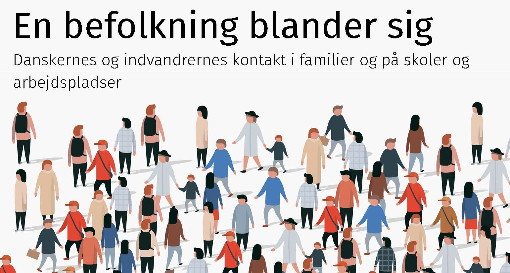

```{r include=FALSE}

options(tinytex.engine_args="-shell-escape")
gdtools::register_gfont(family = "Fira Sans")

library(tidyverse)
library(ggimage)
library(cowplot)
library(sf)
library(leaflet)
library(leaflet.extras)
library(flextable)
library(gt)
library(RColorBrewer)

```

\pagestyle{empty}

ISBN: 978-87-89383-85-9   
       
Published by:  
Institut for Politik og Samfund
Aalborg Universitet 

© Copyright by author(s)
   
\newpage
\newpage
\thispagestyle{empty}

\pagenumbering{roman}

<div style="color: white; opacity: 0.0;">
# Forord {-}
</div>

```{r fig-forside00, echo=FALSE, out.width= "100%"}

if (knitr::is_html_output()) {

  
  
}


```

Bogen er baseret på forskningsprojektet *”Measuring intense migrant-native contact and its concequences”* (MNcontact), der var finansieret af Den Fri Forskningsfond i perioden fra 2019 til 2025. Bogen er en formidlingsbog, der er baseret på projektets datamateriale og forskningsresultater. 

Projektgruppen har bestået af undertegnet, [Jeppe Fjeldgaard Qvist](https://vbn.aau.dk/da/persons/jeppefl)[^00001], [Lanciné Eric Diop-Christensen](https://vbn.aau.dk/en/persons/led), [Hans-Peter Y. Qvist](https://vbn.aau.dk/da/persons/hpq), [Jeevitha Y. Qvist](https://vbn.aau.dk/en/persons/jy), [Troels Fage Hedegaard](https://vbn.aau.dk/en/persons/troelsfh) og [Anna Diop-Christensen](https://dk.linkedin.com/in/anna-diop-christensen-58b5ba282) (i tilfældig rækkefølje). Gruppen har i forskellige konstellationer publiceret en række videnskabelige publikationer og flere er på vej. De er samlet på [projektets hjemmeside](https://vbn.aau.dk/en/projects/measuring-intense-migrant-native-contact-and-its-consequences/publications/). 

[^00001]: Jeppe Fjeldgaard Larsen i publikationer før 2025.

Undervejs har vi arbejdet tæt sammen [Anders Bastrup Jørgensen]( https://vbn.aau.dk/en/persons/anbajo), der skrev Ph.D-afhandling om indvandrere og efterkommeres deltagelse i frivillige foreninger. Vi har også arbejdet sammen med [Rolf Lyneborg Lund]( https://vbn.aau.dk/en/persons/rolfll) og [Anja Jørgensen]( https://vbn.aau.dk/en/persons/anjaj), der i samme periode analyserede spørgsmålet om indvandrere- og efterkommeres boligmæssige placering. 

Vi ønsker alle en god læselyst 

Aalborg 2025


[Christian Albrekt Larsen](https://vbn.aau.dk/en/persons/albrekt)


Forskningsleder på MNcontact. \
Professor, Institut for Politik og Samfund\
Aalborg Universitet\


\newpage

```{=latex}
\tableofcontents
```
