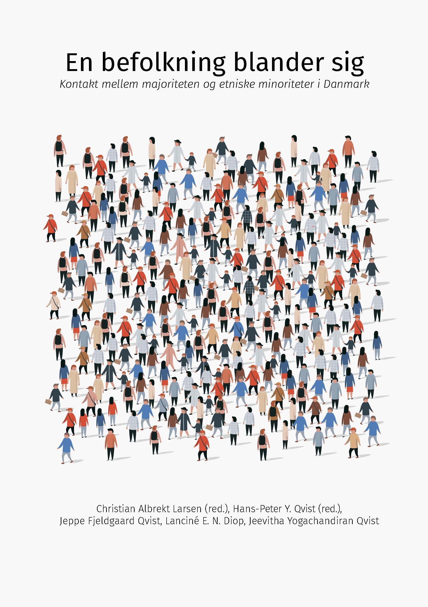

```{r include=FALSE}

options(tinytex.engine_args="-shell-escape")
gdtools::register_gfont(family = "Fira Sans")

library(tidyverse)
library(ggimage)
library(cowplot)
library(sf)
library(leaflet)
library(leaflet.extras)
library(flextable)
library(gt)
library(RColorBrewer)

```

\pagestyle{empty}

ISBN: 978-87-89383-85-9   
       
Published by:  
Institut for Politik og Samfund
Aalborg Universitet 

© Copyright by author(s)
   
\newpage
\thispagestyle{empty}

\pagenumbering{roman}

<div style="color: white; opacity: 0.0;">
# \color{white} En befolkning blander sig {-}
</div>

```{r fig-forside00, echo=FALSE, out.width= "100%"}

if (knitr::is_html_output()) {

  
  
}


```

